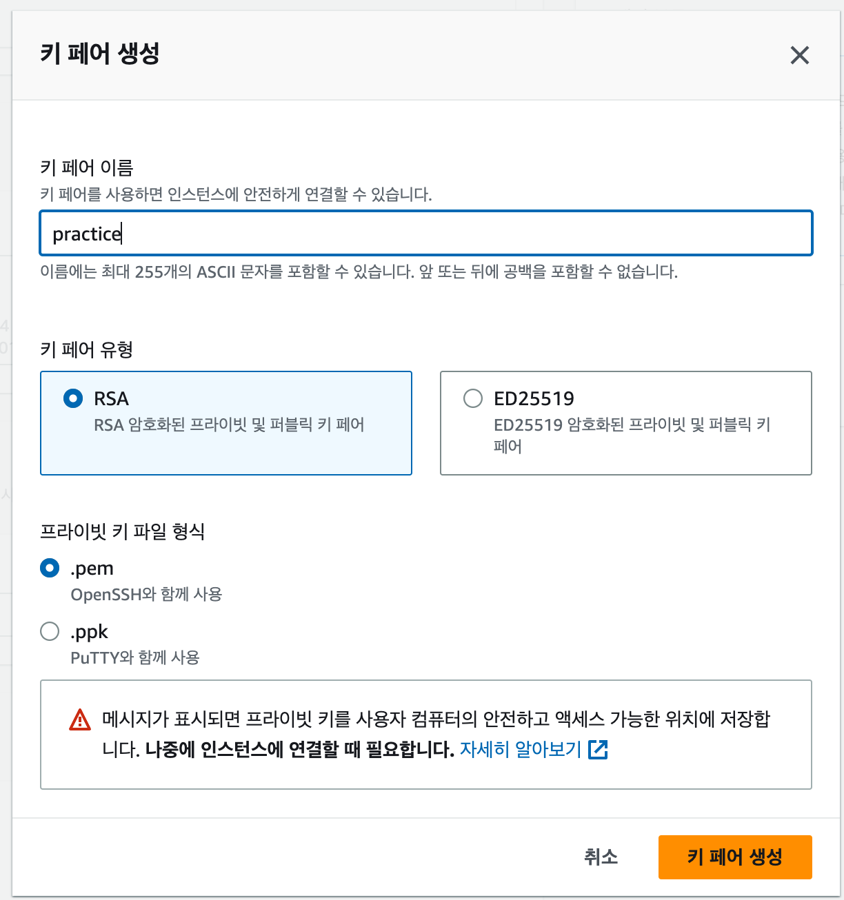
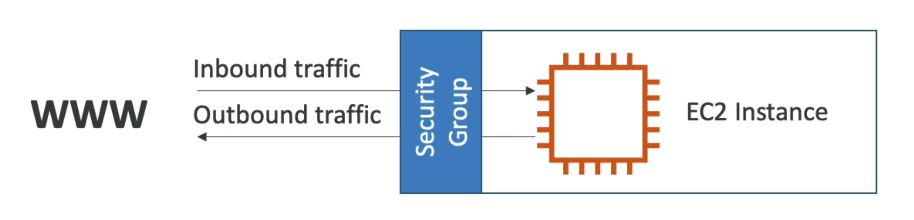
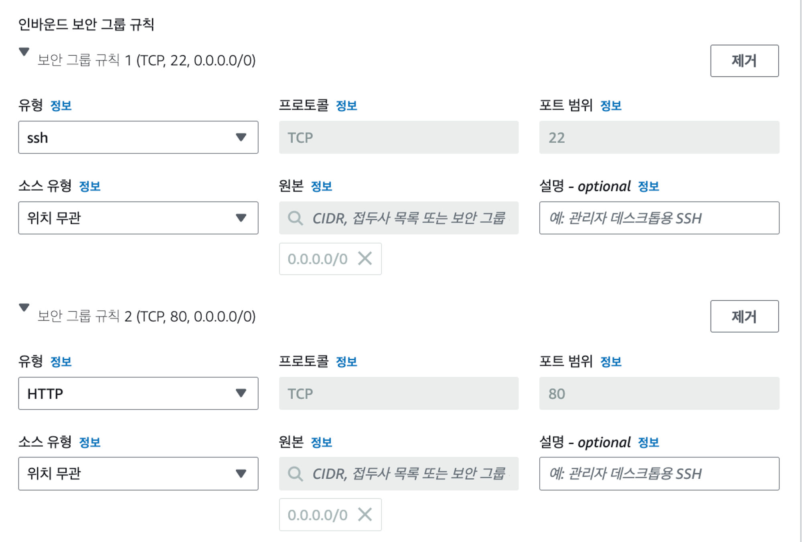
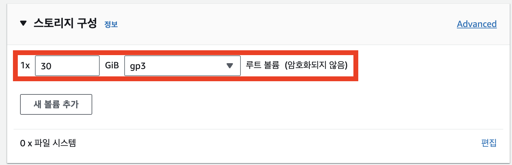

#1.EC2

---
---
## ✏️ EC2(Elastic Compute Cloud)

- 컴퓨터를 빌려서 원격으로 접속해 사용하는 서비스

요약 : `하나의 컴퓨터`

- 개인 컴퓨터로 서버를 배포하면 24시간 동안 컴퓨터를 켜놔야 함, 인터넷으로 컴퓨터 접근이 가능하므로 보안적 위험성이 존재
- 그 대안으로 AWS EC2 사용

> 프론트엔드 웹 페이지를 배포할 때 AWS EC2보다 vercel, netlify, AWS S3를 사용해서 주로 배포

## ✏️ 사용법
### ✔️ 1.리전(Region) 선택하기

#### ✅ **AWS EC2 서비스로 들어가서 리전(Region) 선택하기**

AWS EC2를 시작하기 위해서는 우선적으로 리전(Region)을 먼저 선택해야 한다.

- 인프라를 지리적으로 나누어 배포한 데이터 센터를 의미
- 애플리케이션의 주된 사용자들의 위치와 지리적으로 가까운 리전을 선택하는것이 유리

#### ✅ 많이 하는 실수

**아시아 태평양(서울)** 리전에서 EC2를 생성해놓고, 실수로 **미국 동부(버지니아 북부) 리전**에 들어가서 생성한 EC2가 없어졌다고 당황하는 경우

---
### ✔️ 2.EC2셋팅 - 기본 설정
#### ✅ 1. 이름 및 태그
- EC2의 이름을 설정

#### ✅2. Application and OS Images (Amazon Machine Image)

**Ubuntu 22.04 LTS 선택**

#### ✅ 3. 인스턴스 유형

**인스턴스**란, **AWS EC2에서 빌리는 컴퓨터 1대를 의미**

**인스턴스 유형**: **컴퓨터 사양을 의미**
 - 프리티어: **t2.micro**

#### ✅ 4. 키 페어(로그인)

- 키 페어 이름은 어떤 EC2에 접근하기 위한 키 페어였는 지 알아볼 수 있게 지정하면 좋음
- 키 페어 생성 파일 잘 보관하기

---
### ✔️ 2.EC2셋팅 - 보안 그룹 설정

#### ✅ 보안 그룹(Security Group)이란? 

**보안 그룹(Security Group)** 이란 **AWS 클라우드에서의 네트워크 보안**을 의미 

**EC2 인스턴스**를 **집**이라고 생각한다면, **보안 그룹**은 **집 바깥 쪽에 쳐져있는 울타리와 대문**이라고 생각하기

EC2 인스턴스 주위에 방화벽 역할을 할 **보안 그룹(Security Group)** 을 만들고 보안 그룹에 규칙을 지정함. 이 보안 규칙에는 **인바운드 트래픽(즉, 외부에서 EC2 인스턴스로 보내는 트래픽)** 에서 어떤 트래픽만 허용할 지 설정할 수 있고, **아웃바운드 트래픽(즉, EC2 인스턴스에서 외부로 나가는 트래픽)** 에서 어떤 트래픽만 허용할 지 설정할 수 있음

보안 그룹을 설정할 때는 허용할 **IP 범위**와 **포트(port)** 를 설정할 수 있다.

#### ✅ **보안그룹 설정**

외부에서 EC2로 접근할 포트는 **22번 포트**와 **80번 포트**라고 생각해서 이 2가지에 대해 인바운드 보안 그룹 규칙을 추가
 - 22번 포트는 우리가 EC2에 원격 접속할 때 사용하는 포트
 - 80번 포트에는 백엔드 서버를 띄울 목적으로 사용
 - 어떤 IP에서든 전부 접근할 수 있게 만들기 위해 소스 유형은 **위치 무관**으로 설정

 #### ✅ `IP와 PORT`
 
 **IP**
 
 - 네트워크 상에서의 특정 컴퓨터를 가리키는 주소
- ex) `13.250.15.132`

**Port**

- 한 컴퓨터 내에서 **실행되고 있는 특정 프로그램의 주소**
- 아래와 같은 값에서 `:3000` 부분이 포트 번호를 의미
- **`13.250.15.132:3000`**

---
### ✔️ 2.EC2셋팅 - 스토리지 구성

- EC2를 하나의 컴퓨터라고 생각했을때 저장 공간, 즉 하드 디스크가 필요함
- EC2의 저장 공간을 `EBS(Elastic Block Storage)`라고 부름
- `스토리지(Storage)`, `볼륨(Volume)`이라고도 부름 

- `gp3`선택하기
- 용량은 프리 티어 가능 용량인 30으로 설정
- 후에 변경가능

---
### ✔️ 3. 탄력적 IP 연결

#### ✅ 탄력적 IP가 왜 필요할까?
- EC2를 생성하고 할당받은 IP는 임시 IP이다.
- EC2를 중지해도 변경되지 않는 고정된 IP가 필요하다.
- 탄력적 IP생성 후 `작업` -> `탄력적 IP 주소 연결`

---
### ✔️ 4. 종료 방법

#### ✅ 1. 인스턴스 종료하기
- `인스턴스 상태` -> `인스턴스 종료`
- 종료는 컴퓨터를 아예 삭제시킨다는 걸 의미
- EC2 인스턴스를 한 번 종료하면 도중에 취소할 수 없으니 조심하기

#### ✅ 2. 탄력적 IP 릴리스하기

- `작업` -> `탄력적 IP 주소 릴리스`