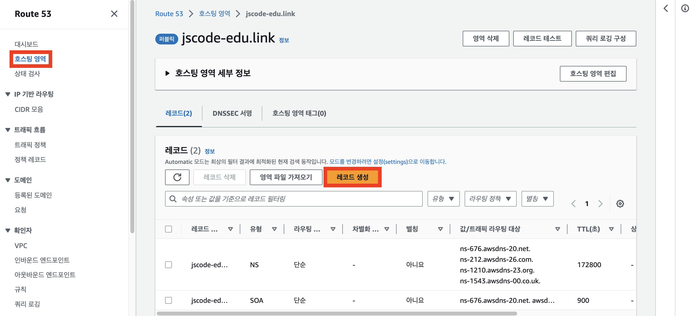
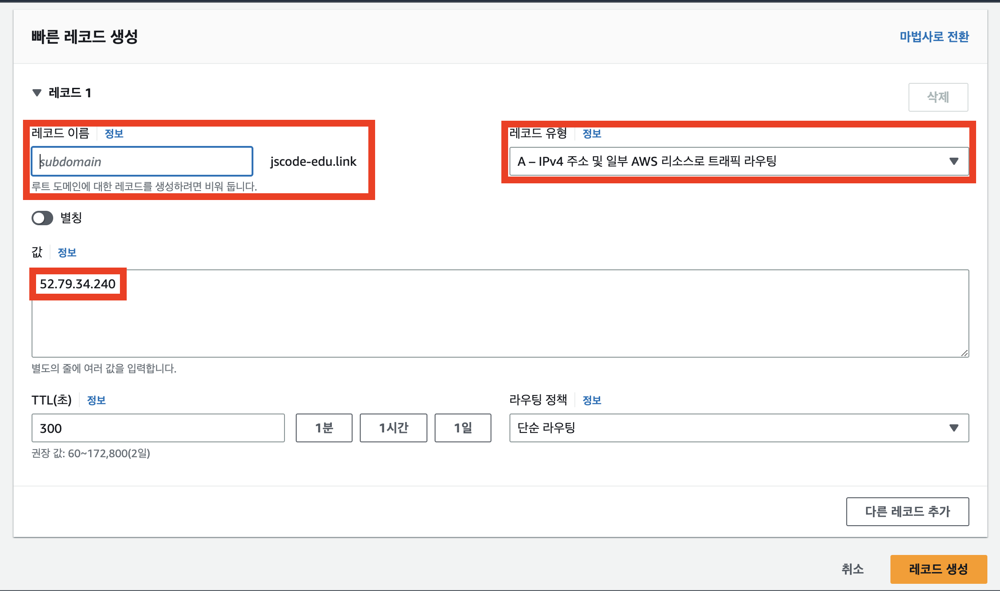

#2.ROUTE53

---
---
## ✏️ Route 53

> 도메인을 발급하고 관리해주는 서비스

- `DNS(Domain in Name System)` 서비스
- IP 주소에는 HTTPS 적용을 할 수가 없다.
- 도메인 주소가 있어야만 HTTPS 적용을 할 수 있다. 
- 이 때문에 특정 서비스를 운영할 때 도메인은 필수적으로 사용한다. 
- 다른 DNS: 가비아(gabia), 후이즈(whois) 

---
---
## ✏️ 사용법

### ✔️ 도메인 구매후 EC2에 연결하기

#### ✅ Route53의 도메인을 EC2에 연결하기

1. Route 53의 `호스팅 영역` 메뉴에 들어가서 레코드 생성 버튼 누르기

2. 레코드 생성하기

- 레코드 이름과 값을 설정하기
- 하나의 도메인으로 여러 개의 서브도메인 사용이 가능하다.

#### ✅ 레코드 유형
1. **A 레코드**
    
    도메인을 **특정 IPv4 주소에 연결시키고 싶을 때 사용**하는 레코드 유형 
    

1. **CNAME 레코드**
    
    도메인을 **특정 도메인 주소에 연결시키고 싶을 때 사용**하는 레코드 유형
    
    만약 CNAME 레코드의 값으로 `www.naver.com`을 적었다고 가정하자. 그러면 해당 도메인으로 접속했을 때, `www.naver.com`으로 연결되어 이동한다.