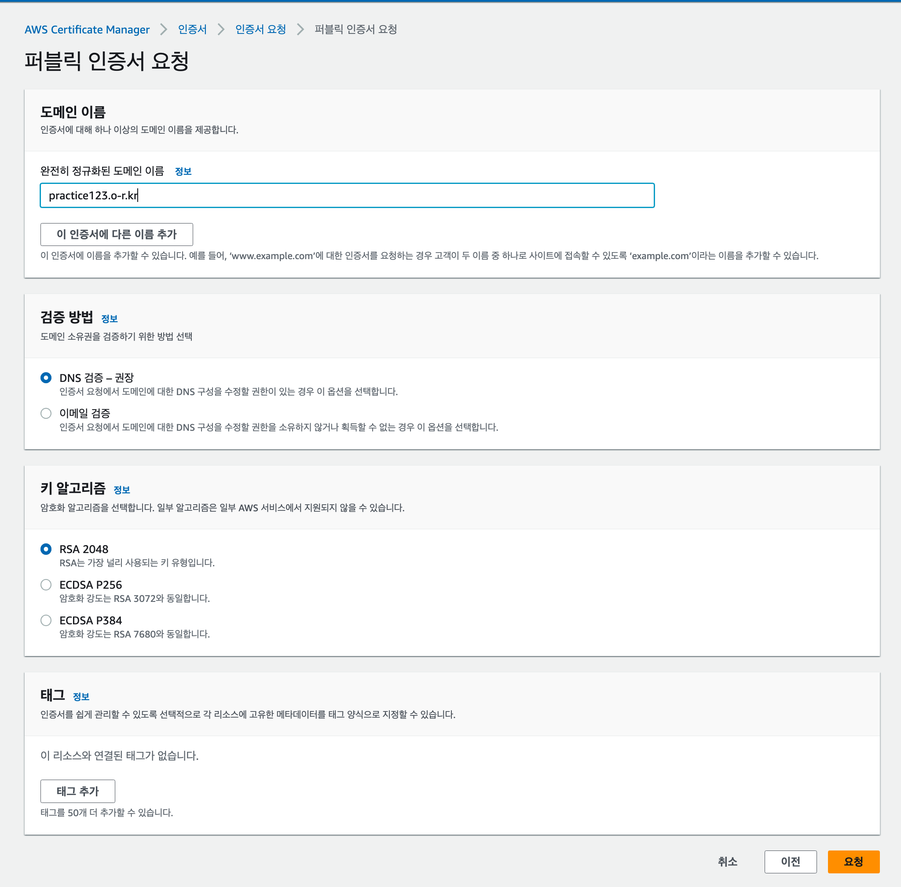
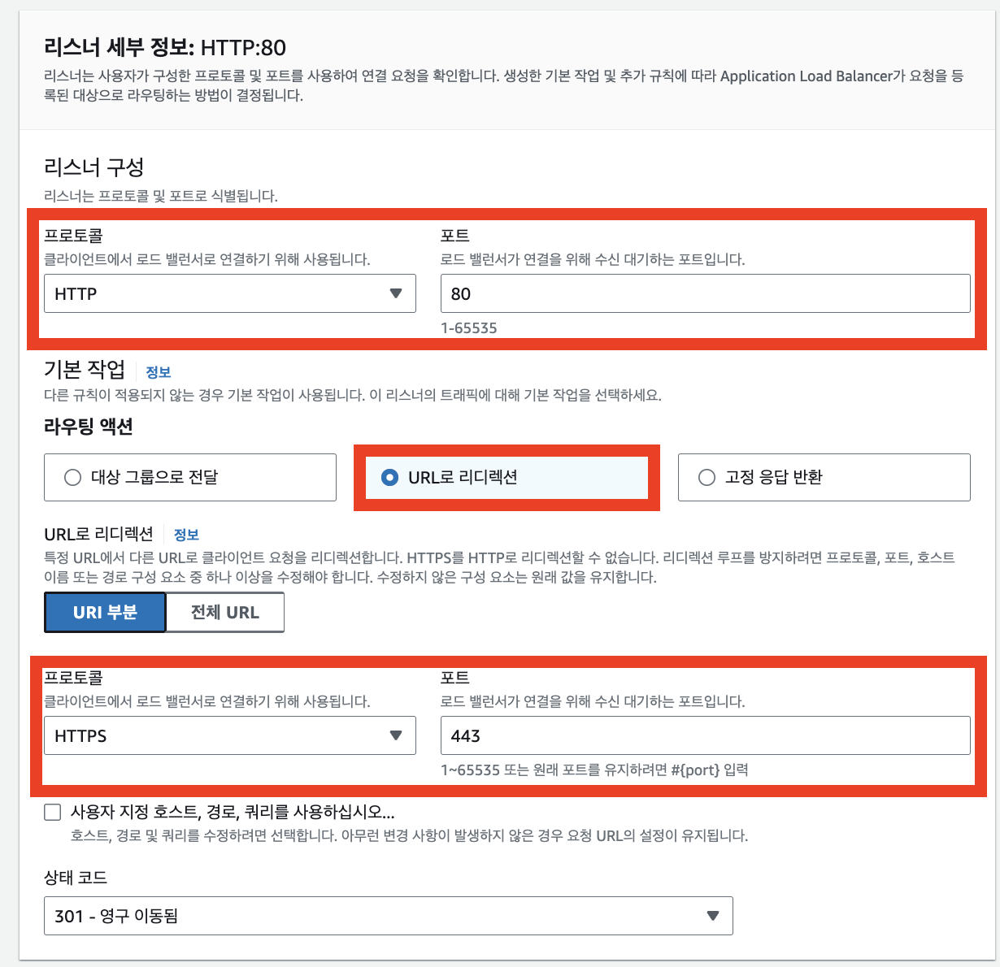

#2.ELB(HTTPS)


---
---
## ✏️ ELB(Elastic Load Balancer)


> ELB: 트래픽(부하)을 적절하게 분배해주는 장치

- ELB의 로드밸런서 기능을 사용하지 않고, ELB의 부가 기능인 SSL/TLS(HTTPS)를 적용시키는 방법 사용

### ✔️ SSL/TLS

- `HTTP`를 `HTTPS`로 바꿔주는 인증서
- ELB는 `SSL/TLS`기능을 제공함


### ✔️ HTTPS

**보안적인 이유**
    
- 데이터를 서버와 주고 받을 때 암호화를 시켜서 통신함. 암호화를 하지 않으면 누군가 중간에서 데이터를 가로채서 해킹할 수도 있음

- HTTPS 인증을 받은 웹 사이트가 백엔드 서버와 통신하려면, 백엔드 서버의 주소도 HTTPS 인증을 받아야 함
-  따라서 **백엔드 서버와 통신할 때도** IP 주소로 통신하는 게 아니라, **HTTPS 인증을 받은 도메인 주소로 통신을 한다.** 

> - 웹 사이트 주소 : `**https**://xxx.co.kr`
> - 백엔드 API 서버 주소 : `**https**://api.xxx.co.kr`


### ✔️  ELB를 활용한 아키텍처 구성


- ELB를 사용하기 전에는 사용자들이 EC2의 IP주소 혹은 도메인 주소에 직접 요청을 보내는 구조
- ELB를 도입하고 사용자들이 ELB에 요청을 보내도록 구성함


---
---
## ✏️ ELB 사용
### ✔️ ELB 셋팅 - 기본
#### ✅ 1. 리전 선택하기
- AWS EC2 로드밸런서 서비스로 들어가서 리전(Region)을 선택

#### ✅ 2. 로드 밸런서 유형 선택하기
- 로드 밸런서 생성
- 3가지 로드 밸런서 유형 중 `Application Load Balancer(ALB)`를 선택

#### ✅ 3. 기본 구성


- **내부** 옵션은 Private IP를 활용할 때 사용
- **인터넷 경계** 옵션을 선택
- IPv6을 사용하는 EC2 인스턴스가 없다면 **IPv4**를 선택
    - **참고) IPv4와 IPv6의 차이**
        
        IPv4 주소는 `121.13.0.5`와 같은 IP 주소를 의미한다. IPv6은 IPv4보다 훨씬 더 많은 주소값을 만들어낼 수 있게 구성했다. IPv6의 형태는 `2dfc:0:0:0:0217:cbff:fe8c:0`와 같다.

#### ✅ 4. 네트워크 매핑


- 가용 영역에 제한을 두지 않고 모든 영역에 트래픽을 보내게 설정하자. 
- 즉, **모든 가용 영역에 다 체크하자.**

---
### ✔️ ELB 셋팅 - 보안그룹
#### ✅ 보안 그룹

1. `AWS EC2 보안 그룹`에서 보안 그룹 생성


- ELB의 특성상 인바운드 규칙에 `80(HTTP)`, `443(HTTPS)` 포트로 모든 IP에 대해 요청을 받을 수 있게 설정

2. ELB 만드는 설정창에서 보안 그룹 등록

---
### ✔️ ELB 셋팅 - 리스너 및 라우팅/헬스체크

#### ✅ 1. 대상 그룹(Target Group) 설정하기


- 리스너 및 라우팅 설정은 ELB로 들어온 요청을 어떤 EC2 인스턴스에 전달할 건지를 설정하는 부분

**2. 대상 유형 선택**

- 특정 인스턴스로 트래픽을 전달하기 때문에 `인스턴스` 선택


**3. 프토토콜, IP 주소 유형, 프로토콜 버전 설정**


- ELB가 클라이언트로 트래픽을 받아 대상 그룹에 어떤 방식으로 전달하는지 설정

**4. 상태 검사 설정하기**


- ELB의 부가 기능으로 `상태 검사(= Health Check, 헬스 체크)` 기능
- 실제 ELB로 들어온 요청을 대상 그룹에 있는 여러 EC2 인스턴스로 전달하는 역할
- 만약 특정 EC2 인스턴스가 에러가 발생해 고장났다면, ELB입장에서 고장난 서버에 요청을 전달할 필요가 없음(비효율적)
- 이를 방지하기 위해 ELB는 주기적(기본 30초 간격)으로 대상 그룹에 속해있는 EC2 인스턴스에 요청을 보냄
- 요청에 대한 응답이 200번대(HTTP Status Code)이면 서버가 잘 작동함을 의미
- 200번대가 아니면 고장났다고 판단하고, 그 EC2로 요청을 보내지 않음

- 대상 그룹의 각각의 EC2 인스턴스에 `GET /health`(HTTP 프로토콜 활용)으로 요청을 보내게끔 설정
- 정상적인 헬스 체크 기능을 위해 EC2 인스턴스에서 작동하고 있는 백엔드 서버에 Health Check용 API를 만들기


**5. 대상 등록**


**6. ELB 만드는 창으로 돌아와서 대상 그룹(Target Group) 등록하기**


ELB에 HTTP를 활용해 80번 포트로 들어온 요청(트래픽)을 설정한 대상 그룹으로 전달한다는 의미

**7. 로드 밸런서 생성**
- 로드 밸런서가 생성됨

#### ✅ 2. Health Check API 추가하기

- EC2에 올린 프로젝트에 설정한 Health Check API를 추가해야함
- EC2 연결해서 파일 설정하기


#### ✅ 3. 로드밸런서 주소를 통해 서버 접속해보기


---
### ✔️ ELB 셋팅 - 도메인연결

#### ✅ 1. Route 53에서 EC2에 연결되어 있던 레코드 삭제

#### ✅ 2. Route 53에서 ELB에 도메인 연결하기

- 구매한 도메인 들어가서 `레코드 생성`버튼 누르기
- 레코드 유형: A-IPv4
- 별칭 체크
- 엔드포인트 선택 : `Application/Classic Load Balancer`에 대한 별칭
- 리전 선택 : 아시아 태평양(서울)
- ELB주소 입력
- `레코드 생성`버튼 누르기


---
### ✔️ HTTPS 인증서 발급, 설정
#### ✅ 1. AWS Certificate Manager 서비스로 들어가서 인증서 요청 버튼 누르기

#### ✅ 2. 인증서 요청하기
- 퍼블릭 인증서 요청
- 도메인 이름은 등록한 도메인 이름 쓰기
- 검증 대기 중으로 상태가 나옴



-> AWS Certificate Manager에서 해야할 것

#### ✅ 3. 인증서 검증하기
- `Route53에서 레코드 생성` AWS Certificate Manager에서 누르기
- `레코드 생성`누르기
- 검증 완료까지 기다리기


#### ✅ 4. ELB의 리스너 및 규칙 수정하기
**1. HTTPS에 대한 리스너 추가하기**
- 로드밸런서 메뉴로 들어가기
- 리스너 및 규칙에서 `리스너 추가`버튼 누르기


- 보안 정책은 default사용
- 보안 리스너 설정 `인증서`부분에 만들어둔 HTTPS인증서 사용하기

#### ✅ 5. HTTP로 접속할 경우 HTTPS로 전환되도록 설정하기
- http를 붙여서 접속하더라도 자동으로 HTTPS로 전환(Redirect)되도록 만들기

- 기존 HTTP:80 리스너를 삭제하기(ELB 리스너 및 규칙에서)
- 리스너 추가하기




---
### ✔️ 종료

- 생성한 ELB와 ELB에 연결한 EC2만 깔끔하게 정리하면 요금이 나가지 않음
1. ELB - 로드 밸런서 삭제
2. EC2 종료

---
### ✔️ Nginx
- HTTPS를 연결하는 방법에는 ELB 뿐만 아니라 Nginx, Certbot을 활용하는 방법도 존재
- Nginx는 HTTPS를 적용하는 데 비용이 나가지 않음
- ELB를 사용하지 않고 백엔드 서버와 Nginx, Certbot을 하나의 EC2에 설치해 사용

- 주의) EC2에 도메인을 연결시키지 않으면 Certbot이 정상적으로 작동하지 않음

**Nginx 설치**
```shell
$ sudo apt update
$ sudo apt install nginx

$ sudo service nginx status 설치확인
```
 - `http://<ip 주소>`로 접속 / https아님

**Certbot 설치**
```shell
$ sudo snap install --classic certbot
$ sudo ln -s /snap/bin/certbot /usr/bin/certbot

ssl인증서 발급 받기
$ sudo certbot --nginx -d <도메인 주소>
```

**리버스 프록시 설정**
- 80번포트가아닌 3000번 포트에 HTTPS설정
```shell
$ vi /etc/nginx/sites-available/default
```
```
...
server {
	...

	server_name <도메인 주소>;
	
	location / {
		# try_files $uri $uri/ =404;
		proxy_pass http://localhost:3000/;
	}
	...
}
```

**Nginx재시작하기**
```shell
$ sudo service nginx restart
```