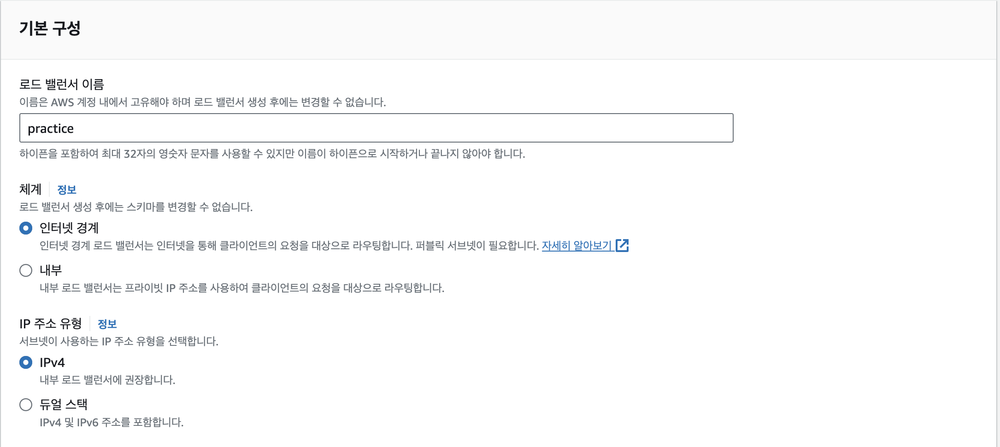

#2.ELB(HTTPS)

---
---
## ✏️ ELB(Elastic Load Balancer)

> ELB: 트래픽(부하)을 적절하게 분배해주는 장치

- ELB의 로드밸런서 기능을 사용하지 않고, ELB의 부가 기능인 SSL/TLS(HTTPS)를 적용시키는 방법 사용

### ✔️ SSL/TLS

- `HTTP`를 `HTTPS`로 바꿔주는 인증서
- ELB는 `SSL/TLS`기능을 제공함

### ✔️ HTTPS

**보안적인 이유**
    
- 데이터를 서버와 주고 받을 때 암호화를 시켜서 통신함. 암호화를 하지 않으면 누군가 중간에서 데이터를 가로채서 해킹할 수도 있음

- HTTPS 인증을 받은 웹 사이트가 백엔드 서버와 통신하려면, 백엔드 서버의 주소도 HTTPS 인증을 받아야 함
-  따라서 **백엔드 서버와 통신할 때도** IP 주소로 통신하는 게 아니라, **HTTPS 인증을 받은 도메인 주소로 통신을 한다.** 

> - 웹 사이트 주소 : `**https**://xxx.co.kr`
> - 백엔드 API 서버 주소 : `**https**://api.xxx.co.kr`

### ✔️  ELB를 활용한 아키텍처 구성

- ELB를 사용하기 전에는 사용자들이 EC2의 IP주소 혹은 도메인 주소에 직접 요청을 보내는 구조
- ELB를 도입하고 사용자들이 ELB에 요청을 보내도록 구성함

---
---
## ✏️ ELB 사용
### ✔️ ELB 셋팅 - 기본
#### ✅ 1. 리전 선택하기
- AWS EC2 로드밸런서 서비스로 들어가서 리전(Region)을 선택

#### ✅ 2. 로드 밸런서 유형 선택하기
- 로드 밸런서 생성
- 3가지 로드 밸런서 유형 중 `Application Load Balancer(ALB)`를 선택

#### ✅ 3. 기본 구성

.png>)

- **내부** 옵션은 Private IP를 활용할 때 사용
- **인터넷 경계** 옵션을 선택
- IPv6을 사용하는 EC2 인스턴스가 없다면 **IPv4**를 선택
    - **참고) IPv4와 IPv6의 차이**
        
        IPv4 주소는 `121.13.0.5`와 같은 IP 주소를 의미한다. IPv6은 IPv4보다 훨씬 더 많은 주소값을 만들어낼 수 있게 구성했다. IPv6의 형태는 `2dfc:0:0:0:0217:cbff:fe8c:0`와 같다.

#### ✅ 4. 네트워크 매핑

.png>)

- 가용 영역에 제한을 두지 않고 모든 영역에 트래픽을 보내게 설정하자. 
- 즉, **모든 가용 영역에 다 체크하자.**

### ✔️ ELB 셋팅 - 보안그룹
#### ✅ 보안 그룹

1. `AWS EC2 보안 그룹`에서 보안 그룹 생성
.png>)

- ELB의 특성상 인바운드 규칙에 `80(HTTP)`, `443(HTTPS)` 포트로 모든 IP에 대해 요청을 받을 수 있게 설정

2. ELB 만들때 보안 그룹 등록

### ✔️ ELB 셋팅 - 리스너 및 라우팅/헬스체크

#### ✅ 1. 대상 그룹(Target Group) 설정하기

.png>)

- 리스너 및 라우팅 설정은 ELB로 들어온 요청을 어떤 EC2 인스턴스에 전달할 건지를 설정하는 부분

**2. 대상 유형 선택**

- 특정 인스턴스로 트래픽을 전달하기 때문에 `인스턴스` 선택

**3. 프토토콜, IP 주소 유형, 프로토콜 버전 설정**

.png>)

- ELB가 대상 그룹에 어떤 방식으로 전달하는지 설정

**4. 상태 검사 설정하기**

.png>)

- ELB의 부가 기능으로 `상태 검사(= Health Check, 헬스 체크)` 기능

실제 ELB로 들어온 요청을 대상 그룹에 있는 여러 EC2 인스턴스로 전달하는 역할을 가진다. ([ELB를 활용한 아키텍처 구성](https://www.notion.so/ELB-422ee00730b4445e84c3d1119d4d69c5?pvs=21)) 그런데 만약 특정 EC2 인스턴스 내에 있는 서버가 예상치 못한 에러로 고장났다고 가정해보자. 그럼 ELB 입장에서 고장난 서버한테 요청(트래픽)을 전달하는 게 비효율적인 행동이다. 

이런 상황을 방지하기 위해 ELB는 주기적으로(기본 30초 간격) 대상 그룹에 속해있는 각각의 EC2 인스턴스에 요청을 보내본다. 그 요청에 대한 200번대(HTTP Status Code) 응답이 잘 날라온다면 서버가 정상적으로 잘 작동되고 있다고 판단한다. 만약 요청을 보냈는데 200번대의 응답이 날라오지 않는다면 서버가 고장났다고 판단해서, ELB가 고장났다고 판단한 EC2 인스턴스로는 요청(트래픽)을 보내지 않는다. 

이러한 작동 과정을 통해 조금 더 효율적인 요청(트래픽)의 분배가 가능해진다. 

위에서 설정한 값을 해석해보자면, 대상 그룹의 각각의 EC2 인스턴스에 `GET /health`(HTTP 프로토콜 활용)으로 요청을 보내게끔 설정한 것이다. 정상적인 헬스 체크 기능을 위해 EC2 인스턴스에서 작동하고 있는 백엔드 서버에 Health Check용 API를 만들어야 한다. 뒤에서 곧 만들 예정이다.

**5. 대상 등록**

**6. ELB 만드는 창으로 돌아와서 대상 그룹(Target Group) 등록하기**

.png>)

ELB에 HTTP를 활용해 80번 포트로 들어온 요청(트래픽)을 설정한 대상 그룹으로 전달한다는 의미

**7. 로드 밸런서 생성**

#### ✅ 2. Health Check API 추가하기

- EC2에 올린 프로젝트에 설정한 Health Check API를 추가해야함

#### ✅ 3. 로드밸런서 주소를 통해 서버 접속해보기

.png>)

### ✔️ ELB 셋팅 - 도메인연결

### ✔️ HTTPS 인증서 발급, 설정

### ✔️ 종료