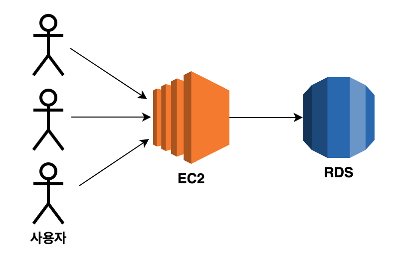
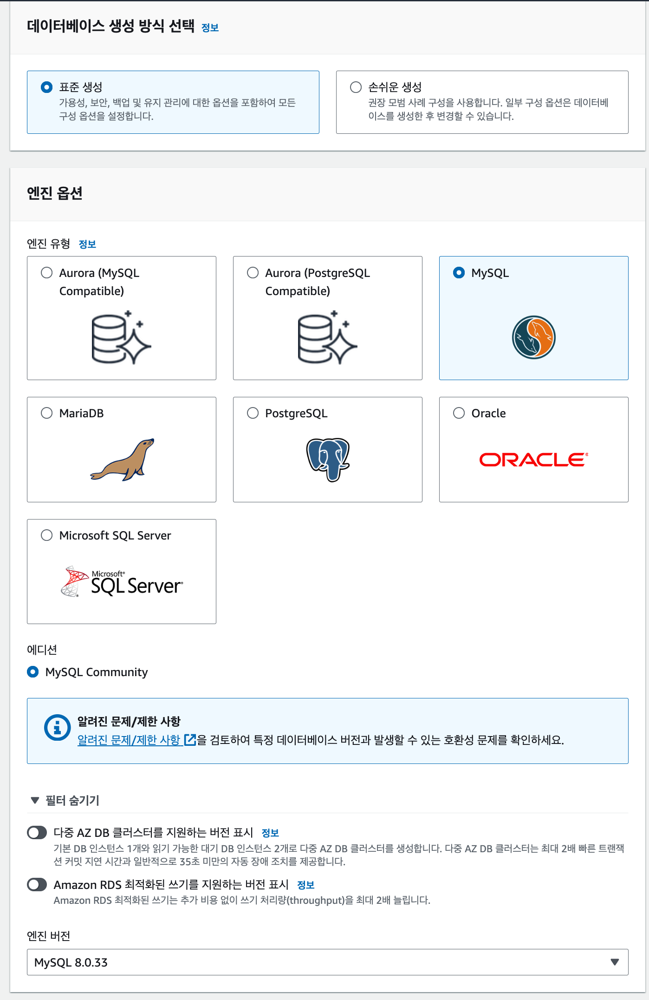
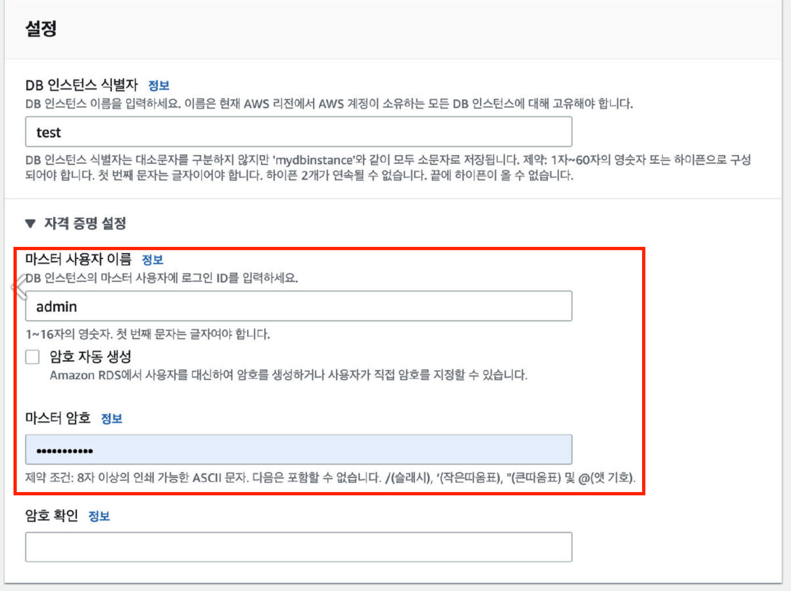
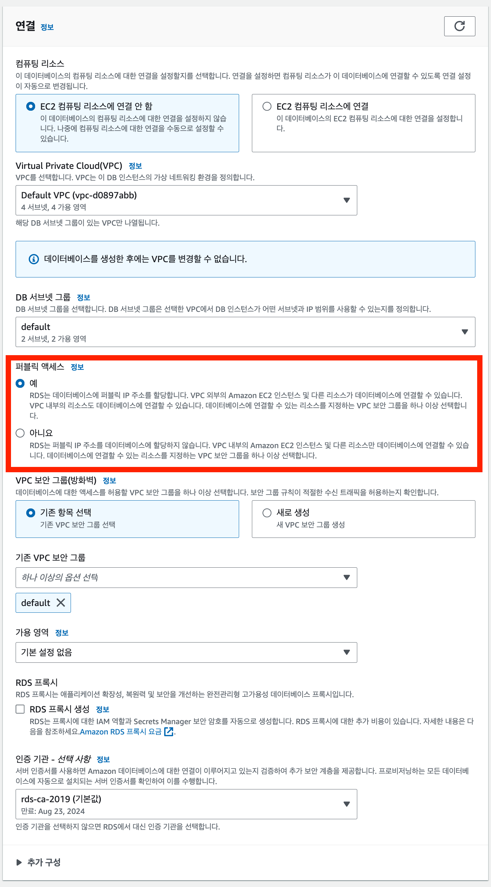
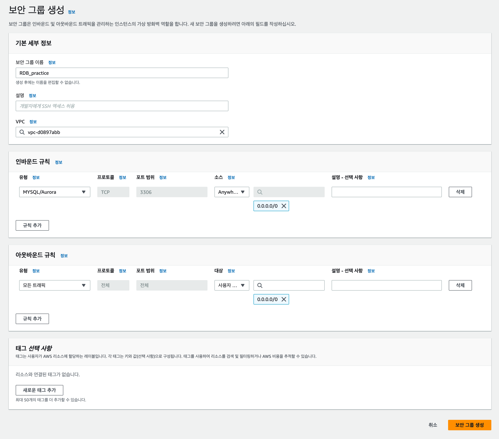
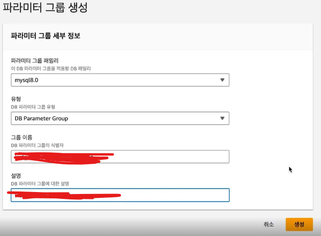
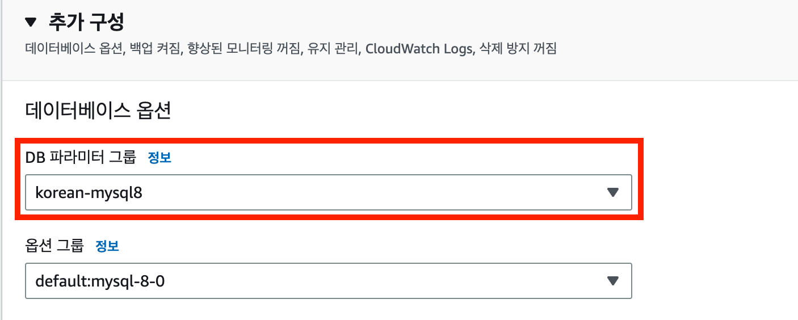
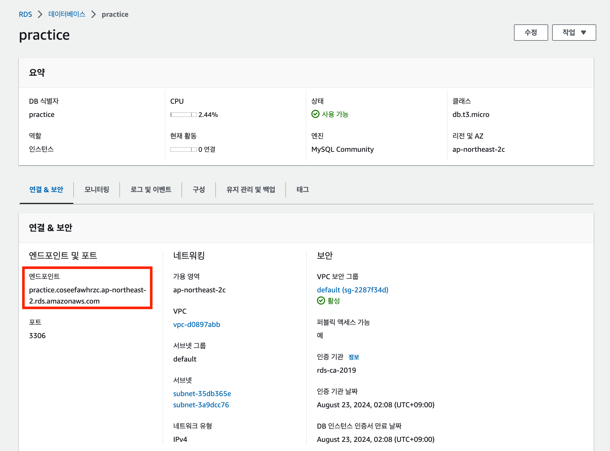
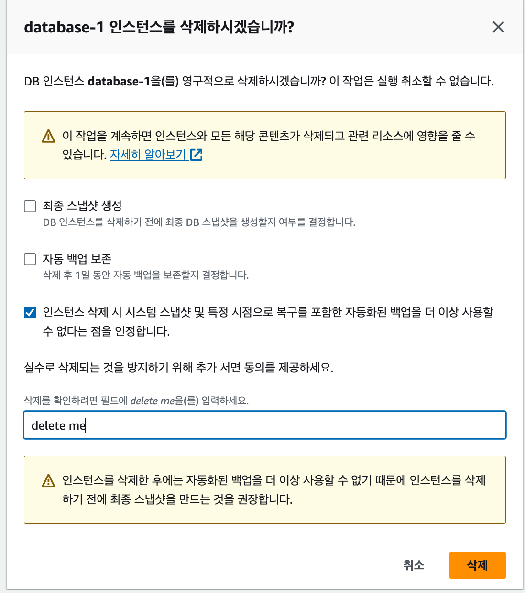

#4.RDS

---
---
## ✏️ RDS

### ✔️ RDS란, 사용하는 이유

- 관계형 데이터베이스 서비스
- 관계형 데이터베이스(MySQL, MariaDB) 등을 AWS로부터 빌려서 사용하는 형태

 

- 로컬 환경에서 개발하면 MySQL과 같은 DB를 연결해서 사용
- 서버를 배포하면 서버가 로컬 DB에 연결 불가능
- 자동백업, 모니터링, 다중 AZ 등의 부가기능 존재

 

- EC2에 MySQL을 설치하는 방법
- 즉, RDS를 사용하지 않는 방법도 가능
- 그러나 백엔드 서버 장애로 EC2 컴퓨터가 죽을 경우, DB도 오류가 날 수 있기때문에 RDS를 분리해서 사용

---
### ✔️ RDS 생성

#### ✅ 1. 리전 선택
- 아시아 태평양(서울) 선택

#### ✅ 2. 데이터베이스 종류 선택

#### ✅ 3. 템플릿 선택
- 프리 티어 선택

#### ✅ 4. 설정

- `마스터 사용자 이름`/`마스터 암호`는 DB에 접근하기 위한 ID, 비밀번호

#### ✅ 5. 인스턴스 구성, 스토리지
- 기본값 그대로 두기

#### ✅ 6. 연결

- 퍼블릭 엑세스: `예`
- 보안 구성을 변경하고 싶을때 `아니오`사용하기

#### ✅ 7. 데이터베이스 인증, 모니터링
- 기본값 그대로 두기

- RDS 생성 완료
---
### ✔️ 보안그룹 설정

#### ✅ 1. 보안그룹 생성
- `AWS EC2 보안그룹` 메뉴 들어가기
- 인바운드, 아웃바운드 규칙 설정하기
- 별도의 설정이 없다면 MySQL은 3306포트에서 실행됨
- DB접근을 위해 3306번 포트 `인바운드 규칙` 추가
- `아웃바운드 규칙`은 모든 트래픽 허용 규칙 추가

#### ✅ 2. 생성한 보안그룹을 RDS에 붙이기
- RDS에 들어가서 보안그룹 붙여주기
- RDS에서 필요한 DB 선택하고, `수정` 버튼 누르기
- 연결 메뉴에서 보안 그룹 선택

---
### ✔️ 파라미터 그룹 추가

#### ✅ 파라미터 그룹 생성
- RDS에서 `파라미터 그룹`으로 들어가기
- `파라미터 그룹 생성`버튼 누르기

- 파라미터 그룹에 들어가서 `편집`누르기/이후 과정 ⬇️

**1. 아래 속성 전부 `utf8mb4`로 설정**

- `character_set_client`
- `character_set_connection`
- `character_set_database`
- `characater_set_filesystem`
- `characater_set_results`
- `character_set_server`

> `utf8` 대신에 `utf8mb4`를 사용하는 이유는 ‘한글’ 뿐만 아니라 ‘이모티콘’도 지원이 가능하도록 하기 위함

**2. 아래 속성 전부 `utf8mb4_unicode_ci`로 설정하기**

- `collation_connection`
- `collation_server`

> `utf8mb4_unicode_ci`은 정렬, 비교 방식을 나타낸다. 

**3. `time_zone`을 `Asia/Seoul`로 설정하기**

#### ✅ RDS의 파라미터 그룹 변경

- RDS의 DB인스턴스 `수정`버튼 -> `DB 파라미터 그룹` 변경
- 주의) DB 파라미터 그룹을 변경한 뒤에는 RDS의 DB를 재부팅해야만 정상적으로 적용됨

---
### ✔️ RDS 접속

#### ✅ DBeaver로 RDS 인스턴스에 접속하기

- `Server Host` : RDS의 엔드포인트 입력
- `Username`: 마스터 사용자 이름 입력
- `Password` : 마스터 암호 입력

#### ✅ 엔드포인트(Endpoint)

- 특정 리소스(ex. 서버, DB 등)에 접근할 수 있도록 해주는 URL을 의미

---
### ✔️ 종료

- RDS에서 삭제할 DB선택후 `작업`버튼 -> `삭제`버튼
- 최종 스냅샷 생성, 자동 백업 보존은 비용 발생함

