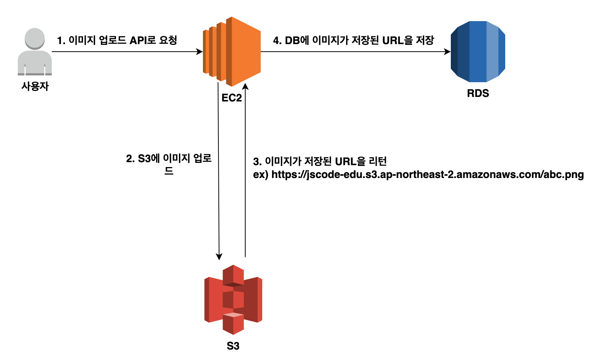
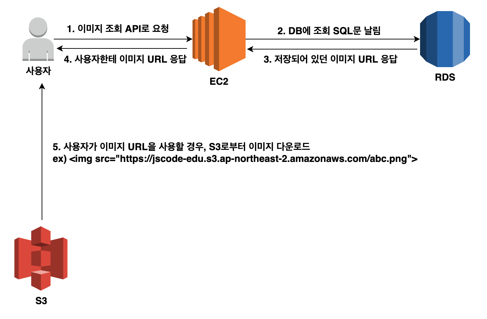
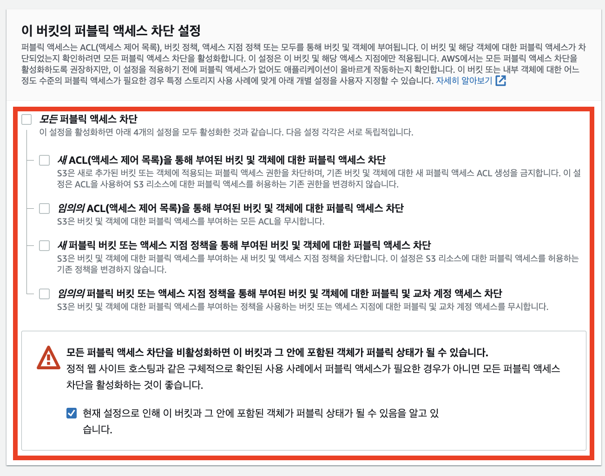
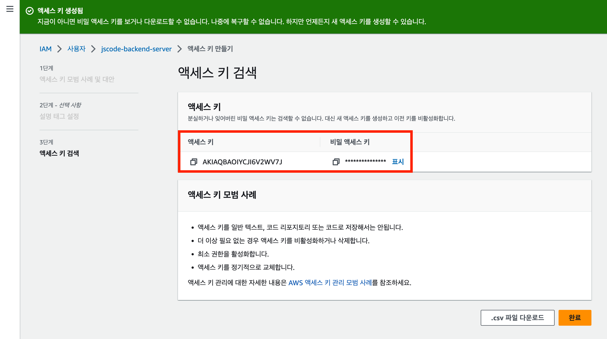

#5.S3


---
---
## ✏️ S3

### ✔️ 정의

- 파일 저장 서비스
- 백엔드 서버의 이미지 업로드 기능에서 이미지 파일을 저장하는 서비스 제공
- EC2내부에 이미지 파일 저장하는 것보다 효율적

✅ 이미지 파일 업로드 과정



✅ 이미지 파일 다운로드 과정



### ✔️ S3 버킷 생성

**버킷(Bucket)**
- 깃 허브의 Repository와 같은 것
- S3에서도 여러개의 버킷을 만들 수 있음
- 하나의 저장소를 버킷이라 부름

**객체(Object)**
- S3에 업로드한 파일을 객체라고 부름


#### ✅ 1. S3 버킷 생성하기

- 버킷 만들기 버튼 누르기
- 버킷 이름 임의로 생성하기



- 나머지는 Default설정으로 그대로 두기
- 버킷 생성하기

#### ✅ 2. 버킷에 정책 추가하기

**정책(Policy)**
- 권한(Permission)을 정의하는 JSON 문서 의미
- AWS는 기본적으로 대부분의 권한이 주어져있지 않아서 특정 소스에 접근하려면 권한을 허용해야함
- 권한을 허용할 때 작성해야 하는 게 정책(Policy)

0. S3들어가서 권한 들어가기
1. 버킷 정책 편집하기
2. `새 문 추가` 버튼 누르기
3. S3검색 - `GetObject` 추가
4. 리소스 추가 버튼 누르기
  - 리소스 ARN: `arn:aws:s3:::{내가 만든 버킷명}/*`의 형식으로 입력하기
  - 리소스 유형: `object`
  - ARN: AWS의 리소스 표현 문법
```
{
    "Version": "2012-10-17",
    "Statement": [
        {
            "Sid": "Statement1",
            "Principal": "*",
            "Effect": "Allow",
            "Action": [
                "s3:GetObject"
            ],
            "Resource": [
                "arn:aws:s3:::maimu-files/*"
            ]
        }
    ]
}
```
- `Principal`: `"*"`이렇게 변경하기
- 누구한테 이 권한을 허용할지에 대한 것: 모두에게 허용


---
### ✔️ IAM 액세스 키 발급받기
- AWS의 리소스에 아무나 접근하지 못하기 때문에 S3에 접근해 `파일을 업로드`하기 어려움
- 파일을 다운로드 받는 것은 모든 사용자에게 허용
- 백엔드 서버만 파일을 업로드하게 하기 위해 IAM 액세스 키 발급받기


#### ✅ 1. IAM에서 ‘사용자’ 메뉴로 들어가서 추가하기
- 사용자 이름 적기
- 권한 설정: 직접 정책 연결
- 권한 정책: `S3Full` 검색 -> `AmazonS3FullAccess` 선택하고 다음
- 사용자 생성


#### ✅ 2. 액세스 키 만들기
- 사용자로 들어가서 `보안 자격 증명` 들어가기 
- `액세스 키 만들기` 버튼 누르기
- `AWS 외부에서 실행되는 애플리케이션`선택 -> 다음
- 액세스 키 만들기 버튼 누르기




- 값 따로 저장하기


---
### ✔️ S3 활용

Express 기준
```bash
AWS_ACCESS_KEY=____
AWS_SECRET_ACCESS_KEY=____
AWS_S3_BUCKET=s3버킷 이름(maimu-files)
```

- postman으로 파일 업로드 해보기
  - `POST`, Body에 `form-data`
- 이미지 파일 저장된 URL 정보를 받을 수 있음
- 이 주소를 데이터베이스에 저장하기


---
### ✔️ S3 종료하기
- 버킷 안에 있는 객체 모두 삭제하기
- 버킷 삭제하기