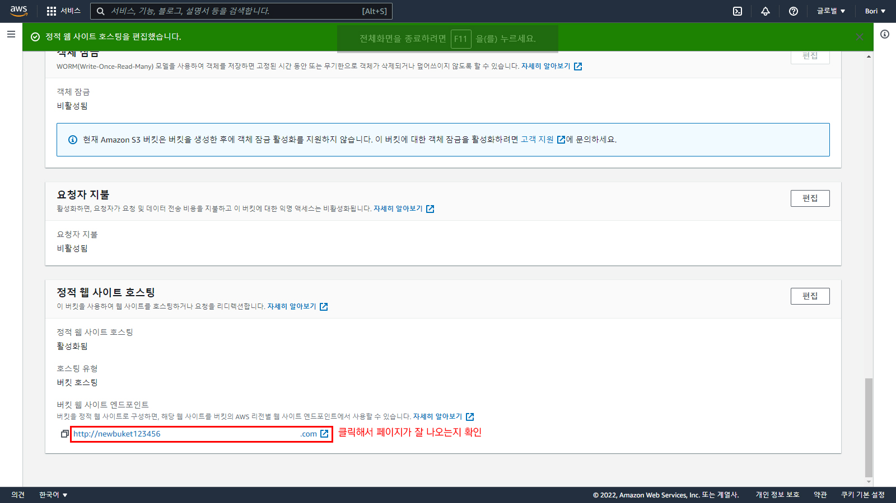

#6.Cloudfront

---
---
## ✏️ Cloudfront

### ✔️ 정의

- S3는 파일 저장 서비스와 동시에 `정적 웹 사이트 호스팅`기능을 가짐
- `CloudFront`: 컨텐츠(파일, 동영상)를 빠르게 전송해주는 서비스

- 컨텐츠는 S3에 저장됨
- 거리가 가까울 수록 데이터를 빠르게 전송 받을 수 있음
- 전세계 곳곳에 컨텐츠의 복사본을 저장해둘 수 있는 임시 저장소를 구축함
- 이 기술을 `CDN(Content Delivery Network)`라 부름
- `CloudFront`는 컨텐츠 전송 성능 향상을 위해 사용
- HTTPS 적용을 위해 CloudFront를 사용해야함
- S3에는 HTTPS적용 기능이 없기 때문

---
### ✔️ S3 버킷 셋팅, IAM 키 발급, S3에 업로드하기, 웹 호스팅 설정

#### ✅ 1. S3에 배포할 웹 서비스 파일 업로드

- 드래그해서 파일 가져오기

#### ✅ 2. S3에 정적 웹 사이트 호스팅 설정

#### ✅ 3. 잘 배포했는지 체크

---
### ✔️ CloudFront 생성

#### ✅ 1. CloudFront 페이지 들어가기

#### ✅ 2. 원본 도메인 입력하기 

- 원본 도메인에 S3 버킷 엔드포인트가 아닌 `S3 정적 웹 사이트 호스팅`의 엔드포인트를 사용

#### ✅ 3. HTTP, HTTPS에 대한 정책 선택

#### ✅ 4. WAF, 가격분류 설정
- `보안 보호 비활성화` 선택
- `북미, 유럽, 아시아, 중동 및 아프리카에서 사용` 선택

#### ✅ 5. 기본값 루트 객체 설정

#### ✅ 6. Cloudfront 배포 생성
- `생성하기`버튼 누르고 생성

---
### ✔️ 도메인 연결, HTTPS 적용

#### ✅ 1. ACM(Certificate Manager)에서 SSL/TLS 인증서 발급받기

- CloudFront는 HTTPS를 적용하려면 `미국 동부(버지니아 북부)`에서 발급받아야함

#### ✅ 2. CloudFront 설정에서 SSL 인증서 추가하기

- `대체 도메인 이름(CNAME)`추가하기
- `사용자 정의 SSL 인증서`추가하기

#### ✅ 3. Route53에서 CloudFront에 도메인 연결하기

---
### ✔️ 종료

**1. S3 종료하기**

**2. CloudFront 비활성화하기**
- 비활성화 버튼

**3. CloudFront 삭제하기**
- 삭제버튼

