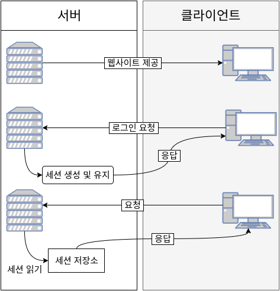
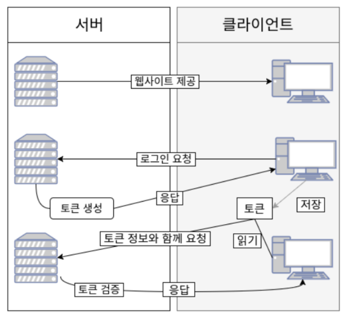
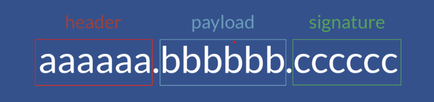

# JWT정리

---
---
**JWT를 왜 쓰는 것인지, 어떤 원리로 가능한 것인지 정리**

- **JSON 웹 토큰**(JSON Web Token, **JWT**)은 선택적 서명 및 선택적 암호화를 사용하여 데이터를 만들기 위한 인터넷 표준

**JWT 이전의 다른 인증 방식**

1. **쿠키 인증방식**
- 쿠키는 Key-Value 형식의 문자열
- 클라이언트가 웹사이트를 방문하면 그 사이트가 사용하고 있는 서버를 통해 클라이언트의 브라우저에 설치됨
- 클라이언트의 브라우저에 정보를 저장하면서 고유의 식별 기능을 함
- 다만 쿠키는 보안에 취약하다는 단점을 가지고 있음. 요청 시 쿠키의 값을 그대로 보내기 때문에 유출 및 조작 당할 위험이 존재한다.

2. **세션 인증방식**

- 세션은 비밀번호 등 클라이언트의 민감한 인증 정보를 브라우저가 아닌 서버에서 저장하고 관리함(쿠키의 단점을 보완)
- 서버의 메모리,  로컬 파일, 데이터베이스 등에 저장함
- 세션 ID 자체를 탈취된다면 보안상의 문제를 일으킬 수 있다는 단점

3. **토큰인증 방식**

- 클라이언트가 서버에 접속하면 서버에서 클라이언트에 토큰을 부여함
- 토큰은 클라이언트가 다시 서버에 요청을 보낼 때 요청 헤더에 토큰을 심어서 보냄
- 클라이언트에 저장됨, 토큰 자체에 데이터가 존재함
- payload가 암호화되지 않아 중요한 정보를 담기에는 위험부담이 존재함

**JWT방식**

- JWT는 정보들을 암호화 시킨 토큰임
- HTTP 헤더에 Access Token을 추가해 서버가 클라이언트를 식별할 수 있음
- **JWT는 JSON 데이터를 Base64 URL-safe Encode 를 통해 인코딩하고, 내부에는 위변조 방지를 위해 개인키를 통한 전자서명도 들어있음**

- **Header**

JWT 에서 사용할 타입과 해시 알고리즘의 종류가 포함됨

- **Payload**

실제로 사용될 정보에 대한 내용을 담고 있는 섹션이다.

- **Signature**

헤더 + 페이로드와 서버가 갖고 있는 key 합친 것을 헤더에서 정의한 알고리즘으로 **암호화**를 한 값이 들어가 있음

**장점**

- JWT는 인증을 위한 별도의 저장소가 필요없음
- 빠른 인증 처리가 가능함
- JWT는 암호화 단계를 거치므로 정보를 안전하게 교환할 수 있음

**JWT 발급시 서버에서 클라이언트에 JWT 어떻게 전송해야하는지 생각해 봅시다.**

- JWT를 사용할 때는 많은 경우 헤더에 AUTHORIZATION 으로 헤더값을 전달함.
- JWT는 데이터량이 많기 때문에 특정 헤더에 값을 넣어 전달함.

**클라이언트에서 서버로 JWT를 어떻게 보내는 지에 대해 생각해봅시다. (Hint : Bearer)**

- 클라이언트에서 서버로 JWT를 보낼때 HTTP 헤더의 AUTHORIZATION으로 헤더값을 전달함

**JWT로 Refresh Token을 추가적으로 발급하면 생기는 장점에 대해 생각해보고, Refresh Token의 보안상 단점도 생각해주세요.**

**장점**

- JWT 토큰 자체에 필요한 정보를 포함하고 있어 빠른 인증이 가능함.
- 토큰의 무결성이 보장됨

**단점**

- 토큰이 한 번 발급되면 만료 기간이 지나기 전까지 계속 사용 가능하므로 만약 토큰이 유출된다면 누군가가 그 토큰을 사용해 악용할 수 있음
