# OSI 7 Layer

# ✏️ OSI 7 Layer

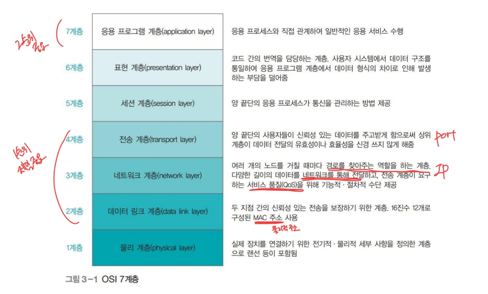

**데이터 전송 흐름**

- 송신지에서 보내는 데이터는 각 계층별로 캡슐화되어 수신지에 전달되고, 수신지에서는 각 계층별로 캡슐화를 풀어 해당 데이터를 확인함

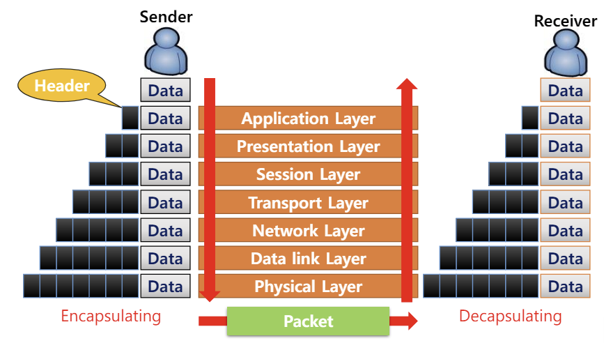

# ✏️ TCP/IP

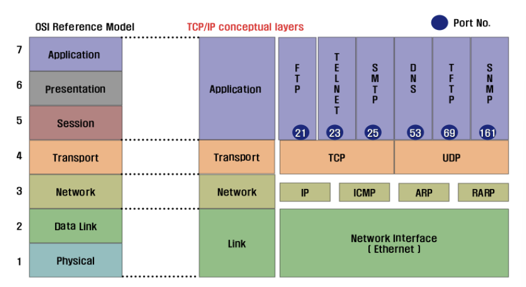

- TCP/IP는 OSI 모델을 기반으로 하고 있으며, 실제 인터넷에 사용됨

---

# ✏️ OSI 7 layer 각 계층별 역할

## ✔️ 물리 계층(1계층)

- 시스템 간의 연결을 의미
- 케이블 내 구리 선의 보호 방법이나 꼬임 방법에 따라 케이블을 분류
    - 일반적으로 UTP를 사용함
- ANSI/EIA 표준 568은 물리 계층에 쓰이는 케이블을 데이터의 속도에 따라 분류
    - 케이블의 종류를 일종의 묶음(CAT)으로 분류

## ✔️ 데이터 링크 계층(2계층)

- 두 포인트 간의 신뢰성 있는 전송을 보장하기 위한 계층으로, CRC 기반의 `오류 제어` 및 `흐름 제어`가 필요
- 물리 계층에서 발생할 수 있는 오류를 찾아내고 수정하는 데 필요한 기능적·절차적 수단을 제공
- `MAC 주소`
    - 데이터 링크 계층에서는 상호 통신을 위해 MAC 주소를 할당 받음
    - `ipconfig/all` 로 확인
    - 12개의 16진수 = 48비트
    - 앞쪽 6개 16진수는 네트워크 카드를 만든 회사를 나타내는 것으로 OUIO
    - 뒤쪽 6개 16진수는 각 회사에서 임의로 붙이는 일종의 시리얼
    - **한 회사에서는 같은 시리얼의 네트워크 카드를 만들지 않기 때문에 같은 MAC 주소는 존재하지 않음**
    
    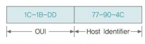
    
- 데이터 링크 계층의 대표적인 네트워크 장비는 `스위치`
    - 같은 LAN, 같은 네트워크에서 동작함
    - IP 주소 사용x
- MAC 계층에서 동작하는 대표적인 프로토콜은 `이더넷`

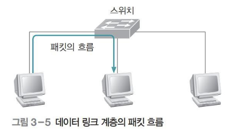

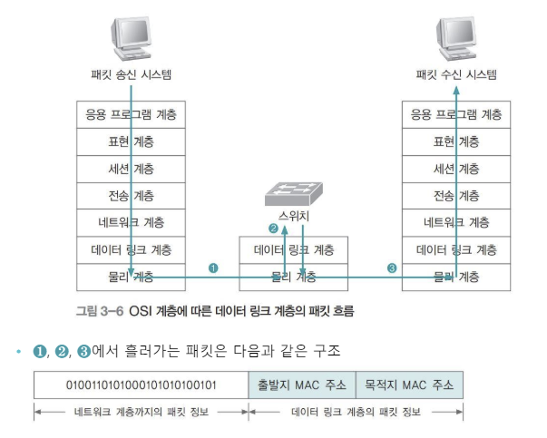

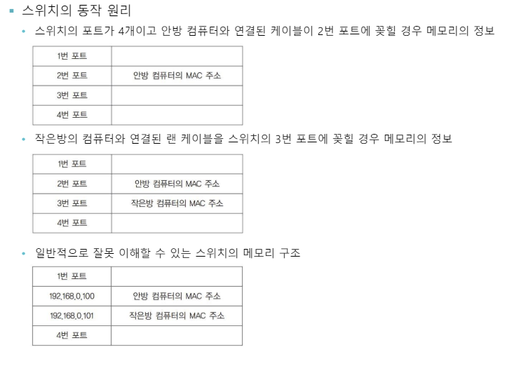

## ✔️ 네트워크 계층(3계층)

- 여러 개의 노드를 거칠 때마다 경로를 찾아주는 역할
- 다양한 길이의 데이터를 네트워크를 통해 전달
- `라우팅`, `흐름 제어`, `세그먼테이션`, `오류 제어` 등을 수행
- `IP 주소`
    - 8비트의 수 4개로 이루어짐
    - A, B, C, D, E 클래스로 구분
        - A 클래스: 첫 번째 자리가 네트워크 주소, 나머지 세 자리는 호스트 주소
        - B 클래스: 두 번째 자리까지 네트워크 주소, 나머지 두 자리는 호스트 주소
        - C 클래스: 세 번째 자리까지 네트워크 주소, 나머지 한 자리는 호스트 주소

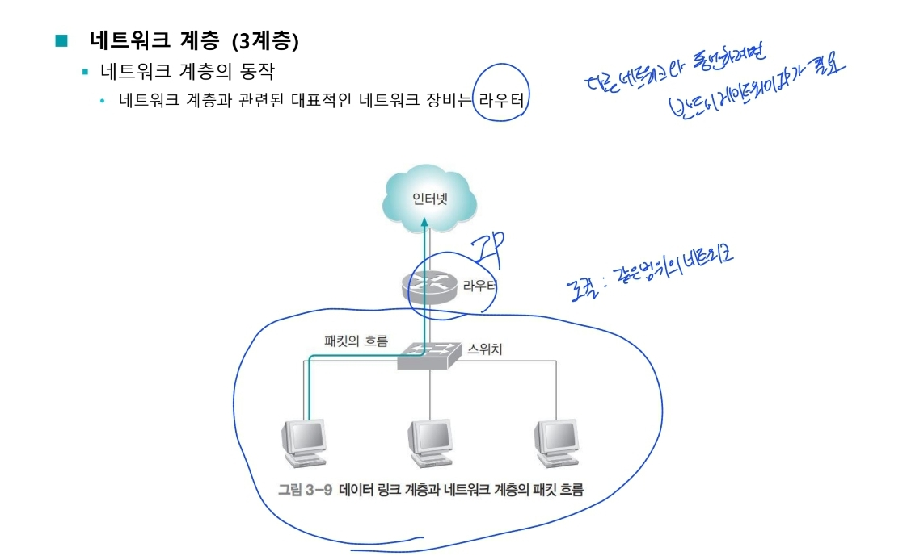

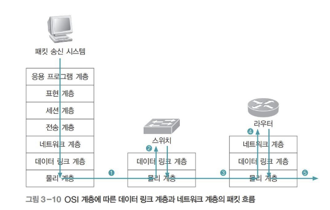

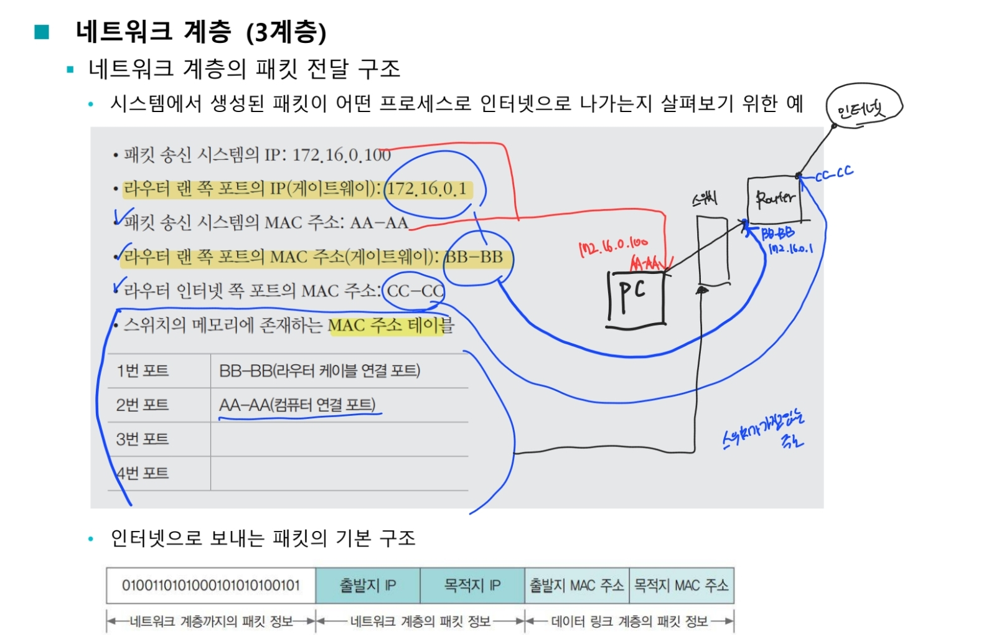

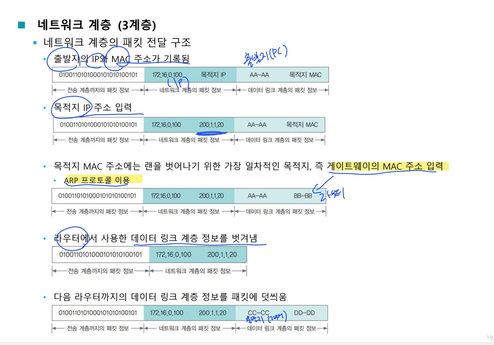

## ✔️ 전송 계층(4계층)

- 양 끝단의 사용자들이 신뢰성 있는 데이터를 주고받을 수 있게 함
- 상위 계층이 데이터 전달의 유효성이나 효율성을 신경 쓰지 않게 해줌
- 시퀀스 넘버 기반의 오류 제어 방식을 사용하여 특정 연결의 유효성을 제어
- 가장 잘 알려진 전송 프로토콜은 TCP로 MAC주소와 IP주소처럼 TCP에도 포트라는 주소가 있음
- `포트`
    - 시스템에 도착한 후 패킷이 찾아갈 응용 프로그램으로 통하는 통로 번호
    - 시스템에서 구동되는 응용 프로그램은 네트워킹을 하기 위해 자신에게 해당되는 패킷을 식별 할 때 사용
    - 포트의 패킷 구조
    
    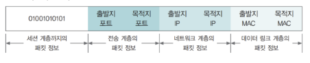
    
    - 출발지 포트는 보통 1025~65535번 중에서 사용하지 않는 임의의 포트를 응용 프로그램별로 할당하여 사용
    
    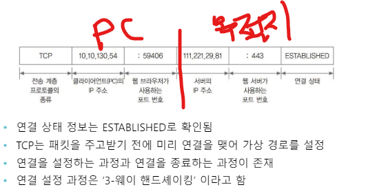
    
- `3-웨이 핸드셰이킹`

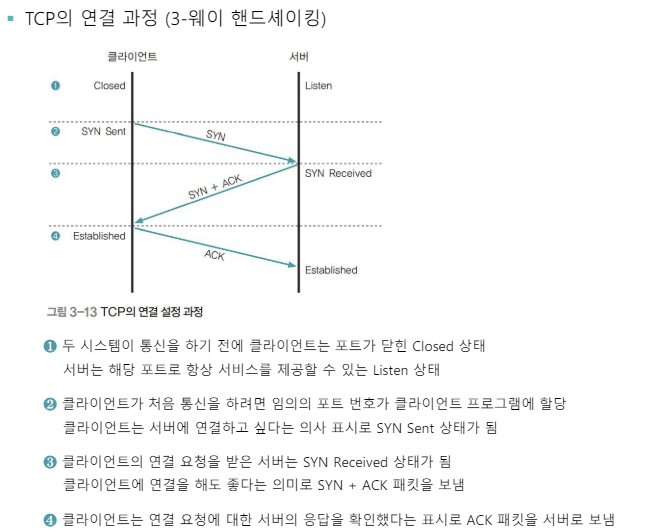

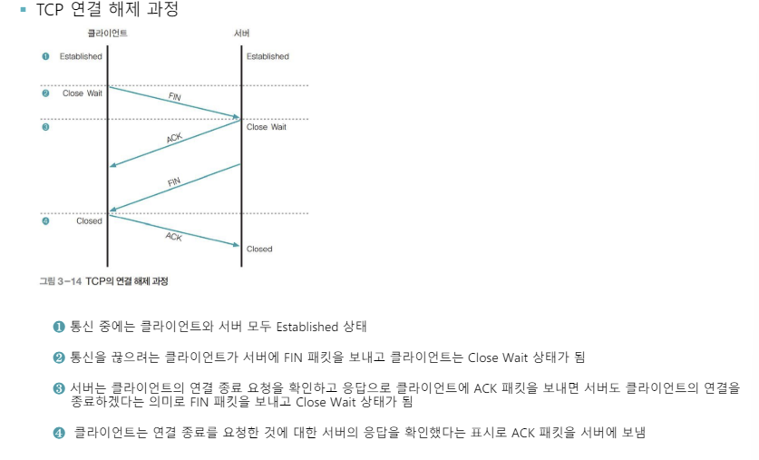

- `TCP` , `신뢰성 높음`
    - 연결 지향형 프로토콜
        - 수신 측이 데이터를 흘려버리지 않도록 하는 데이터 흐름 제어
        - 전송 중에 에러가 발생하면 자동으로 재전송하는 에러 제어 기능
    - 이를 통해 `데이터의 확실한 전송을 보장` 하지만 과정이 완전하지 않아 해커들에게 많은 공격을 받음
- `UDP` , `신뢰성 낮음`
    - TCP와 달리 데이터의 신뢰성 있는 전송을 보장하지 않음
    - 특정한 경우 전송 경로 확립을 위한 번잡함을 생략하고 시간을 절약할 수 있어 UDP가 더 효과적
        - 신뢰성이 매우 높은 회선을 사용하는 경우, 데이터의 확실한 전송을 요구하지 않는 경우, 한 번에 많은 상대에게 메시지를 전송하는 경우

## ✔️ 5~7

**세션 계층(5계층)**

- 양 끝단의 응용 프로세스가 통신을 관리하기 위한 방법을 제공
- 동시 송수신 방식, 반이중 방식, 전이중 방식의 통신과 함께 체크 포인팅, 유휴, 종료, 다시 시작의 과정을 수행
- 전송 계층이 종단 간의 논리적인 설정을 담당한다면 세션 계층은 이런 연결에 정보 교환을 효과적으로 할 수 있게 추가 서비스를 함

**표현 계층(6계층)**

- 데이터의 구조를 하나의 통일된 형식으로 표현.
- 데이터의 압축과 암호화 기능을 수행
- 코드 간의 번역을 담당
- ASN.1 방식
    - 사용자 시스템에서 데이터 구조를 하나의 통일된 형식으로 표현하여 응용 계층의 데이터 형식 차이로 인한 부담을 덜어줌
    - 응용 프로그램 계층 간의 서로 다른 표현을 인식하기 위해 정보를 정의하고 데이터의 압축과 암호화 기능을 수행

**응용 프로그램 계층(7계층)**

- 사용자나 응용 프로그램 사이에 데이터 교환이 가능하게 하는 계층
- 응용 프로세스와 직접 관계하여 일반적인 응용 서비스를 수행
- HTTP, FTP, 터미널 서비스, 메일 프로그램, 디렉터리 서비스 등을 제공

---