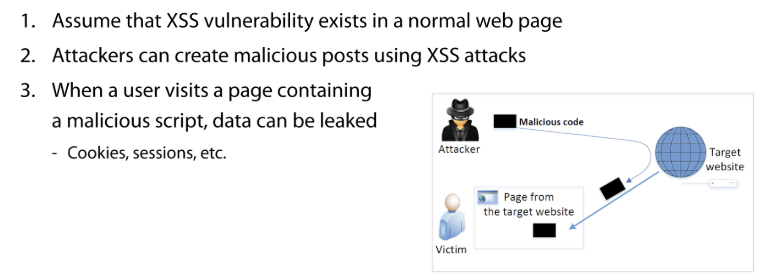

# 12. Web Security

# ✏️ Cross Site Scripting (XSS)

- **A vulnerability that cna target users of a web page**
    - An attacker inserts malicious scripts into web resources to execute them on the user’s web browser
    - Mainly occurs in **client-side language**
        - JavaScript

## ✔️ Reflected XSS attack

- Occurs when the server outputs a request containing a malicious script
- 유저의 입력 값이 HTTP request를 통해 지나가고, response값으로 유저에게 다시 되돌아감

## ✔️ Stored XSS attack

- Occurs when searching for malicious scripts **stored in the server database or file**

## ✔️ Prevent

**`Input Validation`**

- Validate user input in the web application

**`Escape Input`**

- Before outputting user input, **perform escaping to encode special characters**

---

# ✏️ SQL injection

## ✔️ SQL injection

- `Command injection`과 비슷함
- `;` 을 이용해 다음 값을 들고옴

## ✔️ **Blind SQL injection**

- Maliciously retrieve data from a database
- Kind of a twenty questions game(스무고개)

## ✔️ Prevent

- `input validation`
    - String filtering: filters and escapes special strings used in SQL injection from user input
        - ex. escaping characters : `'` , `;`
    - Type check of input value
        - input을 받았을 때, 타입이 같아야함

- `Using parameterized queries`
    - SELECT * FROM table WHERE condition=? →
        - SELCET * FROM table WHERE condition = `value`

---

# ✏️ Attack vectors

- We should separate **the means of attack** & **the goals of the attack**
- Attacker **goals** can be grouped into three classess

## ✔️ Denial of service

- To disrupt the `availability` of critical services
- The main security concern in network environments
- In the software security
    - It can be made to consume all **disk space, memory, and CPU usage**

- target service의 네트워크를 overwhelming with a flood of internet traffic으로 공격
- DDoS attacks involve multiple sources

## ✔️ Leaking information

- To disrupt `confientiality` of critical services
- attacker에게 민감한 정보를 유출당함
- 결과
    - 재정적 손실
    - 운영 방해
    - 신뢰 상실

## ✔️ Privilege escalation