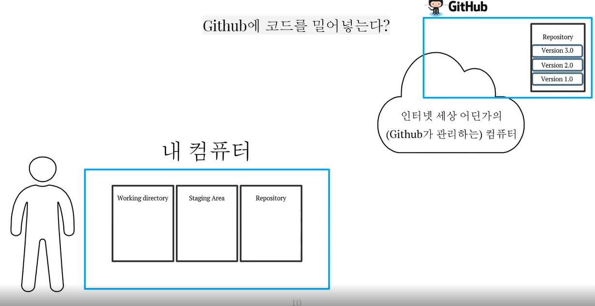

# 버전관리

---
## ✏️ 코드 저장(백업)

### ✔️ 버전이 되기까지 거쳐가는 세 개의 공간

`Working directory`
- 내가 코드 작업을 하는 공간
- 파일들이 생성/수정/삭제되는 공간
- 변경사항이 생기는 공간
- 변경사항들 중 다음 버전이 될 파일들을 선별해서 선별된 파일들을 버전으로 만들기

`Staging area`
- 버전이 될 후보들이 올라오는 공간
- Working directory에서 선별

`Repository`
- 내 컴퓨터 속 local 저장소
- 새 버전으로 만들어줌

---
### ✔️ 명령어
- `git init`
   - 버전 관리 시작
- `git add test.txt` / `git add .`
   - working directory -> staging area로 이동
- `git commit <커밋 메시지>`
   - staging area -> repository로 이동
   1. 짧은 commit message로 빠르게 commit하는 경우 : `git commit -m "xx"`
   2. 길고 자세한 commit message를 남겨야 하는 경우 :
   `git commit`

- `git log`: 커밋(버전) 식별 가능
- `git rm --cached test.txt` : staging area에서 내려옴
- `git status`
- `git commit -am "xx"` : add와 commit을 한 번에 할 수 있음, 한번이라도 커밋을 했던 대상에 대해서만 사용가능

---
### ✔️ 원격 저장소랑 로컬 저장소 연결

- `git remote add origin URL`
   : 로컬 저장소에 원격 저장소 등록해주는 명령어

- `git branch -M main`
- `git push -u origin main`

---
---
## ✏️ 과거 조회, 되돌리기
|어디까지 되돌릴까?|옵션| |
|------|------|------|
|수정한 것까지 통째로|`--hard HEAD^`|"쎄게 되돌리기"|
|add한 것 까지|`--mixed HEAD^`|"적당히 되돌리기"|
|commit한 것만|`--soft HEAD^`|"살짝만 되돌리기"|

- `HEAD^`
   - HEAD: 가장 최근 버전에서(현재 작업중인 브랜치, 커밋 중 가장 최근 커밋을 가리킴)
   - ^ : 하나 되돌리기

- `reset`은 1번 이상의 commit 내역이 있어야 동작한다.

---
**실습**

1. test.txt -> "this is first commit" 작성 후 저장
2. `git add test.txt` / `git commit -m "first commit"`
3. test.txt -> "this is repository" 작성 후 저장
4. `git add test.txt` / `git commit -m "repository"`
5. test.txt -> "this is staging area" 작성 후 저장
6. `git add test.txt`
7. test.txt -> "this is working directory" 작성 후 저장

### ✔️ `git --hard HEAD^`

### ✔️ `git --mixed HEAD^`
- reset의 default라서 mixed안적어도 됨
- `git reset HEAD^`

### ✔️ `git --soft HEAD^`

---
---
## ✏️ 협업