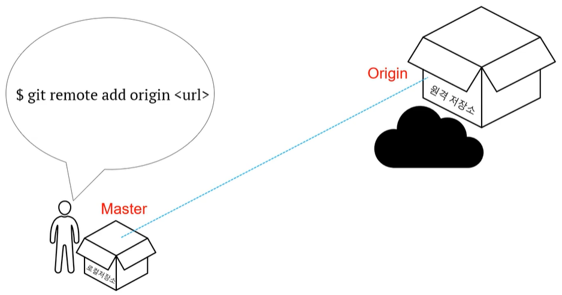

#2.원격

---
---
## ✏️ 로컬/원격
### ✔️ 원격 저장소 조회(추가) / `git remote`

- `git remote (-v)`
- 내 로컬 repository와 상호작용하고 있는(혹은 할 수 있는) 원격 저장소들의 목록을 조회
- (`-v`) 단축이름과 URL같이 보기

> `git remote add origin <url>`
> - `<url>`에 있는 원격저장소를
> - origin이라는 이름으로 추가하기
> - 기존 워킹 디렉토리에 새 원격저장소를 추가

### ✔️ 원격 저장소에 밀어넣기 / `git push`

`git push -u origin master`
 - 내 repository의 master브랜치를
 - origin의 master 브랜치로 push하기
 - `-u`: 디폴트 설정, 앞으로 `git push`사용해도 똑같이 기능하게 설정

### ✔️ 원격 저장소 갖고 와서 합치기 / `git pull`

 `git pull (origin master)`
 - origin을 내 repository의 master 브랜치로 갖고오기(merge)

### ✔️ 원격 저장소 일단 갖고만 오기 / `git fetch`

 `git fetch (origin master)`
 - 동기화시키지는 않고(merge하지 않고)
 - origin을 내 repository의 master 브랜치로 일단 갖고오기
 - local repository의 내용은 변경x
 - fetch내용은 `origin/master`와 같은 곳에서 확인 가능
 - `git checkout origin/master`로 브랜치 변경하면 확인 가능
   - `git checkout FETCH_HEAD`도 같은 기능

### ✔️ 원격 저장소 복사하기 / `git clone`

 `git clone <url>`
 - `<url>`에 있는 원격 저장소 내용을 현재 디렉토리에 복사하기
 - origin 자동으로 생성함

### ✔️ 실습
1. local에 폴더 만들고 파일 생성(test.txt)
2. git init -> git add . -> git commit -m "initial"
3. `git remote add prac1 url1`
4. `git remote add prac2 url2`, 원격 저장소 2개 연결시킴

- `git remote rm prac2`: prac2에 해당하는 원격 저장소 삭제

5. `git push -u prac1 master`

 ---
 ---

