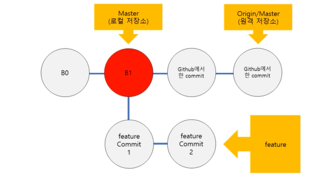

#2.원격

---
---
## ✏️ 로컬/원격
### ✔️ 원격 저장소 조회(추가) / `git remote`

- `git remote (-v)`
- 내 로컬 repository와 상호작용하고 있는(혹은 할 수 있는) 원격 저장소들의 목록을 조회
- (`-v`) 단축이름과 URL같이 보기

> `git remote add origin <url>`
> - `<url>`에 있는 원격저장소를
> - origin이라는 이름으로 추가하기
> - 기존 워킹 디렉토리에 새 원격저장소를 추가


### ✔️ 원격 저장소에 밀어넣기 / `git push`

`git push -u origin master`
 - 내 repository의 master브랜치를
 - origin의 master 브랜치로 push하기
 - `-u`: 디폴트 설정, 앞으로 `git push`사용해도 똑같이 기능하게 설정


### ✔️ 원격 저장소 갖고 와서 합치기 / `git pull`


 `git pull (origin master)`
 - origin을 내 repository의 master 브랜치로 갖고오기(merge)


### ✔️ 원격 저장소 일단 갖고만 오기 / `git fetch`

 `git fetch (origin master)`
 - 동기화시키지는 않고(merge하지 않고)
 - origin을 내 repository의 master 브랜치로 일단 갖고오기
 - local repository의 내용은 변경x
 - fetch내용은 `origin/master`와 같은 곳에서 확인 가능
 - `git checkout origin/master`로 브랜치 변경하면 확인 가능
   - `git checkout FETCH_HEAD`도 같은 기능


### ✔️ 원격 저장소 복사하기 / `git clone`

 `git clone <url>`
 - `<url>`에 있는 원격 저장소 내용을 현재 디렉토리에 복사하기
 - origin 자동으로 생성함


### ✔️ 실습
1. local에 폴더 만들고 파일 생성(test.txt)
2. git init -> git add . -> git commit -m "initial"
3. `git remote add prac1 url1`
4. `git remote add prac2 url2`, 원격 저장소 2개 연결시킴

- `git remote rm prac2`: prac2에 해당하는 원격 저장소 삭제

5. `git push -u prac1 master`

 ---
 ---
## ✏️ 로컬/원격 실습
### ✔️ 내 로컬 저장소 `변함`, 원격 저장소 `변함 없음`

- `push`하면 됨


---
### ✔️ 내 로컬 저장소 `변함 없음`, 원격 저장소 `변함`

- `git pull`로 동기화 후 `push`하기
- `git pull origin main` -> 작업하기 -> `git push origin main`

ex>
- 내 로컬 저장소 파일내용(test.txt -> hello/good/bye)
   - `git commit -am "xx"`까지 완료
- remote저장소 파일내용(test.txt -> hello/good/hello)으로 변경됨
- 이때 `push`하면 마지막 글자(bye, hello) 중 어떤 것이 반영되야함?
   - `git push`할 수 없음이 발생, 깃허브도 반영 우선순위 모름
- 이때 `pull`해도 어떤 것이 반영되는지 모름
- `conflict`발생함
```txt
hello
good
<<<<<<HEAD
bye
======
hello
>>>>>>bhfhsf...
```
<br>

- 해결: 어떤 부분을 우선적으로 합치는지 수동으로 반영해줘야함
- `conflict`발생한 파일을 수동으로 변경하고 `git commit -am` -> `git push`하면 내가 원하는 것 반영 가능


---
### ✔️ 내 로컬 저장소 `변함`, 원격 저장소 `변함`

- 1번, 2번 방법 결과는 같음
- 병합 과정의 차이

#### ✨ 1. `rebase` 방법<br>
 - `git checkout master` / `git merge branch1`<br>


   (1) `fast - forward merge`

   

   (2) `3-way merge`
     - 병합의 결과를 두 브랜치의 최신 커밋 & 공통 조상으로 병합의 결과 판단
     - merge의 결과인 `merge commit`이 생김
     - commit history 관리 어려움


  

   (3) `rebase`


   - 현재 내가 작업하고 있는 branch의 base를 옮긴다
   - base: 현재 내가 작업하고 있는 branch와 합치려는 branch의 공통 조상
   - 합치고자 하는 branch의 최신 commit으로 base를 옮김
   - 쓸데 없는 commit(merge commit)이 생기지 않음(history 관리 용이)

   - `git rebase master`: branch1에서 사용, master branch로 base를 변경해주기/ M2가 base가 됨

- 로컬과 원격 상호작용
  - github에서 커밋을 더 진행하기
  - master로 pull받아 오기
  - `git rebase master` feature branch 에서 사용




> `git log --all --decorate --graph --oneline`

---
#### ✨ 2. `pull request(->merge)` 방법
   - 로컬에서 새로운 브랜치를 만듦
   - commit함
   - commit한 새로운 버전을 원격 저장소에 `pull`해줌(`pull request`)

  (1). 협업 대상 repository fork하기<br>
  (2). fork 해온 곳에서 clone 하기<br>
  (3). `git branch NAME`만들기<br>
  (4). `git checkout NAME` 브랜치로 이동<br>
    - 3번 4번 과정 통합 `git checkout -b NAME`<br>
  (5). 작성하고자 하는 코드 작성, commit하기<br>
  (6). `git push origin NAME` 코드작업을 수행한 branch에 push하기<br>
  (7). `pull request`날리기
  (8). `pull request`날린 branch는 지워주기


