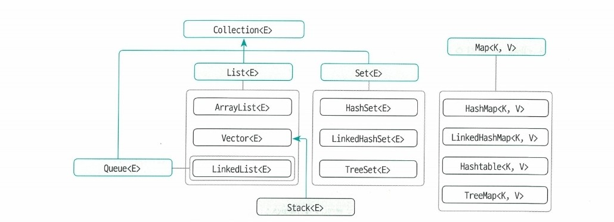
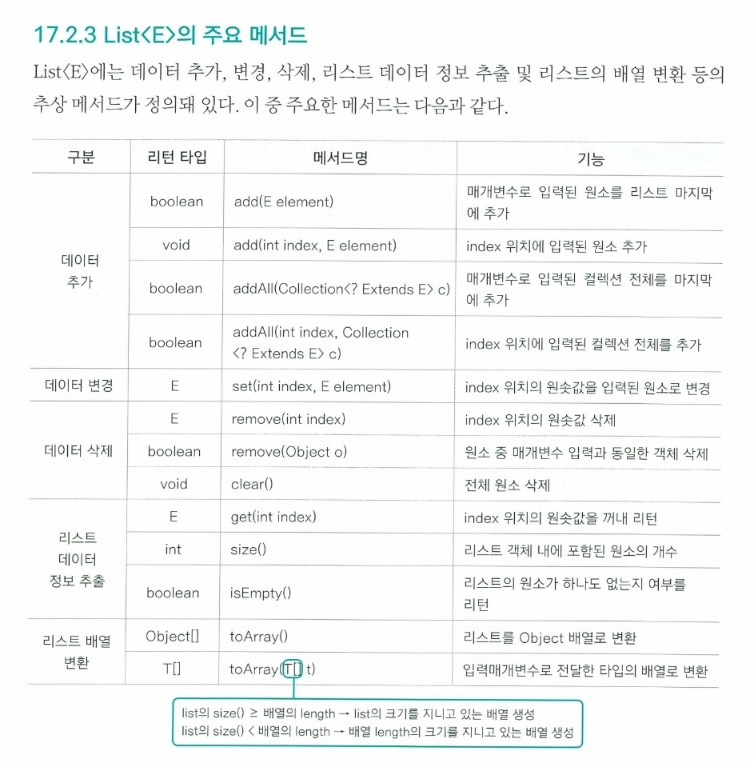

# 컬렉션

---
----
- 데이터의 저장용량을 동적으로 관리할 수 있다는 점에서 배열과 다름



## ✏️ `List<E> 컬렉션 인터페이스`
### ✔️ `List<E>`
- 배열과 다른점은 저장 공간의 크기가 동적으로 변함
```java
//string
String[] array = new String[] {"a", "b", "c"};
System.out.println(Arrays.toString(array));

//list
List<String> alist = new ArrayList<>();
System.out.println(alist);
```

#### ✨ 생성하기

1. 자식 클래스 생성

- `List<E>`는 인터페이스이기 때문에 객체를 스스로 생성하는 것은 불가능
- 자식 클래스로 생성해야함(`ArrayList`, `Vector`, `LinkedList`)

```java
List<제네릭 타입 지정> 참조 변수 = new ArrayList<제네릭 타입 지정>();
List<제네릭 타입 지정> 참조 변수 = new Vector<제네릭 타입 지정>();
List<제네릭 타입 지정> 참조 변수 = new LinkedList<제네릭 타입 지정>();


ArrayList<제네릭 타입 지정> 참조 변수 = new ArrayList<제네릭 타입 지정>();
Vector<제네릭 타입 지정> 참조 변수 = new Vector<제네릭 타입 지정>();
LinkedList<제네릭 타입 지정> 참조 변수 = new LinkedList<제네릭 타입 지정>();
```
- `new ArrayList<Integer>(30);` : capacity=30
- `LinkedList`는 capacity 지정 불가
- capacity기본값은 10


**2. `Arrays.asList()`메서드**
- 정적 컬렉션 객체 생성(List생성하는 다른 방법)
- `List<제네릭 타입> 참조 변수 = Arrays.asList(제네릭 타입 저장 데이터);`
- 내부적으로 배열을 먼저 생성하고 `List<E>`로 래핑해놓은 것
- 내부 구조는 배열과 동일하므로, 저장공간의 크기 변경 불가능
```java
List<Integer> aList1 = Arrays.asList(1,2,3,4);
aList1.set(1, 7); //[1 7 3 4]
aList1.add(5); //오류(저장공간 크기 변경)
aList1.remove(0); //오류(저장공간 크기 변경)
```

#### ✨ 메서드


---
### ✔️ `ArrayList<E>`

- 배열처럼 수집한 원소를 인덱스로 관리하며, 저장용량을 동적으로 관리 가능
- `List<E>`의 모든 메서드 사용 가능
- `aList.toString()`: 배열을 문자로
- `aList.remove(1);`: 1번 인덱스를 삭제
- `aList.remove(new Integer(2));`: 2를 삭제하기

```java
//alist = [1, 2, 3]
Object[] object = alist.toArray(); //[1,2,3]
Integer[] integer1 = alist.toArray(new Integer[0]); //[1,2,3]
Integer[] integer2 = alist.toArray(new Integer[5]); //[1,2,3,null,null]
```


---
### ✔️ `Vector<E>`
- ArrayList, List의 공통적 특징을 모두 가지고 있음
- `동기화 메서드`로 구현되어 있다는 차이점
- 멀티 쓰레드에 적합하도록 설계되어 있음
- 싱글 쓰레드라면 `ArrayList`를 사용하는게 효율적

```java
public synchronized E remove(int index){
    ...
}
```


---
### ✔️ `LinkedList<E>`
- `List<E>`의 공통적인 특징(동일 타입 수집, 메모리 동적 할당, 데이터 추가/변경/삭제 메서드)를 지님
- capacity를 객체를 생성할때 지정할 수 없음
- `ArrayList`와 다르게 linked된 형태로 관리함

> - 데이터 추가, 삭제할 때: `LinkedList<E>`의 속도가 빠름(ArrayList는 수정되면 데이터 이동이 발생)<br>
> - 데이터 검색할 때: `ArrayList<E>`의 속도가 빠름


> - `System.currentTimeMillis()`: 1970년 1월 1일 00시 00분과 현재 시간의 차이를 ms단위로 리턴하는 메서드
> - `System.nanoTime()`: 상대적인 시간 차이를 나노초 단위로 구함, 현재 시간 정보와 관계 없음
