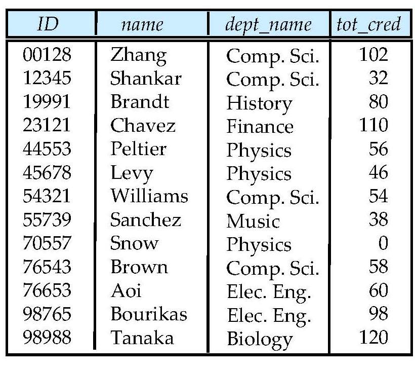
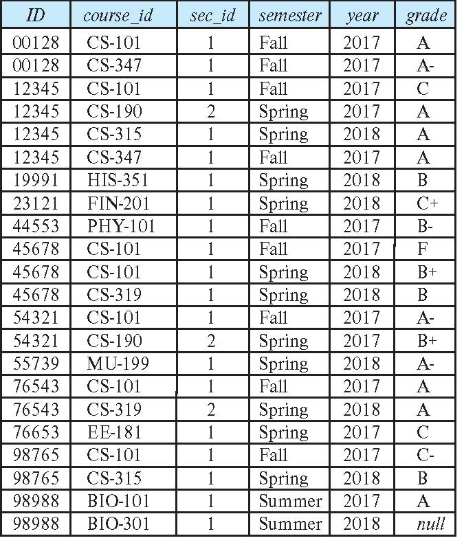
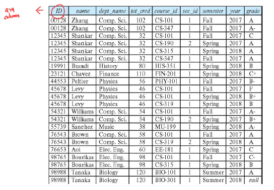
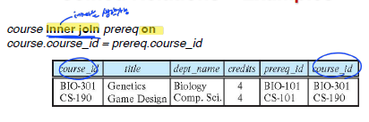
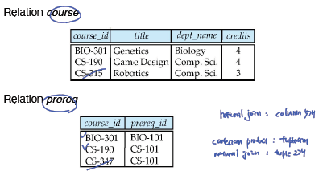
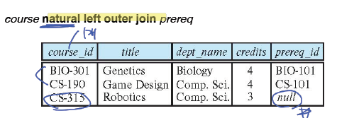
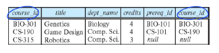
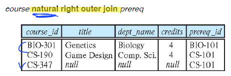
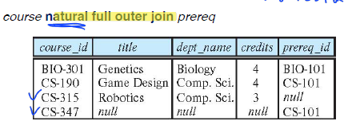
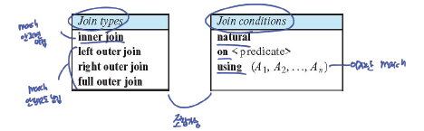

#2.PostgreSQL

---
## ✏️ `Join Expressions`
- `join`연산은 전형적으로 `from`에서 사용됨
1. `inner join`(매칭 안된 것 버림)
   - `Natural join`
2. `outer join`(매칭 안된 것 NULL로 채움)

### ✔️ `Natural Join`
#### ✨ Definition of Natural Join
**cartesian product**
```sql
//List the names of students along with the course ID’s that they have taken

select name, course_id
from students, takes
where student.ID = takes.ID;
```
- column 10개

**natural join**
```sql
select name, course_id
from student natural join takes;
```
- column 9개


**natural join in SQL**
```sql
select A1, A2, … An
from r1 natural join r2 natural join .. natural join rn
where P ;
```
- 여러개의 조인이 가능함
- r1,r2조인 1차 실행, 순서대로 다음 조인 하나씩 실행
- from -> where -> select 순서

**Student**


**Takes**


**student natural join takes**



#### ✨ Using of Natural Join

**`1. Dangerous in natural join`**
- 공통된 모든 속성을 조인하기 때문에 사용에 주의해야함

- List the names of students along with the titles of courses that they have taken
**틀린 버전**
```sql
select name, title
from student natural join takes natural join course;
```
- student 4개 속성, takes 6개 속성 -> ID가 같으므로 natural join하면 9개 속성이됨
- 9개 속성 테이블과 course는 `cousse_id, dept_name`이 같은 속성임
- 의도하지 않은 `dept_name`이 조인됨
- 최종적으로 11개 컬럼이 됨

**올바른 버전**
```sql
select name, title
from student natural join takes, course
where takes.course_id = course.course_id;
```


**`2. Using`**
- To avoid the danger of equating attributes erroneously, we can use the “using” construct that allows us to specify exactly which columns should be
equated.
```sql
select name, title
from (student natural join takes) join course using (course_id)
```
- 중복된 컬럼이 제거됨


**`3. On`**
- `join`사용하면 `on`, or `using`사용하기
- This predicate is written like a `where` clause predicate except for the use of the keyword `on`
```sql
select *
from student join takes on student.ID = takes.ID
```
- ⬆️ `using`과 다르게 중복 칼럼이 제거되지 않음
- 전체 10개 컬럼이 만들어짐
- 아래 sql과 같은 의미
```sql
select *
from student , takes
where student.ID = takes.ID
```
- on에 같은 값 명시하고, where에 다른 조건 두면 가독성 증가함

---
### ✔️ `Outer Join`
- 정보의 손실을 피하는 조인 연산
- 매칭되지 않는 정보를 null로 표현함
- `left outer join`
- `right outer join`
- `full outer join`





#### ✨ `Left Outer Join`


- Most systems display null values as a blank field

- `course left outer join prereq on course.course_id = prereq.course_id`




#### ✨ `Right Outer Join`



#### ✨ `Full Outer Join`



- 정보의 손실이 없음
- `course full outer join prereq using (course_id)`와 같음


#### ✨ `Joined Type and Condition`



- Join condition – defines which tuples in the two relations match.
- Join type – defines how tuples in each relation that do not match any tuple in the other relation (based on the join condition) are treated.


---
---
## ✏️ `Views`

### ✔️ `Using of View`
- A `view` provides a mechanism to hide certain data from the view of certain users.
- Any relation that is not of the conceptual model but is made visible to a
user as a “virtual relation” is called a `view`.
- `create view v as < query expression >;`로 생성함
- `<query expression>`에는 SQL표현이 나옴
- 뷰가 정의되면, 뷰의 이름은 가상 릴레이션으로 사용가능
- 뷰는 새로운 릴레이션을 만드는 것이 아님, 대신 표현식(SQL expression)이 저장되는 것
- `view`는 삭제되기전까지 사용가능, `with`과 다른점

```sql
create view faculty as
select ID, name, dept_name
from instructor ;

//Find all instructors in the Biology department
select name
from faculty
where dept_name = 'Biology’ ;
```
```sql
create view departments_total_salary(dept_name, total_salary) as
   select dept_name, sum (salary)
   from instructor
   group by dept_name ;
```
```sql
create view physics_fall_2017 as
   select course.course_id, sec_id, building, room_number
   from course, section
   where course.course_id = section.course_id
      and course.dept_name = 'Physics'
      and section.semester = 'Fall'
      and section.year = '2017’;

create view physics_fall_2017_watson as
   select course_id, room_number
   from physics_fall_2017 //실제로는 여기에 physics_fall_2017 뷰의 sql이 있는것
   where building= 'Watson';
```
- `physics_fall_2017_watson`의 from의 뷰 `physics_fall_2017`는 실제로 SQL포현식이 들어간것
- 따라서 많은 뷰가 중첩되면 실제로 성능이 낮아짐

---
### ✔️ `Materialized Views`
- Certain database systems allow view relations to be `physically stored`.
  - Physical copy created when the view is defined.
  - Such views are called `materialized view`.
- `create materialized view view_name as …`

- If relations used in the query are updated, the materialized view result
becomes out of date(view 정의에 사용된 relation 수정되면 view 최신 상태 유지함)
   -  Need to maintain the view, by updating the view whenever the
underlying relations are updated.
   - (In PostgreSQL) `refresh materialized view view_name;`
   - 실제 릴레이션 업데이트 -> 뷰 업데이트


---
### ✔️ `Update of View`
- view에 insert문 실행 -> 실제 릴레이션에 insert -> 바뀐 정보로 view만들어줌
- Add a new tuple to faculty view which we defined earlier

`insert into faculty values ('30765', 'Green', 'Music');`
- This insertion must be represented by the insertion into the instructor relation
- faculty에 넣으려면 instructor에 추가되어야 함
- Must have a value for salary.
- Two approaches
   - 1. Reject the insert
   - 2. Inset the tuple `('30765', 'Green', 'Music', null)` into the instructor relation


```sql
create view instructor_info as
   select ID, name, building
   from instructor, department
   where instructor.dept_name= department.dept_name;
```
- `insert into instructor_info
values ('69987', 'White', 'Taylor');`
- 문제1. Which department, if multiple departments in Taylor?
- 문제2. What if no department is in Taylor?
- ex. instructor: `69987, white, null, null`, department: `null, taylor, null`
   - view의 where절을 만족하지 않음
   - 릴레이션들에 값 넣으면, null끼리 매칭됨
   - instructor_info에 추가안됨

```sql
create view history_instructors as
   select *
   from instructor
   where dept_name= 'History’ ;
```
- if we insert ('25566', 'Brown', 'Biology', 100000) into history_instructors?
- PostgreSQL에서 에러가 발생 안함, instructor 릴레이션에 들어가게 됨
- 논리적 오류가 발생함

**결론(view가 업데이트 될 수 있는 조건)**
- 완벽하지는 않음 바로 위 sql, 즉 where문에 대한 조건은 없음
1. The `from` clause has only `one database relation`.
2. The select clause contains only `attribute names of the relation`, and
does not have any `expressions`, `aggregates`, or `distinct` specification.
3. Any attribute not listed in the select clause can be set to `null`
   - 이 속성은 릴레이션에서 `not null`이면 안됨
   - 주키의 일부여도 안됨
4. The query does not have a `group by` or `having` clause.

- view는 만들면 sql 종료해도 남아있음
- 원래있는 릴레이션바뀌면 view도 자연스럽게 변경됨 -> view는 단지 sql문장이기 때문에