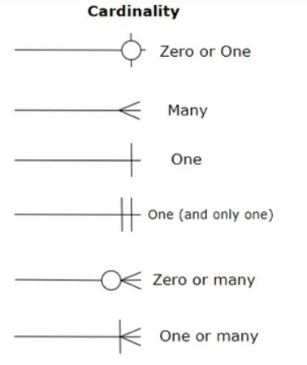
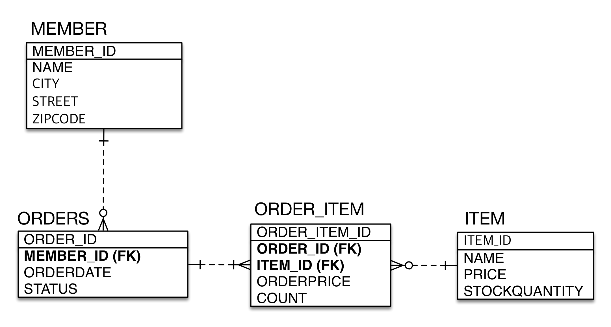
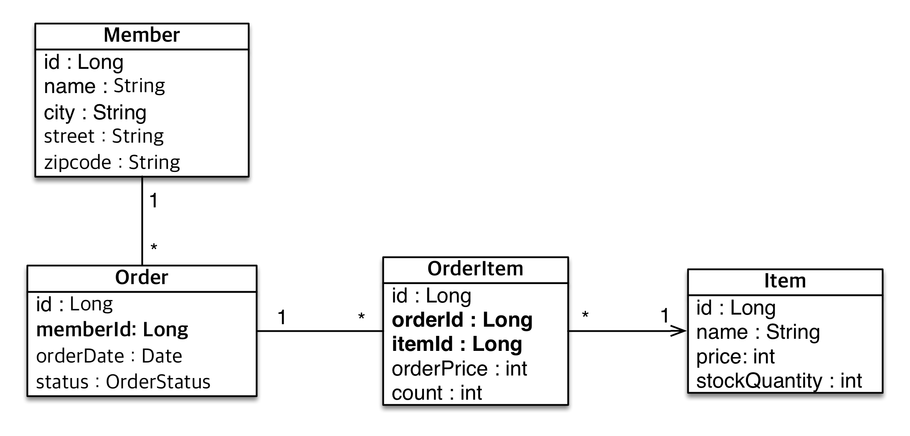

# (JPA)0.실전예제

---


](image/image-16.png)

## ✏️ `2. 엔티티매핑`


```java
@Entity
public class Member {
    @Id @GeneratedValue
    @Column(name = "MEMBER_ID")
    private Long id;

    private String name;
    private String city;
    private String street;
    private String zipcode;
}


@Entity
@Table(name = "ORDERS")
public class Order {

    @Id @GeneratedValue
    @Column(name = "ORDER_ID")
    private Long id;

    @Column(name = "MEMBER_ID")
    private Long memberId;

    @Temporal(TemporalType.TIMESTAMP)
    private Date orderDate;

    @Enumerated(EnumType.STRING)
    private OrderStatus status;
}


@Entity
public class OrderItem {

    @Id @GeneratedValue
    @Column(name = "ORDER_ITEM_ID")
    private Long id;

    @Column(name = "ORDER_ID")
    private Long orderId;

    @Column(name = "ITEM_ID")
    private Long itemId;

    private int orderPrice;
    private int count;
}


@Entity
public class Item {

    @Id @GeneratedValue
    @Column(name = "ITEM_ID")
    private Long id;

    private String name;
    private int price;
    private int stockQuantity;
}
```

### ✔️ 도메인 분석
](image/image-17.png)


### ✔️ 테이블 설계

](image/image-18.png)


### ✔️ 엔티티 설계와 매핑

](image/image-19.png)

- 객체 설계를 테이블 설계에 맞춘 방식
- 테이블의 외래키를 객체에 그대로 가져옴
---
## ✏️ `2. 엔티티매핑`