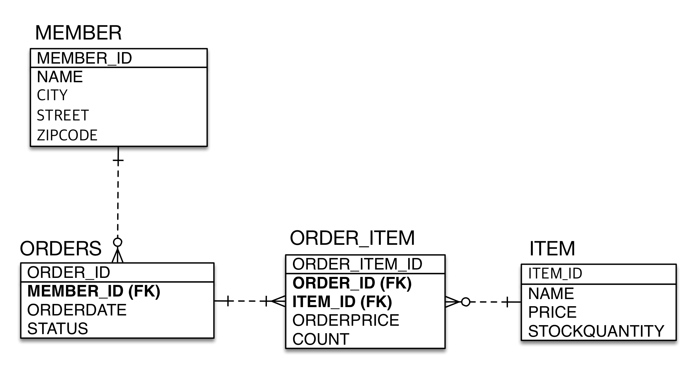

# (JPA)1.영속성,내부동작

---
## ✏️ `JPA 시작해보기`
### ✔️ 구동방식
](image/image-6.png)

• `엔티티 매니저 팩토리`는 하나만 생성해서 애플리케이션 전체에서 공유<br>
• `엔티티 매니저`는 쓰레드간에 공유X (사용하고 버려야함)<br>
• `JPA의 모든 데이터 변경은 트랜잭션 안에서 실행`<br>

```java
public static void main(String[] args) {
        EntityManagerFactory emf = Persistence.createEntityManagerFactory("hello");

        EntityManager em = emf.createEntityManager();

        EntityTransaction tx = em.getTransaction();
        tx.begin();

        try{
           //등록
           Member member = new Member();
           member.setId(1L);
           member.setName("HelloA");
           em.persist(member);

           //조회
           Member findMember = em.find(Member.class, 1L);
           System.out.println("findMember.id = " + findMember.getId());
           System.out.println("findMember.name = " + findMember.getName());

           //삭제
           Member findMember = em.find(Member.class, 1L);
           em.remove(findMember);

           //수정
           Member findMember = em.find(Member.class, 1L);
           findMember.setName("HelloJPA");
        //em.persist(findMember)안써도 됨, 값만 바꿔도 수정됨

            
           List<Member> result = em.createQuery("select m from Member as m", Member.class)
                   .setFirstResult(1)
                   .setMaxResults(8) //page할때 사용
                   .getResultList();
           for (Member member : result){
               System.out.println("member.getName() = " + member.getName());

        }catch(Exception e){
            tx.rollback();
        }finally {
            em.close();
        }

        emf.close();
    }
```
### ✔️ JPQL 소개
• JPA를 사용하면 엔티티 객체를 중심으로 개발<br>
• 그러나 검색을 할 때도 테이블이 아닌 엔티티 객체를 대상으로 검색<br>
• 모든 DB 데이터를 객체로 변환해서 검색하는 것은 불가능<br>
• 애플리케이션이 필요한 데이터만 DB에서 불러오려면 결국 검색 조건이 포함된 SQL이 필요<br>

**JPQL은 엔티티 객체를 대상으로 쿼리**
- 테이블이 아닌 객체를 대상으로 검색하는 객체 지향 쿼리
- SQL을 추상화해서 특정 데이터베이스 SQL에 의존X
- JPQL을 한마디로 정의하면 객체 지향 SQL

**SQL은 데이터베이스 테이블을 대상으로 쿼리**

---
## ✏️ `영속성 컨텍스트`
### ✔️ 정의

](image/image.png)
- 엔티티를 영구 저장하는 환경
- 영속성 컨텍스트는 논리적인 개념, 눈에 보이지 않음
- 엔티티메니저로 접근 가능
- 엔티티메니저와 영속성 컨텍스트는 N:1(스프링)


### ✔️ 생명주기


1. `비영속(new/transient)`
영속성 컨텍스트와 관계가 없는 **새로운** 상태

2. `영속 (managed)`
영속성 컨텍스트에 관리되는 상태

3. `준영속 (detached)`
영속성 컨텍스트에 저장되었다가 분리된 상태

4. `삭제 (removed)`
삭제된 상태

---
#### ✨ 영속, 비영속
```java
public static void main(String[] args) {
        EntityManagerFactory emf = Persistence.createEntityManagerFactory("hello");

        EntityManager em = emf.createEntityManager();

        EntityTransaction tx = em.getTransaction();
        tx.begin();

        try{
           //1. 비영속
           Member member = new Member();
           member.setId(101L);
           member.setName("HelloJPA");
           //2. 영속
           System.out.println("==Before==");
           em.persist(member);
           System.out.println("==After==");
           
           tx.commit(); //영속상태라고 바로 db에 쿼리 주지 않음, 여기서 db에 쿼리 날아감

        }catch(Exception e){
            tx.rollback();
        }finally {
            em.close();
        }

        emf.close();
    }
```
**결과**<br>
```
==Before==
==After==
insert ...
```
- `em.persist(member)`는 영속성 컨텍스트에 넣어주는 역할
- `tx.commit()`에서 DB에 쿼리를 날려줌

#### ✨ 준영속, 삭제
```java
//회원 엔티티를 영속성 컨텍스트에서 분리, 준영속 상태
em.detach(member);

//객체를 삭제한 상태(삭제)
em.remove(member);
```
**준영속**
- 영속 상태의 엔티티가 영속성 컨텍스트에서 분리(detached)
- 영속성 컨텍스트가 제공하는 기능을 사용하지 못함<br>
>
`em.detach(entity)`: 특정 엔티티만 준영속 상태로 전환<br>
`em.clear()`: 영속성 컨텍스트를 초기화함<br>
`em.close()`: 영속성 컨텍스트 종료

---
---
## ✏️ 영속성 컨텍스트의 이점
### ✔️ 1차캐시
](image/image-3.png)

**회원 조회**

1. 영속성 컨텍스트에 이미 존재한다면
```java
 Member findMember = em.find(Member.class, 101L); 
//commit전에 쿼리 안날라감, 영속성 컨텍스트로 들어감
System.out.println("findMember.getId() = " + findMember.getId());  //select 쿼리가 안날아감, 1차 캐시에 저장된 것 꺼냄
```

2. 영속성 컨텍스트에 없다면
```java
//영속
Member findMember1 = em.find(Member.class, 101L); //트랜잭션 처음 시작한다고 가정(이미 101L db 저장), db에서 영속성 컨텍스트에 올려둠(쿼리 날아감)
Member findMember2 = em.find(Member.class, 101L); //영속성 컨텍스트에서 찾음(쿼리 안날아감)
```

### ✔️ 동일성(identity) 보장
- 같은 transaction안에서 발생
- 위 코드랑 이어짐
- 1차 캐시로 반복 가능한 읽기(REPEATABLE READ) 등급의 트랜잭션 격리 수준을 데이터베이스가 아닌 애플리케이션 차원에서 제공
```java
System.out.println("result = " + (findMember1 == findMember2));  //true
```


### ✔️ 트랜잭션을 지원하는 쓰기 지연(transactional write-behind)
**회원 등록**

](image/image-2.png)
- `em.persist(member1)`
- `em.persist(member2)`
- 바로 데이터베이스에 SQL문을 날리는 것이 아닌, 영속성 컨텍스트에 저장하고 쓰기 지연 저장소에 SQL문 저장(2개 저장됨)

](image/image-4.png)
- `tx.commit()`

```java
 //영속
Member member1 = new Member(150L, "A");
Member member2 = new Member(160L, "B");
em.persist(member1);
em.persist(member2);
System.out.println("==================");  //여기까지 Insert 쿼리 안날림

tx.commit(); //커밋하는 순간 DB에 INSERT SQL 보냄
```


### ✔️ 변경 감지(Dirty Checking)

**회원 수정**

](image/image-5.png)

- 트랜잭션 처음 시작한다고 가정했을 때, find에서 SELECT쿼리가 DB에 들어감, 영속성 컨텍스트에 저장함
- `tx.commit()`에서 Update쿼리가 날아감

```java
//영속
Member member = em.find(Member.class, 150L);
member.setName("ZZZZZ");
//em.persist(member) 업데이트할 때 사용할 필요 없음
System.out.println("==================");

tx.commit(); //영속상태라고 바로 db에 쿼리 주지 않음, 여기서 db에 쿼리 날아감
```

<br><br>

>**영속성 컨텍스트는 지연 로딩(Lazy Loading)의 기능도 가지고 있음**

<br>

**회원삭제**
```java
//삭제 대상 엔티티 조회
Member memberA = em.find(Member.class, “memberA");
em.remove(memberA); //엔티티 삭제
```
- 변경 감지의 과정과 동일
---
---
## ✏️ 플러시
### ✔️ 정의

- **영속성 컨텍스트의 변경 내용을 데이터베이스에 반영**

`플러시 발생`
1. 변경 감지(Dirty checking)
2. 수정된 엔티티 쓰기 지연 SQL 저장소에 등록
3. 쓰기 지연 SQL 저장소의 쿼리를 데이터베이스에 전송(등록, 수정, 삭제)

- **영속성 컨텍스트를 비우지 않음!**
- 영속성 컨텍스트의 변경내용을 데이터베이스에 동기화
- 트랙잭션이라는 작업 단위의 커밋 직전에만 동기화하면 됨


### ✔️ 방법

`영속성 컨텍스트를 플러시하는 방법`
1. `em.flush()` - 직접호출
2. `트랜잭션 커밋` - 플러시 자동 호출
3. `JPQL 쿼리 실행` - 플러시 자동 호출


> **JPQL 쿼리 실행시 플러시가 자동으로 호출되는 이유**<br>
> 
```java
em.persist(memberA);
em.persist(memberB);
em.persist(memberC);
//중간에 JPQL 실행
query = em.createQuery("select m from Member m", Member.class);
List<Member> members= query.getResultList();
```
- `persist()`단계에서 SQL쿼리가 DB에 안날라감
- JPQL문으로 원하는 데이터를 찾으려해도 DB에 미리 반영 안되어 있을 수도 있음
- 따라서 JPQL 쿼리 실행시 플러시를 자동 호출해줘서 오류를 방지함

> **플러시 모드 옵션**<br>
> `em.setFlushMode(FlushModeType.COMMIT)`
> - `FlushModeType.AUTO` : 
커밋이나 쿼리를 실행할 때 플러시 (기본값)
> - `FlushModeType.COMMIT` : 커밋할 때만 플러시


