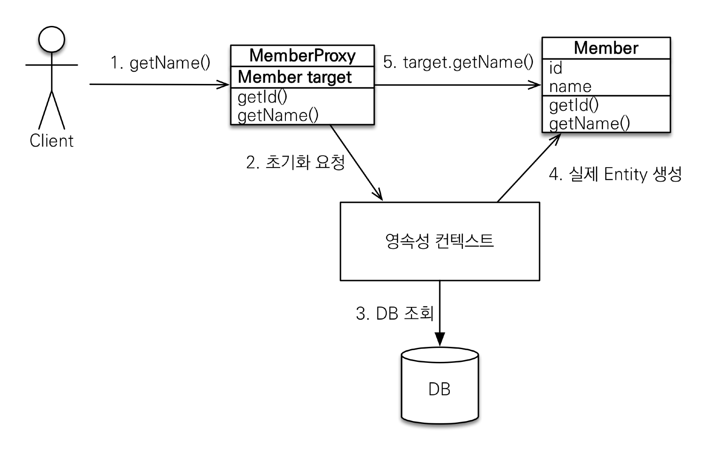

#(JPA)6.프록시와연관관계관리

---
## ✏️ `프록시`
### ✔️ 기초
```java
//멤버만 출력하는 비즈니스 로직
Member member = em.find(Member.class, 1L);
System.out.println("member = " + member.getUsername());

//멤버와 팀 함께 출력하는 비즈니스 로직
Member member = em.find(Member.class, 1L);
String username = member.getUsername();
System.out.println("username = " + username);
Team team = member.getTeam();
System.out.println("team = " + team.getName());
```
- 위 코드에서 find하면 member, team 둘다 DB에서 가져옴
- 그러나 상황에 따라 member만 쿼리로 들고 나오고 싶을때, member,team 한 번에 둘다 쿼리로 들고나오고 싶을때 다른 상황이 발생할 수 있음


**`em.find()` vs `em.getReference()`**
- `em.find()`: 데이터베이스를 통해서 실제 엔티티 객체 조회
- `em.getReference()`: 데이터베이스 조회를 미루는 가짜(프록시)엔티티 객체 조회

---
### ✔️ 프록시 객체 초기화
](image/image-46.png)
> 최초 지연 로딩 시점에는 당연히 참조 값이 없음


<br><br>



- 실제 클래스를 `상속` 받아서 만들어짐
- 실제 클래스와 겉 모양이 같음
- 사용하는 입장에서는 진짜 객체인지 프록시 객체인지 구분하지 않고 사용하면 됨(이론상)
- 프록시 객체는 실제 객체의 참조(target)를 보관
- 프록시 객체를 호출하면 프록시 객체는 실제 객체의 메소드 호출

```java
//1,2,3 공통으로 사용=======
Member member= new Member();
member.setUsername("hello");
em.persist(member);

em.flush();
em.clear();
//=========================

// 1. member와 team을 JPA가 join해서 다 들고옴
Member findMember = em.find(Member.class, member.getId());
            
// 2. select쿼리가 안날아감
Member findMember = em.getReference(Member.class, member.getId());

// 3. select쿼리가 날아감(실제 사용되는 시점, username시점)(id는 이미 존재하기때문에 username시점에 쿼리 나감)
Member findMember = em.getReference(Member.class, member.getId()); 
System.out.println("findMember.getClass() = " + findMember.getClass());   //Member$HibernateProxy... (가짜)

System.out.println("findMember.id = " + findMember.getId());//1(ID값을 getReference할때 값을 넣음, 이미 있기 때문에 쿼리 안날림)
System.out.println("findMember.username = " + findMember.getUsername()); //db에 있는것 들고오기 위해 쿼리 날림
```
- 한번 `getName`초기화했으면 db에 다시 조회할 필요없음

---
### ✔️ 특징
1. `프록시 객체는 처음 사용할 때 한 번만 초기화`
2. `프록시 객체를 초기화 할 때, 프록시 객체가 실제 엔티티로 바뀌는 것은 아님, 초기화되면 프록시 객체를 통해서 실제 엔티티에 접근 가능`
3. `프록시 객체는 원본 엔티티를 상속받음, 따라서 타입 체크시 주의해야함 (== 비교 실패, 대신 instance of 사용)`
   - 타입비교는 `==`으로 하지않기, 실제 비즈니스에서는 메서드 등에서 어떤값이 오는지 헷갈리고 모름

```java
//공통사용=====================
Member member1 = new Member();
member1.setUsername("member1");
em.persist(member1);
Member member2 = new Member();
member2.setUsername("member2");
em.persist(member2);

em.flush();
em.clear();
//============================
Member m1 = em.find(Member.class, member1.getId());
Member m2 = em.find(Member.class, member2.getId());
System.out.println("(m1.getClass() == m2.getClass()) = " + (m1.getClass() == m2.getClass())); // true(엔티티)
```
```java
Member m1 = em.find(Member.class, member1.getId());
Member m2 = em.getReference(Member.class, member2.getId());
System.out.println("(m1.getClass() == m2.getClass()) = " + (m1.getClass() == m2.getClass())); //false
System.out.println(" (m1 instanceof Member) = " + (m1 instanceof Member)); //true
System.out.println("(m2 instanceof Member) = " + (m2 instanceof Member)); //true
```
<br><br>

4. `영속성 컨텍스트에 찾는 엔티티가 이미 있으면 em.getReference()를 호출해도 실제 엔티티 반환`
```java
Member m1 = em.find(Member.class, member1.getId());
System.out.println("m1.getClass() = " + m1.getClass()); //member객체, 영속성 컨텍스트에 올라가게 됨

Member reference = em.getReference(Member.class, member1.getId());
System.out.println("reference.getClass() = " + reference.getClass()); //실제 엔티티 객체, 영속성 컨텍스트에 올라와 있기 때문

System.out.println("(m1 == reference) = " + (m1 == reference)); //true, 같은 영속성컨텍스트 안에서 가져오고,pk같으면 jpa는 true반환
```

```java
Member m1 = em.getReference(Member.class, member1.getId()); //proxy
Member reference = em.getReference(Member.class, member1.getId()); //proxy
System.out.println("(m1 == reference) = " + (m1 == reference)); //true(같은 proxy)
```
```java
Member refMember = em.getReference(Member.class, member1.getId());//proxy
Member findMember = em.find(Member.class, member1.getId()); //실제 DB에 select쿼리 날아감, 그러나 proxy가 반환됨
System.out.println("(m1 == reference) = " + (refMember == findMember)); //true(JPA가 true보장해주기 위해 값들 조정함)
```

<br><br>

5. `영속성 컨텍스트의 도움을 받을 수 없는 준영속 상태일 때, 프록시를 초기화하면 문제 발생`
- (하이버네이트는 org.hibernate.LazyInitializationException 예외를 터트림)

```java
Member refMember = em.getReference(Member.class, member1.getId());
System.out.println("refMember.getClass() = " + refMember.getClass()); //proxy

//셋 중 하나 사용
em.detach(refMember); //영속성컨텍스트에서 관리안함
em.clear();
em.close();

System.out.println("refMember.getUsername() = " + refMember.getUsername()); //초기화 시도, exception이라서 exception보기

//===============
catch(Exception e){
    tx.rollback();
    e.printStackTrace();
}
```
---
### ✔️ 확인
- 프록시 인스턴스의 초기화 여부 확인
PersistenceUnitUtil.isLoaded(Object entity)
```java
//초기화 확인
Member refMember = em.getReference(Member.class, member1.getId());
System.out.println("emf.getPersistenceUnitUtil().isLoaded(refMember) = " + emf.getPersistenceUnitUtil().isLoaded(refMember)); //false(아직 초기화 안함)
```


- 프록시 클래스 확인 방법
entity.getClass().getName() 출력(..javasist.. or
HibernateProxy…)
- 프록시 강제 초기화
org.hibernate.Hibernate.initialize(entity);
- 참고: JPA 표준은 강제 초기화 없음
    - 강제 호출: `member.getName()`

```java
Member refMember = em.getReference(Member.class, member1.getId());
//둘 중 하나
refMember.getUsername(); //강제초기화한것임
Hibernate.initialize(refMember); //좀 세려된 강제초기화 방법
System.out.println("emf.getPersistenceUnitUtil().isLoaded(refMember) = " + emf.getPersistenceUnitUtil().isLoaded(refMember)); //true, username탐색하면서 초기화함
```
---
---
## ✏️ `즉시로딩과 지연로딩`
### ✔️ 조인전략(각각 테이블 변환)