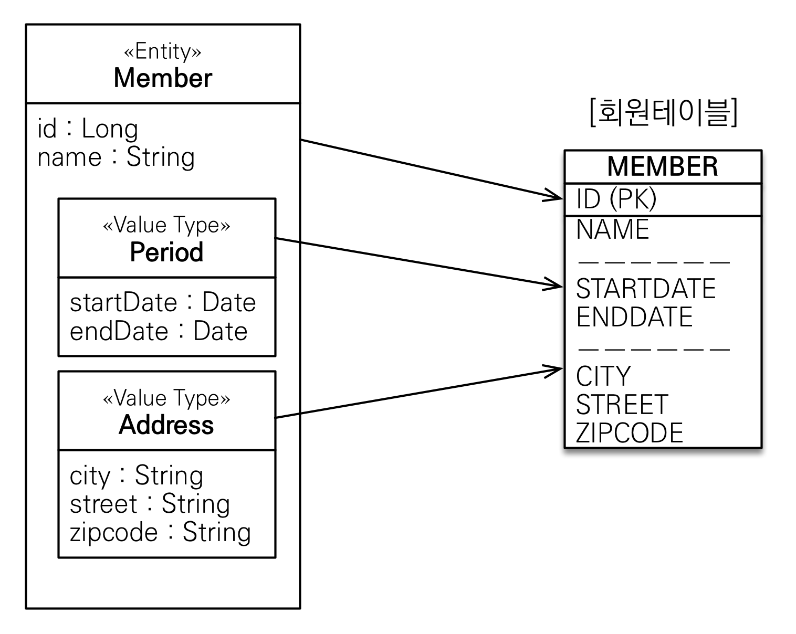
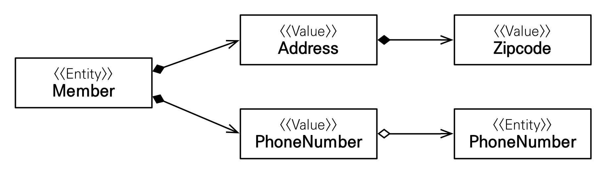
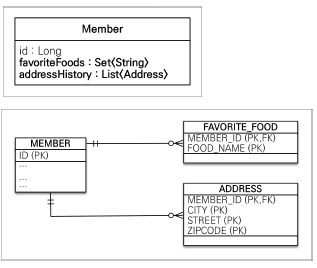
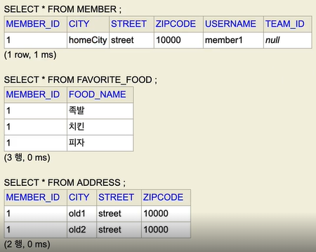
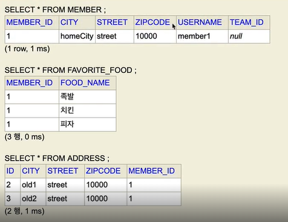

#(JPA)7.값타입

---
**JPA 데이터 타입 분류**
1. 엔티티 타입
- `@Entity`로 정의하는 객체
- 데이터가 변해도 식별자(ex.id)로 지속해서 추적 가능
- ex) 회원 엔티티의 키나 나이 값을 변경해도 식별자로 인식 가능

2. 값 타입
- `int`, `Integer`, `String`처럼 단순히 값으로 사용하는 자바 기본 타입이나 객체
- 식별자가 없고 값만 있으므로 변경시 추적 불가
- ex) 숫자 100을 200으로 변경하면 완전히 다른 값으로 대체<br>
    1) 기본값 타입
    - 자바 기본 타입(int, double)
    - 래퍼 클래스(Integer, Long)
    - String

    2) 임베디드 타입(embedded type, 복합 값 타입)

    3) 컬렉션 값 타입(collection value type)

---
---
## ✏️ `기본값 타입`

- 생명주기를 엔티티에 의존
- ex.) Member를 삭제하면 이름, 나이 필드도 함께 삭제
- 값 타입은 공유하면 안됨
- ex.) 회원 이름 변경시 다른 회원의 이름도 함께 변경되면 안됨

**참고: 자바의 기본 타입은 절대 공유X**
- `int`, `double` 같은 기본 타입(primitive type)은 절대 공유X
- 기본 타입은 항상 값을 복사함
- `Integer`같은 래퍼 클래스나 `String` 같은 특수한 클래스는 공유가능한 객체이지만 변경X

```java
int a = 10;
int b = a;

a = 20; //기본타입은 공유x
System.out.println("a = " + a); //20
System.out.println("b = " + b); //10

Integer a = new Integer(10);
Integer b = a; // a주소값이 넘어감
//이론상 a를 20올 바꾸면 b도 변경됨
//그러나 a의 값을 20으로 변경하는것이 불가능
```

---
---
## ✏️ `임베디드 타입`
### ✔️ 기초
- 새로운 값 타입을 직접 정의할 수 있음
- JPA는 `임베디드 타입(embedded type)`이라 함
- 주로 기본 값 타입을 모아서 만들어서 복합 값 타입이라고도 함

**사용법**
- `@Embeddable`: 값 타입을 정의하는 곳에 표시
- `@Embedded`: 값 타입을 사용하는 곳에 표시
- `기본 생성자 필수`


**임베디드 타입과 테이블 매핑**
- 임베디드 타입은 엔티티의 값일 뿐이다.
- 임베디드 타입을 사용하기 전과 후에 매핑하는 테이블은 같음
- 객체와 테이블을 아주 세밀하게(find-grained) 매핑하는 것이 가능
- 잘 설계한 ORM 애플리케이션은 매핑한 테이블의 수보다 클래스의 수가 더 많음

```java
//MemberE
@Embedded
private Period workPeriod;
@Embedded
private Address homeAddress;
```
```java
@Embeddable
public class Address {
    private String city;
    private String street;
    //@Column(name = "ZIPCODE")
    private String zipcode;

    //private Member member;

    public Address(){}
    public Address(String city, String street, String zipcode) {
        this.city = city;
        this.street = street;
        this.zipcode = zipcode;
    }
    ...
}
```
```java
@Embeddable
public class Period {
    private LocalDateTime startDate;
    private LocalDateTime endDate;
    ...
}
```

```java
MemberE memberE = new MemberE();
memberE.setUsername("hello");
memberE.setHomeAddress(new Address("city", "street", "10"));
memberE.setWorkPeriod(new Period());
em.persist(memberE);
```
**장점**
- 재사용이 용이함
- 높은 응집도
- `Period.isWork()`처럼 해당 값 타입만 사용하는 의미 있는 메소드를 만들 수 있음
- 임베디드 타입을 포함한 모든 값 타입은, 값 타입을 소유한 엔티티에 생명주기를 의존함


### ✔️ 활용
#### ✨ 임베디드 타입과 연관관계

- 임베디드타입은 임베디드타입을 가질 수 있음
- `PhoneNumber`임베디드타입이 엔티티를 가지고 있음

ex.
```java
@Embeddable
public class Address {
    private String city;
    private String street;
    private String zipcode;

    private Member member; //엔티티
    ...
}
```

#### ✨ `@AttributeOverride`: 속성 재정의
- 한 엔티티에서 같은 값 타입을 사용한다면?
- 컬럼 명이 중복됨, 오류 발생
```java
//MemberE
@Embedded
private Address homeAddress;
@Embedded
private Address workAddress;
```
- `@AttributeOverrides`, `@AttributeOverride`를 사용해서 컬럼명 속성을 재정의

```java
//MemberE
@Embedded
@AttributeOverrides({
    @AttributeOverride(name="city",
        column = @Column(name = "WORK_CITY")),
    @AttributeOverride(name="street",
        column = @Column(name = "WORK_STREET")),
    @AttributeOverride(name="zipcode",
        column = @Column(name = "WORK_ZIPCODE"))
}) 
private Address workAddress;
```

#### ✨ 임베디드 타입과 `null`
```java
//MemberE
@Embedded
private Period workPeriod;     
//=null이면 안에있는 값들(2개)도 모두 null
```
- 임베디드 타입의 값이 `null`이면 매핑한 컬럼 값은 모두 `null`

---
---
## ✏️ `값타입과 불변객체`

- 임베디드 타입 같은 값 타입을 여러 엔티티에서 공유하면 위험함
```java
Address address = new Address("city", "street", "10000");

MemberE memberE1 = new MemberE();
memberE1.setUsername("member1");
memberE1.setHomeAddress(address);
em.persist(memberE1);

MemberE memberE2 = new MemberE();
memberE2.setUsername("member1");
memberE2.setHomeAddress(address);
em.persist(memberE2);

memberE1.getHomeAddress().setCity("newCity"); 
//memberE2의 값도 바뀜,update쿼리 2번나감
```
- `MemberE`테이블을 살펴보면 memberE1, memberE2 값들이 모두 바뀐것을 알 수 있음
- 값 타입의 실제 인스턴스인 값을 공유하는 것은 위험
- 대신 값(인스턴스)를 복사해서 사용하기

```java
Address address = new Address("city", "street", "10000");

MemberE memberE1 = new MemberE();
memberE1.setUsername("member1");
memberE1.setHomeAddress(address);
em.persist(memberE1);

Address copyAddress = new Address(address.getCity(), address.getStreet(), address.getZipcode());

MemberE memberE2 = new MemberE();
memberE2.setUsername("member1");
memberE2.setHomeAddress(copyAddress);
em.persist(memberE2);
```

**객체 타입의 한계**
- 항상 값을 복사해서 사용하면 공유 참조로 인해 발생하는 부작용을 피할 수 있음
- 문제는 임베디드 타입처럼 직접 정의한 값 타입은 자바의 기본타입이 아니라 객체 타입임
- 자바 기본 타입에 값을 대입하면 값을 복사함
- 그러나 객체 타입은 참조 값을 직접 대입하는 것을 막을 방법이 없음
- 객체의 공유 참조는 피할 수 없음
```java
//기본 타입(primitive type)
int a = 10;
int b = a;//기본 타입은 값을 복사
b = 4;

//객체 타입
Address a = new Address(“Old”);
Address b = a; //객체 타입은 참조를 전달
b.setCity(“New”);
```
---
### ✔️ 불변 객체

- 객체 타입을 수정할 수 없게 만들면 부작용을 원천 차단할 수 있음
- 값 타입은 불변 객체(immutable object)로 설계해야함
- 불변 객체: 생성 시점 이후 절대 값을 변경할 수 없는 객체
- 생성자로만 값을 설정하고 수정자(Setter)를 만들지 않으면 됨
- 수정자를 `private`으로 만들어도 됨
- 참고: `Integer`, `String`은 자바가 제공하는 대표적인 불변 객체

```java
//불변객체(setter사용 불가라고 가정)
Address newAddress = new Address("NewCity", address.getStreet(), address.getZipcode()); //새로만들기

memberE1.setHomeAddress(newAddress);//값을 통으로 갈아끼움
```

---
### ✔️ 값타입의 비교

- 값 타입: 인스턴스가 달라도 그 안에 값이 같으면 같은 것으로 봐야 함

```java
int a = 10;
int b = 10;
System.out.println("(a == b) = " + (a == b));  //true

Address address1 = new Address("city", "street", "10000");
Address address2 = new Address("city", "street", "10000");

System.out.println("address1 == address2 = " + (address1 == address2)); //false(참조값이 다름)
System.out.println("address1 equals address2 = " + (address1.equals(address2))); //false(오버라이드 안한, 기본이 ==)
```
>동일성(identity) 비교: 인스턴스의 참조 값을 비교, == 사용<br>
>동등성(equivalence) 비교: 인스턴스의 값을 비교, equals()사용

- 값 타입은 a.equals(b)를 사용해서 동등성 비교를 해야 함
- 값이 같으면 같은 것으로 봐야하기 때문에 `equals`오버라이드 해줌(주로 모든 필드를 다 지정해야함)

```java
@Override
public boolean equals(Object o) {
    if (this == o) return true;
    if (o == null || getClass() != o.getClass()) return false;
    Address address = (Address) o;
    return Objects.equals(city, address.city) && Objects.equals(street, address.street) && Objects.equals(zipcode, address.zipcode);
}

@Override
public int hashCode() {
    return Objects.hash(city, street, zipcode);
}
```
`System.out.println("address1 equals address2 = " + (address1.equals(address2)));`결과가 true가 됨, 내용이 같기 때문


---
---
## ✏️ `값타입 컬렉션`
### ✔️ 기초

- 식별자 id같은 것을 넣으면, 값타입이 아닌 엔티티가 되어버림
- 따라서 값들만 테이블에 저장하고, 모두 묶어서 pk로 저장함



```java
//MemberE
@Embedded
private Address homeAddress;

@ElementCollection
@CollectionTable(name = "FAVORITE_FOOD", joinColumns =
    @JoinColumn(name = "MEMBER_ID"))//외래키로 잡음
@Column(name = "FOOD_NAME") //임베디드타입이 아니고 내가 정의한 String한개라서 컬럼 이름 지정 가능
private Set<String> favoriteFoods = new HashSet<>();

@ElementCollection
@CollectionTable(name = "ADDRESS", joinColumns =
     @JoinColumn(name = "MEMBER_ID"))
private List<Address> addressHistory = new ArrayList<>();
```
- 테이블 Member: ..city,street,zipcode..들어가 있음
- 테이블 FAVORITE_FOOD: MEMBER_ID, FOOD_NAME
- 테이블 ADDRESS: MEMBER_ID, city, street, zipcod
<br><br>

- 값 타입을 하나 이상 저장할 때 사용
- `@ElementCollection`, `@CollectionTable` 사용
- 데이터베이스는 컬렉션을 같은 테이블에 저장할 수 없음
    - 데이터베이스에는 여러개의 값을 가지는 컬렉션을 저장하는 것이 불가능
    - 따라서 꼼수로 일대다 형식의 별도의 테이블 만듦

- 컬렉션을 저장하기 위한 별도의 테이블이 필요함

---
### ✔️ 활용
#### ✨ 값타입 저장
```java
MemberE memberE = new MemberE();
memberE.setUsername("member1");
memberE.setHomeAddress(new Address("homeCity", "street", "10000"));

memberE.getFavoriteFoods().add("치킨");
memberE.getFavoriteFoods().add("족발");
memberE.getFavoriteFoods().add("피자");

memberE.getAddressHistory().add(new Address("old1", "street", "10000"));
memberE.getAddressHistory().add(new Address("old2", "street", "10000"));

em.persist(memberE);
//Member insert, addressHistory 2번 insert, favoriteFood 3번 insert
```


- 값 타입 컬렉션을 따로 persist하지 않아도 persist됨
- 값 타입은 라이프사이클은 엔티티에 의존함
> 참고: 값 타입 컬렉션은 영속성 전이(Cascade) + 고아 객체 제거 기능을 필수로 가진다고 볼 수 있음

#### ✨ 값타입 조회
```java
...위에서 이어짐
em.flush();
em.clear();

MemberE findMemberE = em.find(MemberE.class, memberE.getId());
//member만 select로 가져옴, 나머지 컬렉션 2개는 지연로딩
            
List<Address> addressHistory = findMemberE.getAddressHistory();  //여기서 쿼리로 들고옴
for(Address address : addressHistory){
    System.out.println("address.getCity() = " + address.getCity());
}
Set<String> favoriteFoods = findMemberE.getFavoriteFoods(); //여기서 쿼리로 들고옴
for(String favoriteFood : favoriteFoods){
    System.out.println("favoriteFood = " + favoriteFood);
}
```
- 값 타입 컬렉션도 지연 로딩 전략 사용

#### ✨ 값타입 수정
- 컬렉션의 값만 변경해도 자동으로 데이터베이스에 변경된 내용 쿼리로 날려줌

```java
MemberE findMemberE = em.find(MemberE.class, memberE.getId());
// findMemberE.getHomeAddress().setCity("newCity"); //이거 사용하면 안됨, 값타입은 불변해야함

//이거 사용해서 완전히 교체해야함
Address a = findMemberE.getHomeAddress();
findMemberE.setHomeAddress(new Address("newCity", a.getStreet(), a.getZipcode()));


//===========
//컬렉션 값 타입 변경하기
//String을 완전히 교체하기
findMemberE.getFavoriteFoods().remove("치킨");
findMemberE.getFavoriteFoods().add("한식");

//Address
findMemberE.getAddressHistory().remove(new Address("old1", "street", "10000"));
findMemberE.getAddressHistory().add(new Address("newCity1", "street", "10000"));
```
 - `Address`부분 보기: `remove`는 기본적으로 `equals`로 찾고 제거함
 - 오버라이딩 똑바로 안하면 오류발생
 - `Address`부분 보면 `ADDRESS`테이블에서 `old1`을 제거할때 테이블 내용을 모두 지우는 `delete`쿼리가 날아감, 이후 `old2`, `newCity1`을 삽입하는 `insert`쿼리가 날아감
---
 **값 타입 컬렉션의 제약사항**
- 값 타입은 엔티티와 다르게 식별자(ex. ID) 개념이 없음
- 따라서 값을 변경하면 추적이 어려움
- `값 타입 컬렉션에 변경 사항이 발생하면, 주인 엔티티와 연관된 모든 데이터를 삭제하고, 값 타입 컬렉션에 있는 현재 값을 모두 다시 저장한다`
   - ex. 바로 위 코드에서 ADDRESS테이블에서 `MEBER_ID`와 관련된 모든 데이터(old1..)을 삭제함
   - 사용을 지양하는것이 좋음
- 값 타입 컬렉션을 매핑하는 테이블은 모든 컬럼을 묶어서 기본키를 구성해야 함: null 입력X, 중복 저장X
    - 모든 칼럼이 PK가 됨


**값 타입 컬렉션 대안**


- 실무에서는 상황에 따라 값 타입 컬렉션 대신에 `일대다 `관계를 고려해보기
```java
@Entity
@Table(name = "ADDRESS")
public class AddressEntity {
    @Id
    @GeneratedValue
    private Long id;
    private Address address;

    public AddressEntity(String city, String street, String zipcode){
        this.address = new Address(city, street, zipcode);
    }
    ...
}
```
```java
//memberE
//@ElementCollection이거 대신 사용

@OneToMany(cascade = CascadeType.ALL, orphanRemoval = true)
@JoinColumn(name = "MEMBER_ID")
private List<AddressEntity> addressHistory = new ArrayList<>();
```
```java
...
memberE.getAddressEntity().add(new AddressEntity("old1", "street", "10000"));
memberE.getAddressEntity().add(new AddressEntity("old2", "street", "10000"));
...
```
- 일대다 관계를 위한 엔티티를 만들고, 여기에서 값 타입을 사용
- 영속성 전이(Cascade) + 고아 객체 제거를 사용해서 값 타입 컬렉션 처럼 사용

- 값타입 컬렉션은 언제사용할까?: 단순한거에 사용<br>
ex. 좋아하는 메뉴 선택 치킨[]/피자[]..등 체크박스<br>
추적할 필요없고, 값이 변경되어도 UPDATE할 필요 없을때


**정리**<br><br>
**엔티티 타입의 특징**
- 식별자 존재함
- 생명 주기 관리
- 공유가능
<br><br>

**값 타입의 특징**
- 식별자 없음
- 생명 주기를 엔티티에 의존
- 공유하지 않는 것이 안전(복사해서 사용)
- 불변 객체로 만드는 것이 안전
<br>
<br>
- 엔티티와 값 타입을 혼동해서 엔티티를 값 타입으로 만들면 안됨
- 식별자가 필요하고, 지속해서 값을 추적, 변경해야 한다면 그것은 값 타입이 아닌 엔티티임