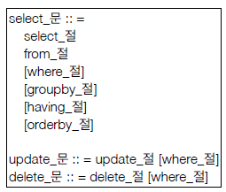

#(JPA)8.객체지향쿼리언어1

---
## ✏️ `객체지향쿼리언어`
### ✔️ `JPQL`
```java
List<MemberE> result = em.createQuery("select m From MemberE m where m.username like '%kim%", MemberE.class).getResultList();

for(MemberE memberE : result){
    System.out.println("memberE = " + memberE);
}
```
- 테이블이 아닌 객체를 대상으로 검색하는 객체 지향 쿼리
- SQL을 추상화해서 특정 데이터베이스 SQL에 의존하지 않음


### ✔️ `Criteria`
- JPQL은 동적쿼리를 만들기 어려움->`criteria`사용하기
```java
//Criteria 사용 준비
CriteriaBuilder cb = em.getCriteriaBuilder();

CriteriaQuery<Member> query = cb.createQuery(Member.class);

//루트 클래스 (조회를 시작할 클래스)
Root<Member> m = query.from(Member.class);
//쿼리 생성 CriteriaQuery<Member> cq =
CriteriaQuery<Member> cq = query.select(m);

String username = "kiki";
if (username != null) {
        cq.where(cb.equal(m.get("username"), "kim"));
}
//이렇게 동적쿼리를 사용하기가 용이함

List<Member> resultList = em.createQuery(cq).getResultList();
```
- 문자가 아닌 자바코드로 JPQL을 작성할 수 있음
- JPA의 공식 기능임
- 단점: 너무 복잡하고 실용성이 없음, QueryDSL 사용 권장


### ✔️ `QueryDSL`
```java
//select m from Member m where m.age > 18
JPAFactoryQuery query = new JPAQueryFactory(em);
QMember m = QMember.member;
List<Member> list = query.selectFrom(m)
    .where(m.age.gt(18))
    .orderBy(m.name.desc())
    .fetch();
```
- 문자가 아닌 자바코드로 JPQL을 작성할 수 있음
- 컴파일 시점에 문법 오류를 찾을 수 있음
- 동적쿼리 작성 편리함


### ✔️ `네이티브 SQL`
- JPA가 제공하는 SQL을 직접 사용하는 기능
- JPQL로 해결할 수 없는 특정 데이터베이스에 의존적인 기능 사용가능
- ex.) 오라클 CONNECT BY 등

```java
String sql = “SELECT ID, AGE, TEAM_ID, NAME FROM MEMBER WHERE NAME = ‘kim’";

List<Member> resultList = em.createNativeQuery(sql, Member.class).getResultList();
```

### ✔️ `JDBC 직접 사용, SpringJdbcTemplate`
- JPA를 사용하면서 JDBC 커넥션을 직접 사용하거나, 스프링 JdbcTemplate, 마이바티스등을 함께 사용 가능
- 단 영속성 컨텍스트를 적절한 시점에 강제로 플러시 필요
- ex.) JPA를 우회해서 SQL을 실행하기 직전에 영속성 컨텍스트 수동 플러시


> query날아갈때 자동으로 flush해줌(JPQL, Criteria 등등)
---
---
## ✏️ `JPQL - 기본문법`
### ✔️ `기본 문법`



- `select m from Member as m where m.age > 18`
- 엔티티와 속성은 대소문자 구분함 (Member, age)
- JPQL 키워드는 대소문자 구분X (SELECT, FROM, where)
- **엔티티 이름 사용, 테이블 이름이 아님(Member)**
- **별칭은 필수(m) (as는 생략가능)**

```java
select
    COUNT(m), //회원수
    SUM(m.age), //나이 합
    AVG(m.age), //평균 나이
    MAX(m.age), //최대 나이
    MIN(m.age) //최소 나이
from Member m
```
---

### ✔️ `TypeQuery, Query`
- `TypeQuery`: 반환 타입이 명확할 때 사용
- `Query`: 반환 타입이 명확하지 않을 때 사용
```java
Member member = new Member();
member.setUsername("member1");
member.setAge(10);
em.persist(member);

TypedQuery<Member> query = em.createQuery("select m from Member m", Member.class); //뒤에 Member.class는 반환타입
TypedQuery<String> query1 = em.createQuery("select m.username from Member m", String.class);
Query query2 = em.createQuery("select m.username, m.age from Member m"); //타입정보를 받을 수 없을때
```
---
### ✔️ 결과조회 API

- `query.getResultList()`: 결과가 하나 이상일 때, 리스트 반환
    - 결과가 없으면 빈 리스트 반환
- `query.getSingleResult()`: 결과가 정확히 하나, 단일 객체 반환
    - 결과가 없으면: `javax.persistence.NoResultException`
    - 둘 이상이면: `javax.persistence.NonUniqueResultException`

```java
TypedQuery<Member> query = em.createQuery("select m from Member m", Member.class);
List<Member> resultList = query.getResultList(); //값이 여러개

TypedQuery<Member> query = em.createQuery("select m from Member m where m.id =10 ", Member.class);
Member result = query.getSingleResult(); //값이 1개
```
---
### ✔️ 파리미터 바인딩
- 1. 이름기준
```java
Member result = em.createQuery("select m from Member m where m.username = :username", Member.class)
    .setParameter("username", "member1")
    .getSingleResult();
```
- 2. 위치기준
   - 위치기준은 사용지양하기
```java
SELECT m FROM Member m where m.username=?1
query.setParameter(1, usernameParam);
```


---
### ✔️ `프로젝션(SELECT)`
- `SELECT` 절에 조회할 대상을 지정하는 것
- 프로젝션 대상: 엔티티, 임베디드 타입, 스칼라 타입(숫자, 문자등 기본 데이터 타
입)

   - `SELECT m FROM Member m` -> 엔티티 프로젝션
   - `SELECT m.team FROM Member m` -> 엔티티 프로젝션
   - `SELECT m.address FROM Member m` -> 임베디드 타입 프로젝션
   - `SELECT m.username, m.age FROM Member m` -> 스칼라 타입 프로젝션
- `DISTINCT`로 중복 제거가능
```java
//1~4 중복사용
Member member = new Member();
member.setUsername("member1");
member.setAge(10);
em.persist(member);

em.flush();
em.clear();

//1(JPQL에서 flush발생)
List<Member> result = em.createQuery("select m from Member m", Member.class)
        .getResultList(); 
//엔티티들(Member 리스트)이 반환됨, 모두 영속성 컨텍스트에서 관리됨
Member findMember = result.get(0);
findMember.setAge(20); 
//영속성컨텍스트에 존재하는 Member age가 20살로 변경됨
```
```java
//2-1
List<Team> result = em.createQuery("select m.team from Member m ", Team.class)
        .getResultList(); 
//실행하면 이너조인으로 팀 테이블에서 함께 찾아옴

//2-2
List<Team> result1 = em.createQuery("select m.team from Member m join m.team t ", Team.class)
        .getResultList(); 
//위 코드랑 나가는 sql은 같음, 그러나 jpql은 나가는 sql이랑 비슷하게 작성하는 것이 좋아서 다시 작성함
```
```java
//3
em.createQuery("select o.address from Order o", Address.class)
    .getResultList(); 
//from Address이런식으로 하는것은 불가능, 값타입의 한계, 소속된 엔티티에서 찾아야함
```
```java
//4
em.createQuery("select distinct m.username, m.age from Member m")
    .getResultList();
//타입을 빼야함
```

**프로젝션 여러값 조회**
- `SELECT m.username, m.age FROM Member m`
- 1. `Query 타입`으로 조회
- 2. `Object[] 타입`으로 조회
- 3. `new 명령어`로 조회
    - 단순 값을 DTO로 바로 조회
    - 패키지 명을 포함한 전체 클래스 명 입력
    - 순서와 타입이 일치하는 `생성자` 필요
```java
//1
List resultList = em.createQuery("select distinct m.username, m.age from Member m")
    .getResultList();
Object o = resultList.get(0);
Object[] result = (Object[]) o; //배열 첫 번째 username, 두 번째 age
System.out.println("result[0] = " + result[0]);
System.out.println("result[0] = " + result[1]);

//2
List<Object[]> resultList = em.createQuery("select distinct m.username, m.age from Member m")
    .getResultList();
Object[] result = resultList.get(0);System.out.println("result[0] = " + result[0]);
System.out.println("result[0] = " + result[1]);

//3
List<MemberDTO> result = em.createQuery("select new jpql.MemberDTO(m.username, m.age) from Member m", MemberDTO.class)
    .getResultList(); 
//MemberDTO클래스의 생성자를 통해 만들어짐
MemberDTO memberDTO = result.get(0);
System.out.println("memberDTO.getUsername() = " + memberDTO.getUsername());
System.out.println("memberDTO.getAge() = " + memberDTO.getAge());
```
```java
public class MemberDTO {

    private String username;
    private int age;

    public MemberDTO(String username, int age) {
        this.username = username;
        this.age = age;
    }
    ...
}
```

---
### ✔️ `페이징`
