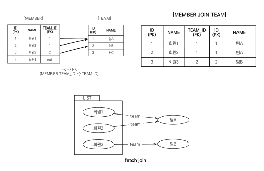
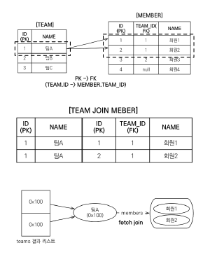
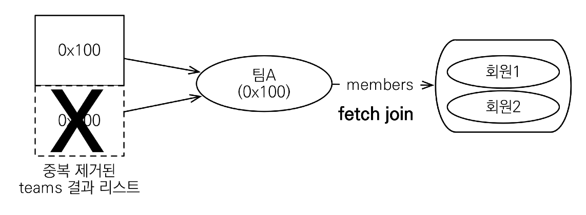

#(JPA)8.객체지향쿼리언어2

---
## ✏️ `경로표현식`
- .(점)을 찍어 객체 그래프를 탐색하는 것


### ✔️ `상태 필드`
- 단순히 값을 저장하기 위한 필드
- 경로 탐색의 끝, 탐색X

```java
 String query = "select m.username From Member m"; 
 //m.username에서 m.username.xx이런식으로 불가능, 경로 탐색의 끝
```

### ✔️ `연관 필드`
- 연관관계를 위한 필드
   - 단일 값 연관 필드:<br>
`@ManyToOne, @OneToOne`, 대상이 **엔티티**(ex: m.team)
   - 컬렉션 값 연관 필드:<br>
`@OneToMany, @ManyToMany`, 대상이 **컬렉션**(ex: m.orders)


- 단일 값 연관 경로: 묵시적 내부 조인(inner join) 발생, 탐색 가능
```java
String query = "select m.team.name From Member m"; //더 탐색가능(m.team)에서
List<Team> result = em.createQuery(query, Team.class)
        .getResultList();
//멤버와연관된 팀을 들고옴-> member와 team을 이너조인한 sql, 묵시적 내부 조인, 조심해서 사용하기
```
```sql
//JPQL: 
select o.member from Order o
//SQL:
select m.*
from Orders o
inner join Member m on o.member_id = m.id
```

- 컬렉션 값 연관 경로: 묵시적 내부 조인 발생, 탐색 불가능
   - FROM 절에서 명시적 조인을 통해 별칭을 얻으면 별칭을 통해 탐색 가능
```java
String query = "select t.members From Team t"; 
//탐색불가, size()정도만 가능, 컬렉션 그 자체이기 때문
Collection result = em.createQuery(query, Collection.class) 
//List<Collection> result = ...(query, Collection.class)도 가능
        .getResultList();
```
```java
String query = "select m.username From Team t join t.members m";
//명시적 조인으로 별칭을 얻음, 실무에서 묵시적 조인 쓰지말기
```

### ✔️ `활용`
- 명시적 조인: join 키워드 직접 사용<br>
`select m from Member m join m.team t`

- 묵시적 조인: 경로 표현식에 의해 묵시적으로 SQL 조인 발생(내부 조인만 가능)<br>
`select m.team from Member m`

- 묵시적 조인 주의사항
   - 항상 내부 조인함
   - 컬렉션은 경로 탐색의 끝임, 컬렉션 탐색을 하려면 명시적 조인을 통해 별칭을 얻어야함
   - 경로 탐색은 주로 SELECT, WHERE 절에서 사용됨(JPQL), 그러나 묵시적 조인으로 인해 SQL의 FROM (JOIN) 절에 영향을 줌
- **가급적 묵시적 조인 대신에 명시적 조인 사용**
- 묵시적 조인은 조인이 일어나는 상황을 한눈에 파악하기 어려움


**예제**
- select o.member.team from Order o -> 성공
(조인이 2번 일어남member, team/ 좋은 코드는 아님)
- select t.members from Team -> 성공(컬렉션)
- select t.members.username from Team t -> 실패(컬렉션 탐색 실패)
- select m.username from Team t join t.members m -> 성공(컬렉션 별칭)


---
---
## ✏️ `페치조인`

- SQL 조인 종류아님
- JPQL에서 성능 최적화를 위해 제공하는 기능
- `연관된 엔티티나 컬렉션`을 SQL 한 번에 함께 조회하는 기능
- 페치 조인 -> `[ LEFT [OUTER] | INNER ] JOIN FETCH 조인경로`


### ✔️ `엔티티 페치 조인`
- 회원을 조회하면서 연관된 팀도 함께 조회
- SQL을 보면 회원 뿐만 아니라 팀(T.*)도 함께 SELECT됨
```java
//ManyToOne(Member-Team)
//JPQL
select m from Member m join fetch m.team
//SQL
SELECT M.*, T.* FROM MEMBER M
INNER JOIN TEAM T ON M.TEAM_ID=T.ID
```



```java
Team teamA = new Team();
teamA.setName("팀A");
em.persist(teamA);

Team teamB = new Team();
teamB.setName("팀B");
em.persist(teamB);

Member member1 = new Member();
member1.setUsername("회원1");
member1.setTeam(teamA);
em.persist(member1);

Member member2 = new Member();
member2.setUsername("회원2");
member2.setTeam(teamA);
em.persist(member2);

Member member3 = new Member();
member3.setUsername("회원3");
member3.setTeam(teamB);
em.persist(member3);

em.flush();
em.clear();

//fetch join안함
String query = "select m From Member m";
List<Member> result = em.createQuery(query, Member.class)
    .getResultList();

for(Member member : result){
    System.out.println(member.getUsername() + ", " + member.getTeam().getName()); 
//Team은 프록시로 들어오고, getName하는 시점에 쿼리 날림
//첫 번째 루프 프록시로 진행, 쿼리 날림, 영속성 컨텍스트에 팀A가 들어감
//회원1, 팀A(SQL)
//회원2, 팀A(1차 캐시에서 들고옴)
//회원3, 팀B(SQL)
}
```
- 회원 100명 - > N + 1(첫번째 날린쿼리, 여기서는 회원쿼리)

```java
//fetch join
String query = "select m From Member m join fetch m.team";
List<Member> result = em.createQuery(query, Member.class)
    .getResultList();

//쿼리: member 와 inner join team
for(Member member : result){
//여기서 team은 프록시가 아님, 실제 엔티티
    System.out.println(member.getUsername() + ", " + member.getTeam().getName());
}
//회원1, 팀A
//회원2, 팀A
//회원3, 팀B
```
- 페치 조인으로 회원과 팀을 함께 조회해서 지연 로딩 아님


---

### ✔️ `컬렉션 페치 조인`
- `일대다 관계`
```java
//JPQL
select t
from Team t join fetch t.members
where t.name = '팀A'
//SQL
SELECT T.*, M.*
FROM TEAM T
INNER JOIN MEMBER M ON T.ID=M.TEAM_ID
WHERE T.NAME = '팀A'
```



```java
String query = "select t From Team t join fetch t.members";
List<Team> result = em.createQuery(query, Team.class)
    .getResultList();

for(Team team : result){
    System.out.println(team.getName() + ", " + team.getMembers().size());
//팀A, 회원 2개
//팀A, 회원 2개
//팀B, 회원 1개
}
```
- 일대다 조인은 값이 예상보다 늘어날 수도 있음(다대일은 아님)
```java
for(Team team : result){
    System.out.println("team = " + team.getName() + ", " + team.getMembers().size());
    for(Member member : team.getMembers()){
        System.out.println(member);
    }
}
//팀A, Team@0x100(주소값 임의 지정)
////Member@0x200
////Member@0x300
//팀A, Team@0x100(주소값 임의 지정)
////Member@0x200
////Member@0x300
//팀B, Team@0x200
////Member@0x100
```
- 페치 조인으로 팀과 회원을 함께 조회해서 지연 로딩 발생 안함


---

### ✔️ `Distinct`
```java
String query = "select distinct t From Team t join fetch t.members";
```
- JPQL의 DISTINCT 2가지 기능 제공
1. SQL에 DISTINCT를 추가
   - SQL에 DISTINCT를 추가하지만 데이터가 다르므로 SQL 결과에서 중복제거 실패


2. 애플리케이션에서 엔티티 중복 제거
    - 같은 식별자를 가진 `Team 엔티티` 제거
    - 팀A는 1번만 나옴


- 하이버네이트6 부터는 DISTINCT 명령어를 사용하지 않아도 애플리케이션에서 중복 제거가 자동으로 적용됨

---
### ✔️ `페치 조인과 일반 조인 차이`

- 일반 조인 실행시 연관된 엔티티를 함께 조회하지 않음
- 일반 조인도 값이 추가되긴 함(팀A 2개, 팀B 1개, 멤버정보만 없을 뿐 조인은 같음)
```java
//JPQL
select t
from Team t join t.members m
//SQL
SELECT T.*
FROM TEAM T
INNER JOIN MEMBER M ON T.ID=M.TEAM_ID
```
- 결과를 반환할 때 연관관계 고려X
- 단지 SELECT 절에 지정한 엔티티만 조회함
- 여기서는 팀 엔티티만 조회하고, 회원 엔티티는 조회X
- 페치 조인을 사용할 때만 연관된 엔티티도 함께 조회(즉시 로딩)
- 페치 조인은 객체 그래프를 SQL 한번에 조회하는 개념

---

### ✔️ `페치 조인 한계와 특징`
- `페치 조인 대상에는 별칭을 줄 수 없음`
   - `select t From Team t join fetch t.members m`불가능
   - 하이버네이트는 가능하지만, 가급적 사용x
- `둘 이상의 컬렉션은 페치 조인 할 수 없음`
   - Team에 members있고 orders도 있는 경우(둘 다 컬렉션일때)
- 컬렉션을 페치 조인하면 페이징 API(setFirstResult, setMaxResults)를 사용할 수 없음
   - `일대일, 다대일 같은 단일 값 연관 필드들은 페치 조인해도 페이징 가능`
   - 하이버네이트는 경고 로그를 남기고 메모리에서 페이징(매우 위험)

- 연관된 엔티티들을 SQL 한 번으로 조회할 수 있음 - 성능 최적화
- 엔티티에 직접 적용하는 글로벌 로딩 전략보다 우선함
   - `@OneToMany(fetch = FetchType.LAZY) //글로벌 로딩 전략`

- result는 팀A, 팀B로 결과 2개
**컬렉션 페이징 대안** 
```java
String query = "select t From Team t";

List<Team> result = em.createQuery(query, Team.class)
    .setFirstResult(0)
    .setMaxResults(2)
    .getResultList();

for(Team team : result){
    System.out.println(team.getName() + ", " + team.getMembers().size());
    for(Member member : team.getMembers()){
        System.out.println(member);
    }
}
```
- 컬렉션(일대다) 페이징을 굳이 사용하고 싶을때 이렇게 사용하기
- 먼저 JPQL로 Team SELECT SQL날림
- result는 팀A, 팀B로 결과 2개
- 첫 번째 루프에서 teamA와 관련된 멤버와 LAZY로딩
- 두 번째 루프에서 teamB와 관련된 멤버와 LAZY로딩
- SQL 3번
   - JPQL
   - teamA와 연관된 멤버 2개를 찾는 SQL1개
   - teamB와 연관된 멤버 1개를 찾는 SQL1개

```java
//Team 엔티티
@BatchSize(size = 100)
@OneToMany(mappedBy = "team")
private List<Member> members = new ArrayList<>();
```
- BatchSize 사용하면 SQL 2번
  - JPQL
  - teamA, teamB와 연관된 멤버 찾는 SQL1개


**정리**<br>
- 페치 조인은 객체 그래프를 유지할 때 사용하면 효과적
   - `.team`처럼 .으로 찾아갈 수 있을때
- 여러 테이블을 조인해서 엔티티가 가진 모양이 아닌 전혀 다른 결과를 내야 하면, 페치 조인 보다는 일반 조인을 사용하고 필요
한 데이터들만 조회해서 DTO로 반환하는 것이 효과적

---
---
## ✏️ `다형성 쿼리`
### ✔️ `TYPE`
- 조회 대상을 특정 자식으로 한정
- Item 중에 Book, Movie를 조회하기 ⬇️
```java
//JPQL
select i from Item i
where type(i) IN (Book, Movie)
//SQL
select i from Item i
where i.DTYPE in (‘B’, ‘M’)
```

### ✔️ `TREAT`
- 자바의 타입 캐스팅과 유사
- 상속 구조에서 부모 타입을 특정 자식 타입으로 다룰 때 사용
- FROM, WHERE, SELECT(하이버네이트 지원) 사용
- 부모인 Item과 자식 Book이 존재 ⬇️
```java
//JPQL
select i from Item i
where treat(i as Book).author = ‘kim’
//SQL
select i.* from Item i
where i.DTYPE = ‘B’ and i.author = ‘kim’
```
- 위 코드는 싱글테이블 전략
- 테이블 구현 전략에 따라 SQL코드가 달라짐


---
---
## ✏️ `엔티티 직접 사용`

`JPQL에서 엔티티를 직접 사용하면 SQL에서 해당 엔티티의 기본 키 값을 사용`
- 엔티티를 구분하는 값이 PK값임
- 따라서 엔티티만 넘겨도 DB에서 기본키값 사용


### ✔️ `기본 키 값`
- 둘 다 같은 SQL실행
```java
//엔티티를 직접 사용
String query = "select m from Member m where m = :member";

Member findMember = em.createQuery(query, Member.class)
    .setParameter("member", member1)
    .getSingleResult();

//엔티티의 아이디(식별자)를 사용
String query = "select m from Member m where m.id = :memberId";

Member findMember = em.createQuery(query, Member.class)
    .setParameter("memberId", member1.getId())
    .getSingleResult();
```
```SQL
select m.* from Member m where m.id=?
```

### ✔️ `외래 키 값`
- `m.team`은 `@JoinColumn(name = "TEAM_ID")`여기 외래키를 가리킴
- 같은 SQL 실행됨
```java
//엔티티 사용
String query = "select m from Member m where m.team = :team";

List<Member> members = em.createQuery(query, Member.class)
    .setParameter("team", teamA)
    .getResultList();

//식별자 사용
String query = "select m from Member m where m.team.id = :teamId";
```
```SQL
select m.* from Member m where m.team_id=?
```

---
---
## ✏️ `Named 쿼리`

- 미리 정의해서 이름을 부여해두고 사용하는 JPQL
- `정적 쿼리`
- 어노테이션, XML에 정의
- 애플리케이션 로딩 시점에 초기화 후 재사용
  - JPA나 Hibernate가 로딩 시점에 캐시해둠
  - 다시 SQL호출하는 코스트를 낮춤
- 애플리케이션 로딩 시점에 쿼리를 검증
  - 문법 안맞으면 오류


```java
@Entity
@NamedQuery(
            name = "Member.findByUsername",
            query="select m from Member m where m.username = :username")
public class Member {
...
}
```
```java
List<Member> resultList =
em.createNamedQuery("Member.findByUsername", Member.class)
    .setParameter("username", "회원1")
    .getResultList();
```
- XML에 Named쿼리 정의해둘 수 있음
- XML이 항상 우선권을 가짐
- 애플리케이션 운영 환경에 따라 다른 XML을 배포할 수 있음

---
---
## ✏️ `벌크 연산`
- 재고가 10개 미만인 모든 상품의 가격을 10% 상승시킬때, JPA 변경 감지 기능으로 실행하려면 너무 많은 SQL 실행됨
   - 1. 재고가 10개 미만인 상품을 리스트로 조회
   - 2. 상품 엔티티의 가격을 10% 증가
   - 3. 트랜잭션 커밋 시점에 변경감지가 동작
- 변경된 데이터가 100건이라면 100번의 UPDATE SQL 실행

### ✔️ `사용`

쿼리 한 번으로 여러 테이블 로우 변경(엔티티)기능
```java
int resultCount = em.createQuery("update Member m set m.age = 20")
    .executeUpdate();
```
- `executeUpdate()`의 결과는 영향받은 엔티티 수 반환
- `UPDATE, DELETE` 지원
- `INSERT`(insert into .. select, 하이버네이트 지원)


### ✔️ `주의`

`벌크 연산은 영속성 컨텍스트를 무시하고 데이터베이스에 직접쿼리`

**오류없이 벌크 연산 사용하는 법**
1. 벌크 연산을 먼저 실행
- 영속성 컨텍스트에 값이 없을때 벌크연산 실행하면 문제 발생X
- DB에만 쿼리가 날아감

2. `벌크 연산 수행 후 영속성 컨텍스트 초기화`
- 영속성컨텍스트에 있는 값은 벌크연산 실행될때 flush됨(JPQL이기 때문)
- 마지막에 다시 영속성컨텍스트 초기화해줌


```java
Member member1 = new Member();
member1.setUsername("회원1");
member1.setTeam(teamA);
em.persist(member1);

Member member2 = new Member();
...

Member member3 = new Member();
...

int resultCount = em.createQuery("update Member m set m.age = 20")
    .executeUpdate();
//em.clear();

member1.getAge();//20아님
member2.getAge();//20아님
member3.getAge();//3도 마찬가지
```
- `em.flush()` 안해도 JPQL에서 Member INSERT쿼리 날려주고, 그 다음 벌크 연산 UPDATE쿼리 날림
- DB에는 20살로 변함
- 영속성컨텍스트는 벌크 업데이트가 반영이 안되어 있음
- 따라서 영속성 컨텍스트 초기화 해주면 좋음
- 벌크 코드 바로 뒤에 `em.clear()`해서 영속성 컨텍스트 초기화해줌

---
---
---
- 자기 자신을 가져올때, 예를 들어 `select m from Member m`과 같은 경우는 연관된 엔티티도 함께 들고오는 듯
- (1) JPQL 이너조인해서 1개, (2) 연관된 엔티티 Team과 관련된 SQL 1개
- Lazy라면 따로 나중에 들고오고, fetch join이면 select에 한 번에 들고오는 듯
- `em.find(Member.class, memberId)`도 두 개 들고옴
---
- `select m.team from Member m..`과 같은 경우는 그대로 JPQL 들고 오는 듯? SQL 1개