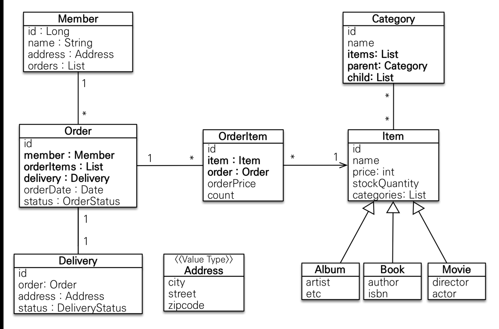

#(Spring+JPA)1.활용

---
**엔티티 분석**




**테이블 분석**


---
## ✏️ `엔티티 설계`

 **Member**
```java
@Entity
@Getter @Setter
public class Member {

    @Id @GeneratedValue
    @Column(name = "member_id")
    private Long id;

    private String name;

    @Embedded
    private Address address;

    @OneToMany(mappedBy = "member")
    private List<Order> orders = new ArrayList<>();
}
```

**Order**
```java
@Entity
@Table(name = "orders")
@Getter @Setter
@NoArgsConstructor(access = AccessLevel.PROTECTED) //protected 기본 생성자 만듦
public class Order {

    @Id @GeneratedValue
    @Column(name = "order_id")
    private  Long id;

    @ManyToOne(fetch = LAZY)
    @JoinColumn(name = "member_id")
    private Member member;
    //LAZY로 하는 이유: JPQL select o From order o;  -> SQL select * from order  (n(member) + 1(order))문제 발생

    @OneToMany(mappedBy = "order", cascade = CascadeType.ALL) //persist(orderItemA)persist(orderItemB) persist(order) -> persist(order)
    private List<OrderItem> orderItems = new ArrayList<>();   //Order를 persist하면 강제로 리스트도 persist

    @OneToOne(fetch = LAZY, cascade = CascadeType.ALL) //order저장할때 delivery도 저장해줌
    @JoinColumn(name = "delivery_id")
    private Delivery delivery;

    //order_date(이름 자동으로 바꿔줌)
    private LocalDateTime orderDate; //주문시간

    @Enumerated(EnumType.STRING)
    private OrderStatus status;  //주문상태 [ORDER, CANCEL]

    //==연관관계 메서드==// -> 핵심적으로 컨트롤하는 쪽에 만들면 좋음
    public void setMember(Member member){
        this.member = member;
        member.getOrders().add(this);
    }

    public void addOrderItem(OrderItem orderItem){
        orderItems.add(orderItem);
        orderItem.setOrder(this);
    }

    public void setDelivery(Delivery delivery){
        this.delivery = delivery;
        delivery.setOrder(this);
    }


    //==생성 메서드==//
    public static Order createOrder(Member member, Delivery delivery, OrderItem... orderItems){
        Order order = new Order();
        order.setMember(member);
        order.setDelivery(delivery);
        for(OrderItem orderItem : orderItems){
            order.addOrderItem(orderItem);
        }
        order.setStatus(OrderStatus.ORDER);
        order.setOrderDate(LocalDateTime.now());
        return order;
    }

    //==비즈니스 로직==//
    /**
     * 주문 취소
     */
    public void cancel(){
        if(delivery.getStatus() == DeliveryStatus.COMP){
            throw new IllegalStateException("이미 배송완료된 상품은 취소가 불가능합니다.");
        }

        this.setStatus(OrderStatus.CANCEL);
        for (OrderItem orderItem : orderItems){
            orderItem.cancel();
        }
    }
    
    //==조회 로직==//
    /**
     * 전체 주문 가격 조회
     */
    public int getTotalPrice(){
        int totalPrice = 0;
        for (OrderItem orderItem : orderItems){
            totalPrice += orderItem.getTotalPrice();
        }
        return totalPrice;
    }
}
```

**OrderItem**
```java
@Entity
@Getter @Setter
@NoArgsConstructor(access = AccessLevel.PROTECTED)
public class OrderItem {

    @Id @GeneratedValue
    @Column(name = "order_item_id")
    private Long id;

    @ManyToOne(fetch = LAZY)
    @JoinColumn(name = "item_id")
    private Item item;

    @ManyToOne(fetch = LAZY)
    @JoinColumn(name = "order_id")
    private Order order;

    private int orderPrice; //주문가격
    private int count;      //주문수량


    //==생성 메서드==//
    public static OrderItem createOrderItem(Item item, int orderPrice, int count){
        OrderItem orderItem = new OrderItem();
        orderItem.setItem(item);
        orderItem.setOrderPrice(orderPrice);
        orderItem.setCount(count);

        item.removeStock(count);
        return orderItem;
    }

    //==비즈니스 로직==//
    public void cancel(){
        getItem().addStock(count);
    }

    //==조회 로직==//
    public int getTotalPrice(){
        return getOrderPrice() * getCount();
    }
}
```

**Item**
```java
@Entity
@Inheritance(strategy = InheritanceType.SINGLE_TABLE)
@DiscriminatorColumn(name = "dtype")
@Getter @Setter
public abstract class Item {

    @Id
    @GeneratedValue
    @Column(name = "item_id")
    private Long id;

    private String name;
    private int price;
    private int stockQuantity;

    @ManyToMany(mappedBy = "items")
    private List<Category> categories = new ArrayList<>();

    //==비즈니스 로직==//엔티티 자체가 해결할 수 있는 것일때
    /**
     * stock 증가
     */
    public void addStock(int quantity){
        this.stockQuantity += quantity;
    }

    /**
     * stock 감소
     */
    public void removeStock(int quantity){
        int restStock = this.stockQuantity - quantity;
        if(restStock < 0){
            throw new NotEnoughStockException("need more stock");
        }
        this.stockQuantity = restStock;
    }
}


...

@Entity
@DiscriminatorValue("B")
@Getter @Setter
public class Book extends Item {

    private String author;
    private String isbn;
}
```

**Delivery**
```java
@Entity
@Getter @Setter
public class Delivery {

    @Id @GeneratedValue
    @Column(name = "delivery_id")
    private Long id;

    @OneToOne(mappedBy = "delivery", fetch = LAZY)
    private Order order;

    @Embedded
    private Address address;

    @Enumerated(EnumType.STRING)
    private DeliveryStatus status;  //READY, COMP
}
```

**Category**
```java
@Entity
@Getter @Setter
public class Category {

    @Id @GeneratedValue
    @Column(name = "category_id")
    private Long id;

    private String name;

    @ManyToMany
    @JoinTable(name = "category_item",    
            joinColumns = @JoinColumn(name = "category_id"),
            inverseJoinColumns = @JoinColumn(name = "item_id")
    )
    private List<Item> items = new ArrayList<>();

    @ManyToOne(fetch = LAZY)
    @JoinColumn(name = "parent_id")
    private Category parent;

    @OneToMany(mappedBy = "parent")
    private List<Category> child = new ArrayList<>();


    //연관관계 메서드
    public void addChildCategory(Category child){
        this.child.add(child);
        child.setParent(this);
    }
}
```

**Address**
```java
@Embeddable
@Getter
public class Address {

    private String city;
    private String street;
    private String zipcode;

    protected Address(){

    }

    public Address(String city, String street, String zipcode) {
        this.city = city;
        this.street = street;
        this.zipcode = zipcode;
    }
}
```
- 값 타입은 변경 불가능하게 설계하기
- `엔티티나 임베디드 타입(@Embeddable)은 자바 기본 생성자(default constructor)를 public 또는protected 로 설정`

---
## ✏️ `엔티티 설계시 주의사항`

1. 엔티티에는 가급적 Setter를 사용하지 않기
2. 모든 연관관계는 지연로딩으로 설정하기
   - 연관된 엔티티를 함께 DB에서 조회해야 하면, fetch join 또는 엔티티 그래프 기능을 사용
   - `@XToOne(OneToOne, ManyToOne)` 관계는 기본이 즉시로딩이므로 직접 지연로딩으로 설정하기
3. 컬렉션은 필드에서 초기화 하기
   - `... = new ArrayList<>();`
   - null문제에서 안전
   - 하이버네이트는 엔티티를 영속화 할 때, 컬랙션을 감싸서 하이버네이트가 제공하는 내장 컬렉션으로 변경한다. 
   - 만약 임의의 메서드에서 컬력션을 잘못 생성하면 하이버네이트 내부 메커니즘에 문제가 발생할 수 있다. - 따라서 필드레벨에서 생성하는 것이 가장 안전하다.

4. 테이블, 컬럼명 생성 전략
스프링 부트 신규 설정 (엔티티(필드) 테이블(컬럼))
- 카멜 케이스 -> 언더스코어(memberPoint member_point)
- .(점) -> _(언더스코어)
- 대문자 -> 소문자
<br><br>
- 적용 2 단계
1. 논리명 생성: 명시적으로 컬럼, 테이블명을 직접 적지 않으면 논리명 적용
2. 물리명 적용:
spring.jpa.hibernate.naming.physical-strategy : 모든 논리명에 적용됨, 실제 테이블에 적용
(username usernm 등으로 회사 룰로 바꿀 수 있음)


---
---
## ✏️ `애플리케이션 구현`
- controller, web: 웹 계층
- service: 비즈니스 로직, `트랜잭션` 처리
- repository: JPA를 직접 사용하는 계층, `엔티티 매니저 사용`
- domain: 엔티티가 모여 있는 계층, 모든 계층에서 사용

