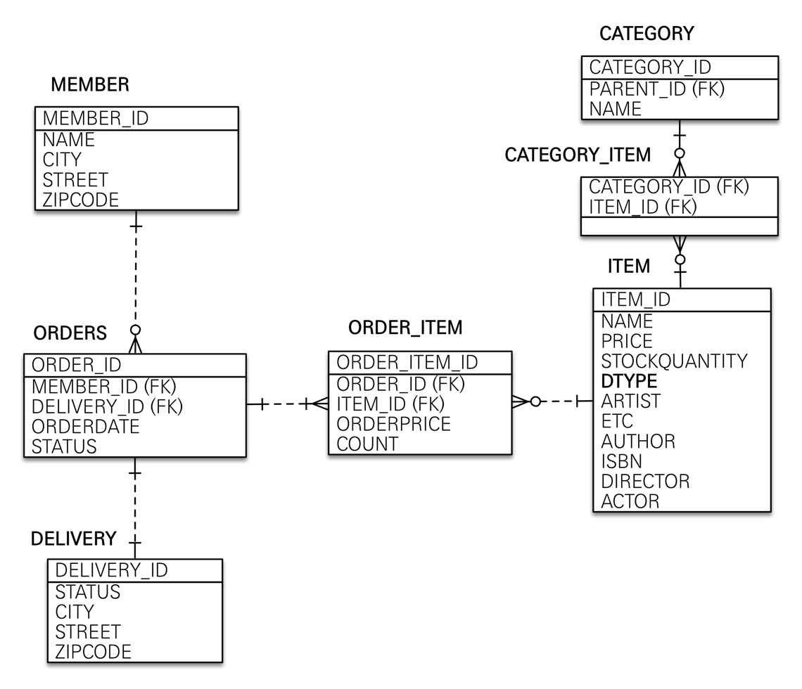

#(Spring+JPA)1.활용

---
**엔티티 분석**


**테이블 분석**


---
## ✏️ `엔티티 설계`

 **Member**
```java
@Entity
@Getter @Setter
public class Member {

    @Id @GeneratedValue
    @Column(name = "member_id")
    private Long id;

    private String name;

    @Embedded
    private Address address;

    @OneToMany(mappedBy = "member")
    private List<Order> orders = new ArrayList<>();
}
```

**Order**
```java
@Entity
@Table(name = "orders")
@Getter @Setter
@NoArgsConstructor(access = AccessLevel.PROTECTED) //protected 기본 생성자 만듦
public class Order {

    @Id @GeneratedValue
    @Column(name = "order_id")
    private  Long id;

    @ManyToOne(fetch = LAZY)
    @JoinColumn(name = "member_id")
    private Member member;
    //LAZY로 하는 이유: JPQL select o From order o;  -> SQL select * from order  (n(member) + 1(order))문제 발생

    @OneToMany(mappedBy = "order", cascade = CascadeType.ALL) //persist(orderItemA)persist(orderItemB) persist(order) -> persist(order)
    private List<OrderItem> orderItems = new ArrayList<>();   //Order를 persist하면 강제로 리스트도 persist

    @OneToOne(fetch = LAZY, cascade = CascadeType.ALL) //order저장할때 delivery도 저장해줌
    @JoinColumn(name = "delivery_id")
    private Delivery delivery;

    //order_date(이름 자동으로 바꿔줌)
    private LocalDateTime orderDate; //주문시간

    @Enumerated(EnumType.STRING)
    private OrderStatus status;  //주문상태 [ORDER, CANCEL]

    //==연관관계 메서드==// -> 핵심적으로 컨트롤하는 쪽에 만들면 좋음
    public void setMember(Member member){
        this.member = member;
        member.getOrders().add(this);
    }

    public void addOrderItem(OrderItem orderItem){
        orderItems.add(orderItem);
        orderItem.setOrder(this);
    }

    public void setDelivery(Delivery delivery){
        this.delivery = delivery;
        delivery.setOrder(this);
    }


    //==생성 메서드==//
    public static Order createOrder(Member member, Delivery delivery, OrderItem... orderItems){
        Order order = new Order();
        order.setMember(member);
        order.setDelivery(delivery);
        for(OrderItem orderItem : orderItems){
            order.addOrderItem(orderItem);
        }
        order.setStatus(OrderStatus.ORDER);
        order.setOrderDate(LocalDateTime.now());
        return order;
    }

    //==비즈니스 로직==//
    /**
     * 주문 취소
     */
    public void cancel(){
        if(delivery.getStatus() == DeliveryStatus.COMP){
            throw new IllegalStateException("이미 배송완료된 상품은 취소가 불가능합니다.");
        }

        this.setStatus(OrderStatus.CANCEL);
        for (OrderItem orderItem : orderItems){
            orderItem.cancel();
        }
    }
    
    //==조회 로직==//
    /**
     * 전체 주문 가격 조회
     */
    public int getTotalPrice(){
        int totalPrice = 0;
        for (OrderItem orderItem : orderItems){
            totalPrice += orderItem.getTotalPrice();
        }
        return totalPrice;
    }
}
```

**OrderItem**
```java
@Entity
@Getter @Setter
@NoArgsConstructor(access = AccessLevel.PROTECTED)
public class OrderItem {

    @Id @GeneratedValue
    @Column(name = "order_item_id")
    private Long id;

    @ManyToOne(fetch = LAZY)
    @JoinColumn(name = "item_id")
    private Item item;

    @ManyToOne(fetch = LAZY)
    @JoinColumn(name = "order_id")
    private Order order;

    private int orderPrice; //주문가격
    private int count;      //주문수량


    //==생성 메서드==//
    public static OrderItem createOrderItem(Item item, int orderPrice, int count){
        OrderItem orderItem = new OrderItem();
        orderItem.setItem(item);
        orderItem.setOrderPrice(orderPrice);
        orderItem.setCount(count);

        item.removeStock(count);
        return orderItem;
    }

    //==비즈니스 로직==//
    public void cancel(){
        getItem().addStock(count);
    }

    //==조회 로직==//
    public int getTotalPrice(){
        return getOrderPrice() * getCount();
    }
}
```

**Item**
```java
@Entity
@Inheritance(strategy = InheritanceType.SINGLE_TABLE)
@DiscriminatorColumn(name = "dtype")
@Getter @Setter
public abstract class Item {

    @Id
    @GeneratedValue
    @Column(name = "item_id")
    private Long id;

    private String name;
    private int price;
    private int stockQuantity;

    @ManyToMany(mappedBy = "items")
    private List<Category> categories = new ArrayList<>();

    //==비즈니스 로직==//엔티티 자체가 해결할 수 있는 것일때
    /**
     * stock 증가
     */
    public void addStock(int quantity){
        this.stockQuantity += quantity;
    }

    /**
     * stock 감소
     */
    public void removeStock(int quantity){
        int restStock = this.stockQuantity - quantity;
        if(restStock < 0){
            throw new NotEnoughStockException("need more stock");
        }
        this.stockQuantity = restStock;
    }
}


...

@Entity
@DiscriminatorValue("B")
@Getter @Setter
public class Book extends Item {

    private String author;
    private String isbn;
}
```

**Delivery**
```java
@Entity
@Getter @Setter
public class Delivery {

    @Id @GeneratedValue
    @Column(name = "delivery_id")
    private Long id;

    @OneToOne(mappedBy = "delivery", fetch = LAZY)
    private Order order;

    @Embedded
    private Address address;

    @Enumerated(EnumType.STRING)
    private DeliveryStatus status;  //READY, COMP
}
```

**Category**
```java
@Entity
@Getter @Setter
public class Category {

    @Id @GeneratedValue
    @Column(name = "category_id")
    private Long id;

    private String name;

    @ManyToMany
    @JoinTable(name = "category_item",    
            joinColumns = @JoinColumn(name = "category_id"),
            inverseJoinColumns = @JoinColumn(name = "item_id")
    )
    private List<Item> items = new ArrayList<>();

    @ManyToOne(fetch = LAZY)
    @JoinColumn(name = "parent_id")
    private Category parent;

    @OneToMany(mappedBy = "parent")
    private List<Category> child = new ArrayList<>();


    //연관관계 메서드
    public void addChildCategory(Category child){
        this.child.add(child);
        child.setParent(this);
    }
}
```

**Address**
```java
@Embeddable
@Getter
public class Address {

    private String city;
    private String street;
    private String zipcode;

    protected Address(){

    }

    public Address(String city, String street, String zipcode) {
        this.city = city;
        this.street = street;
        this.zipcode = zipcode;
    }
}
```
- 값 타입은 변경 불가능하게 설계하기
- `엔티티나 임베디드 타입(@Embeddable)은 자바 기본 생성자(default constructor)를 public 또는protected 로 설정`

---
## ✏️ `엔티티 설계시 주의사항`

1. 엔티티에는 가급적 Setter를 사용하지 않기
2. 모든 연관관계는 지연로딩으로 설정하기
   - 연관된 엔티티를 함께 DB에서 조회해야 하면, fetch join 또는 엔티티 그래프 기능을 사용
   - `@XToOne(OneToOne, ManyToOne)` 관계는 기본이 즉시로딩이므로 직접 지연로딩으로 설정하기
3. 컬렉션은 필드에서 초기화 하기
   - `... = new ArrayList<>();`
   - null문제에서 안전
   - 하이버네이트는 엔티티를 영속화 할 때, 컬랙션을 감싸서 하이버네이트가 제공하는 내장 컬렉션으로 변경한다. 
   - 만약 임의의 메서드에서 컬력션을 잘못 생성하면 하이버네이트 내부 메커니즘에 문제가 발생할 수 있다. - 따라서 필드레벨에서 생성하는 것이 가장 안전하다.

4. 테이블, 컬럼명 생성 전략
스프링 부트 신규 설정 (엔티티(필드) 테이블(컬럼))
- 카멜 케이스 -> 언더스코어(memberPoint member_point)
- .(점) -> _(언더스코어)
- 대문자 -> 소문자
<br><br>
- 적용 2 단계
1. 논리명 생성: 명시적으로 컬럼, 테이블명을 직접 적지 않으면 논리명 적용
2. 물리명 적용:
spring.jpa.hibernate.naming.physical-strategy : 모든 논리명에 적용됨, 실제 테이블에 적용
(username usernm 등으로 회사 룰로 바꿀 수 있음)


---
---
## ✏️ `애플리케이션 구현`
- controller, web: 웹 계층
- service: 비즈니스 로직, `트랜잭션` 처리
- repository: JPA를 직접 사용하는 계층, `엔티티 매니저 사용`
- domain: 엔티티가 모여 있는 계층, 모든 계층에서 사용


### ✔️ `Repository`
- `@PersistenceContext` : 엔티티 메니저( EntityManager ) 주입
- `@PersistenceUnit` : 엔티티 메니터 팩토리( EntityManagerFactory ) 주입
- 스프링 데이터 JPA를 사용하면 EntityManager 도 주입 가능
- `@Autowired private final EntityManager em;`


### ✔️ `Service`
- `@Transactional(readOnly = true)`  //default readOnly=false
    - 트랜잭션, 영속성 컨텍스트 
    - readOnly=true : 데이터의 변경이 없는 읽기 전용 메서드에 사용, 영속성 컨텍스트를 플러시 하지 않으므로 약간의 성능 향상(읽기 전용에는 다 적용)
    - 데이터베이스 드라이버가 지원하면 DB에서 성능 향상


### ✔️ `Test`
- `@RunWith(SpringRunner.class)` : 스프링과 테스트 통합
- `@SpringBootTest` : 스프링 부트 띄우고 테스트(이게 없으면 @Autowired 다 실패)
- `@Transactional` : 반복 가능한 테스트 지원, 각각의 테스트를 실행할 때마다 트랜잭션을 시작하고 테스트
가 끝나면 트랜잭션을 강제로 롤백 (이 어노테이션이 테스트 케이스에서 사용될 때만 롤백)
- 테스트 케이스는 메모리 DB를 사용하는 것이 이상적

```java
//MemberServiceTest

@RunWith(SpringRunner.class)  //스프링이랑 같이 테스트할 때 사용
@SpringBootTest   //스프링 부트를 띄운 상태로 실행
@Transactional    //test끝나면 commit안하고 rollback시킴(test에서만)
public class MemberServiceTest {

    @Autowired MemberService memberService;
    @Autowired MemberRepository memberRepository;
//    @Autowired EntityManager em;

    @Test
//    @Rollback(false)   //false면 rollback안하고 insert문 내보냄
    public void 회원가입() throws Exception{
        //given
        Member member = new Member();
        member.setName("kim");

        //when
        Long savedId = memberService.join(member);

        //then
        //em.flush (영속성 컨텍스트 반영함/insert문이 나가면서 볼 수 있음)
        assertEquals(member, memberRepository.findOne(savedId));
    }

    @Test(expected = IllegalStateException.class)
    public void 중복_회원_예제() throws Exception{
        //given
        Member member1 = new Member();
        member1.setName("kim1");
        Member member2 = new Member();
        member2.setName("kim1");

        //when
        memberService.join(member1);
        memberService.join(member2); //예외가 발생해야 한다.

        //then
        fail("예외가 발생해야 한다."); //위에서 오류가 나면 여기로 내려오면 안됨
    }
}
```


### ✔️ `Controller`
- `MemberForm`에서 `@NotEmpty(message="회원 이름은 필수 입니다)`

```java
@PostMapping("/members/new")
    public String create(@Valid MemberForm form, BindingResult result){   //form의 notempty를 지키기 위해 valid어노테이션 사용

        if(result.hasErrors()){  //@Valid 다음에 오류가 발생했을때 사용
            return "members/createMemberForm";
        }

        Address address = new Address(form.getCity(), form.getStreet(), form.getZipcode());

        Member member = new Member();
        member.setName(form.getName());
        member.setAddress(address);

        memberService.join(member);
        return "redirect:/";
    }
```

**객체 vs 엔티티 직접 사용**
> 참고: 요구사항이 정말 단순할 때는 폼 객체( MemberForm) 없이 엔티티(Member)를 직접 등록과 수정 화면에서 사용해도 됨. 하지만 화면 요구사항이 복잡해지기 시작하면, 엔티티에 화면을 처리하기 위한 기능이
점점 증가함<br>
> 실무에서 엔티티는 핵심 비즈니스 로직만 가지고 있고, 화면을 위한 로직은 없어야 한다. 화면이나 API에 맞는 폼 객체나 DTO를 사용. 엔티티는 순수하게 유지.


```java
//ItemController
...
@PostMapping("items/{itemId}/edit")
public String updateItem(@PathVariable Long itemId, @ModelAttribute BookForm form){

    Book book = new Book(); //객체는 새로운 객체, 그러나 id가 같음, 이미 데이터베이스에 한번 갔다온것, 준영속성 상태(new로 생성했기 때문에 JPA가 관리하지 않음)
    book.setId(form.getId());
    book.setName(form.getName());
    book.setPrice(form.getPrice());
    book.setStockQuantity(form.getStockQuantity());
    book.setAuthor(form.getAuthor());
    book.setIsbn(form.getIsbn());
    itemService.saveItem(book);

//itemService.updateItem(itemId, form.getName(), form.getPrice(), form.getStockQuantity());
    return "redirect:/items";
}
```
- 상품 수정 폼에서 정보를 수정하고 Submit 버튼을 선택
- /items/{itemId}/edit URL을 POST 방식으로 요청하고 updateItem() 메서드를 실행
- 이때 컨트롤러에 파라미터로 넘어온 item 엔티티 인스턴스는 현재 준영속 상태. 따라서 영속성 컨텍스트
의 지원을 받을 수 없고 데이터를 수정해도 변경 감지 기능은 동작X

### ✔️ 변경감지/병합(merge)

**준영속 엔티티**
- 영속성 컨텍스트가 더는 관리하지 않는 엔티티
- `itemService.saveItem(book)` 에서 수정을 시도하는 Book 객체
- Book 객체는 이미 DB에 한번 저장되어서 식별자가 존재함. 이렇게 임의로 만들어낸 엔티티도 기존 식별자를 가지고 있으면 준영속 엔티티로 볼 수 있음


**준영속 엔티티를 수정하는 2가지 방법**

**변경 감지 기능 사용**
```java
//ItemService
@Transactional
public void updateItem(Long itemId, String name, int price, int stockQuantity){
    Item findItem = itemRepository.findOne(itemId);
    //id로 엔티티 조회
    findItem.setPrice(price);
    findItem.setName(name);
    findItem.setStockQuantity(stockQuantity);
}
```
- 영속성 컨텍스트에서 엔티티를 다시 조회한 후에 데이터를 수정하는 방법
- 트랜잭션 안에서 엔티티를 다시 조회, 변경할 값 선택 트랜잭션 커밋 시점에 변경 감지(Dirty Checking) 이 동작해서 데이터베이스에 UPDATE SQL 실행

**병합(merge) 사용**

```java
//ItemRepository
public void save(Item item){
    if(item.getId() == null){
        em.persist(item);
    }else{
        em.merge(item);  
        //Item merge = em.merge(item) 
        //item이 영속상태로 변경x, return값(merge)이 영속상태
    }
}
```
- save() 메서드는 식별자 값이 없으면(null) 새로운 엔티티로 판단해서 영속화(persist)하고 식별자가 있
으면 병합(merge)
- 지금처럼 준영속 상태인 상품 엔티티를 수정할 때는 id 값이 있으므로 병합 수행


병합 동작 방식
1. merge() 를 실행
2. 파라미터로 넘어온 준영속 엔티티의 식별자 값으로 1차 캐시에서 엔티티를 조회
2-1. 만약 1차 캐시에 엔티티가 없으면 데이터베이스에서 엔티티를 조회하고, 1차 캐시에 저장
3. 조회한 영속 엔티티(mergeMember)에 member 엔티티의 값을 채워 넣음(member 엔티티의 모든 값
을 mergeMember에 밀어 넣는다. 이때 mergeMember의 “회원1”이라는 이름이 “회원명변경”으로 바뀜)
4. 영속 상태인 mergeMember를 반환

**간단히 정리**
1. 준영속 엔티티의 식별자 값으로 영속 엔티티를 조회
2. 영속 엔티티의 값을 준영속 엔티티의 값으로 모두 교체(병합)
3. 트랜잭션 커밋 시점에 변경 감지 기능이 동작해서 데이터베이스에 UPDATE SQL이 실행

> 주의: 변경 감지 기능을 사용하면 원하는 속성만 선택해서 변경할 수 있지만, 병합을 사용하면 모든 속성이
변경됨. 병합시 값이 없으면 `null` 로 업데이트 할 위험도 있음 (병합은 모든 필드를 교체)


1. 엔티티를 변경할 때는 항상 `변경 감지` 사용하기
2. 컨트롤러에서 어설프게 엔티티를 생성하지 않기
3. 트랜잭션이 있는 서비스 계층에 식별자(id)와 변경할 데이터를 명확하게 전달하기(파라미터 or dto)
4. 트랜잭션이 있는 서비스 계층에서 영속 상태의 엔티티를 조회하고, 엔티티의 데이터를 직접 변경
5. 트랜잭션 커밋 시점에 변경 감지가 실행됨