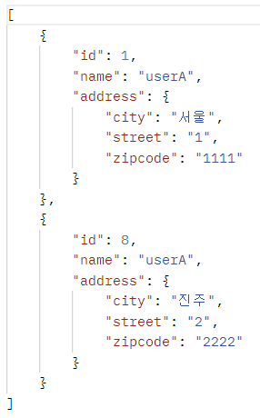
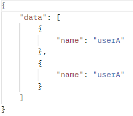

#(Spring+JPA)2.활용(1)

---
---
## ✏️ `API 개발 기본`
- api 패키지를 controller패키지와 분리하는게 좋음

### ✔️ `회원 등록 API`
```java
@RestController
@RequiredArgsConstructor
public class MemberApiController {
    private final MemberService memberService;

    @PostMapping("/api/v1/members")
    public CreateMemberResponse saveMemberV1(@RequestBody @Valid Member member){
        Long id = memberService.join(member);
        return new CreateMemberResponse(id);
    }

    @PostMapping("/api/v2/members")
    public CreateMemberResponse saveMemberV2(@RequestBody @Valid
    CreateMemberRequest request) {
        Member member = new Member();
        member.setName(request.getName());

        Long id = memberService.join(member);
        return new CreateMemberResponse(id);
    }

    @Data
    static class CreateMemberRequest {
        @NotEmpty //DTO장점, 유지보수에서 어떤 필드가 들어가는지 확인 쉽게 가능, 엔티티가 아닌 여기서 제약 걸수있음
        private String name;
    }

    @Data
    static class CreateMemberResponse {
        private Long id;

        public CreateMemberResponse(Long id) {
            this.id = id;
        }
    }
}
```
#### ✨ V1
- 요청 값으로 Member `엔티티`를 직접 받음

**문제점**
- 엔티티에 프레젠테이션 계층을 위한 로직이 추가됨
- 엔티티에 API 검증을 위한 로직이 들어감 (@NotEmpty등등)
- 실무에서는 회원 엔티티를 위한 API가 다양하게 만들어지는데, 한 엔티티에 각각의 API를 위한 모든 요청 요구사항을 담기가 어려움
- 엔티티가 변경되면 API 스펙이 변함

**결론**
- API 요청 스펙에 맞추어 별도의 DTO를 파라미터로 받음


#### ✨ V2
- 엔티티 대신에 `DTO`를 RequestBody에 매핑
- `CreateMemberRequest` 를 `Member` 엔티티 대신에 RequestBody와 매핑
- 엔티티와 프레젠테이션 계층을 위한 로직을 분리할 수 있음
- 엔티티와 API 스펙을 명확하게 분리가능
- 엔티티가 변해도 API 스펙이 변하지 않음

---
### ✔️ `회원 수정 API`
```java
@PatchMapping("/api/v2/members/{id}")
//@PutMapping
public UpdateMemberResponse updateMemberV2(
        @PathVariable("id") Long id,
        @RequestBody @Valid UpdateMemberRequest request){

    memberService.update(id, request.getName());
    Member findMember = memberService.findOne(id);
    return new UpdateMemberResponse(findMember.getId(), findMember.getName());
}

@Data
static class UpdateMemberRequest{
    private String name;
}

@Data
@AllArgsConstructor
static class UpdateMemberResponse{
    private Long id;
    private String name;
}
```
```java
//MemberService
@Transactional
public void update(Long id, String name){
    Member member = memberRepository.findOne(id);
    member.setName(name);
}
```
- 변경 감지를 사용해서 데이터를 수정
> PUT은 전체 업데이트를 할 때 사용함. 부분 업데이트를 하려면 PATCH를 사용하거나 POST를
사용하는 것이 REST 스타일에 맞음


---
### ✔️ `회원 조회 API`
```java
@GetMapping("/api/v1/members")
public List<Member> membersV1(){ //array로 나감, 스펙 확장 불가능, 유연성 낮아짐
    return memberService.findMembers();
}

@GetMapping("/api/v2/members")
public Result memberV2(){
    List<Member> findMembers = memberService.findMembers();
    List<MemberDto> collect = findMembers.stream()
            .map(m -> new MemberDto(m.getName()))
            .collect(Collectors.toList());
        
    return new Result(collect); //배열로 안내보냄
//  return new Result(collect.size(), collect);
}

@Data
@AllArgsConstructor
static class Result<T>{
//  private int count;
    private T data;
}

@Data
@AllArgsConstructor
static class MemberDto{
    private String name;
}
/////////////////////////
//Member
...
@JsonIgnore
@OneToMany(mappedBy = "member")
private List<Order> orders = new ArrayList<>();
...
```
#### ✨ V1
- 응답 값으로 엔티티를 직접 외부에 노출

**문제점**
- 엔티티에 프레젠테이션 계층을 위한 로직이 추가됨
- 기본적으로 엔티티의 `모든 값이 노출`됨
- 응답 스펙을 맞추기 위해 로직이 추가됨 (`@JsonIgnore`, 별도의 뷰 로직 등)
- 실무에서는 같은 엔티티에 대해 API가 용도에 따라 다양하게 만들어지는데, 한 엔티티에 각각의 API를 위한 프레젠테이션 응답 로직을 담기는 어려움
- 엔티티가 변경되면 API 스펙이 변함
- `추가로 컬렉션을 직접 반환하면 항후 API 스펙을 변경하기 어려움`(별도의 Result 클래스 생성으로 해결)


- Json에서 { count: []} 내부의 배열은 괜찮음

#### ✨ V2
- 엔티티를 DTO로 변환해서 반환
- 엔티티가 변해도 API 스펙이 변경되지 않음
- 추가로 `Result` 클래스로 컬렉션을 감싸서 향후 필요한 필드 추가 가능



> 엔티티를 외부에 노출하지 말기
실무에서는 `member` 엔티티의 데이터가 필요한 API가 계속 증가하게 됨. 따라서 엔티티 대신에 API 스펙에 맞는 별도의 DTO를 노출해야 함


