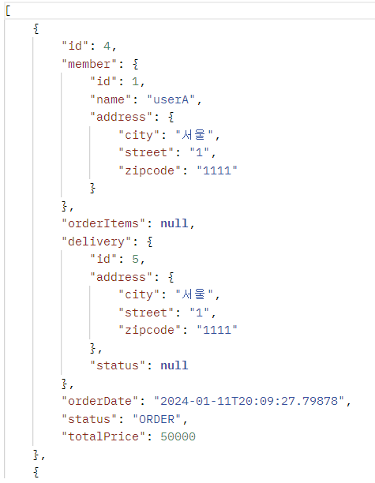
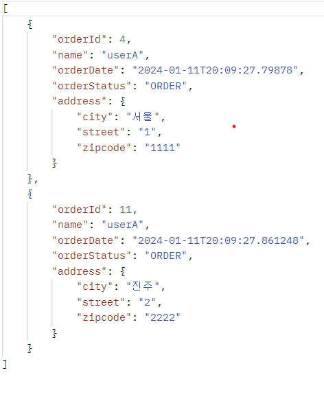

#(Spring+JPA)2.활용(2)

---
---
userA
- JPA1 BOOK
- JPA2 BOOK

userB
- SPRING1 BOOK
- SPRING2 BOOK

```java
@Component
@RequiredArgsConstructor
public class initDb {

    private final InitService initService;

    @PostConstruct
    public void init(){
        initService.dbInit1();
        initService.dbInit2();
    }

    @Component
    @Transactional
    @RequiredArgsConstructor
    static class InitService{

        private final EntityManager em;
        public void dbInit1(){
            Member member = createMember("userA", "서울", "1", "1111");
            em.persist(member);

            Book book1 = createBook("JPA1 BOOK", 10000, 100);
            em.persist(book1);

            Book book2 = createBook("JPA2 BOOK", 20000, 100);
            em.persist(book2);

            OrderItem orderItem1 = OrderItem.createOrderItem(book1, 10000, 1);
            OrderItem orderItem2 = OrderItem.createOrderItem(book2, 20000, 2);

            Delivery delivery = createDelivery(member);

            Order order = Order.createOrder(member, delivery, orderItem1, orderItem2);
            em.persist(order);
        }

        public void dbInit2(){
            Member member = createMember("userB", "진주", "2", "2222");
            em.persist(member);

            Book book1 = createBook("SPRING1 BOOK", 20000, 200);
            em.persist(book1);

            Book book2 = createBook("SPRING2 BOOK", 40000, 300);
            em.persist(book2);

            OrderItem orderItem1 = OrderItem.createOrderItem(book1, 20000, 3);
            OrderItem orderItem2 = OrderItem.createOrderItem(book2, 40000, 4);

            Delivery delivery = createDelivery(member);

            Order order = Order.createOrder(member, delivery, orderItem1, orderItem2);
            em.persist(order);
        }
        
        private Delivery createDelivery(Member member) {
            Delivery delivery = new Delivery();
            delivery.setAddress(member.getAddress());
            return delivery;
        }

        private static Member createMember(String name, String city, String street, String zipcode) {
            Member member = new Member();
            member.setName("userA");
            member.setAddress(new Address(city, street, zipcode));
            return member;
        }

        private static Book createBook(String name, int price, int stockQuantity) {
            Book book = new Book();
            book.setName(name);
            book.setPrice(price);
            book.setStockQuantity(stockQuantity);
            return book;
        }
    }
}
```


---
---
## ✏️ `API 개발 고급 1. 지연 로딩과 조회 성능 최적화`
- 지연 로딩으로 발생하는 성능 문제를 해결하기
- `xToOne(ManyToOne, OneToOne)` 관계 최적화

### ✔️ `V1: 엔티티 직접 노출`
- `Hibernate5Module` 모듈 등록, `LAZY=null` 처리
- 양방향 관계 문제 발생 -> `@JsonIgnore`
> 주의: 엔티티를 직접 노출할 때는 양방향 연관관계가 걸린 곳은 꼭 한곳을 `@JsonIgnore` 처리 해야함. 그렇지 않으면 양쪽을 서로 호출하면서 무한 루프에 걸림.
```java
//Member
@JsonIgnore
@OneToMany(mappedBy = "member")
private List<Order> orders = new ArrayList<>();

//OrderItem
@JsonIgnore
@ManyToOne(fetch = LAZY)
@JoinColumn(name = "order_id")
private Order order;

//Delivery
@JsonIgnore
@OneToOne(mappedBy = "delivery", fetch = LAZY)
private Order order;
```

```java
@RestController
@RequiredArgsConstructor
public class OrderSimpleApiController {

    private final OrderRepository orderRepository;
    private final OrderSimpleQueryRepository orderSimpleQueryRepository;

    @GetMapping("/api/v1/simple-orders")
    public List<Order> ordersV1(){
        List<Order> all = orderRepository.findAllByString(new OrderSearch());
        for (Order order : all) {
            order.getMember().getName(); //getMember()까지는 프록시객체, getName()으로 강제 초기화
            order.getDelivery().getAddress(); //Lazy 강제 초기화
        }
        //orderItems는 NULL로 나감, 원하는 것만 강제 초기화
        return all;
    }
}
```


- 엔티티를 직접 노출하는 것은 좋지 않음
- `order` `member` 와 `order` `delivery` 는 지연 로딩 
- 따라서 실제 엔티티 대신에 프록시가 존재함
- jackson 라이브러리는 기본적으로 이 프록시 객체를 json으로 어떻게 생성해야 하는지 모름 -> 예외 발생
- `Hibernate5Module` 을 스프링 빈으로 등록하면 해결(스프링 부트 사용중): 자료 참고하기

```java
//@SpringBootApplication
@Bean
Hibernate5Module hibernate5Module() {
    Hibernate5Module hibernate5Module = new Hibernate5Module();
//		hibernate5Module.configure(Hibernate5Module.Feature.FORCE_LAZY_LOADING, true); //강제 지연 로딩 가능, 사용하지 말기
	return hibernate5Module;
}
```
- 기본적으로 초기화 된 프록시 객체만 노출, 초기화 되지 않은 프록시 객체는 노출 안함
- 위 코드 주석 부분의 옵션을 키면 `order -> member` , `member -> orders` 양방향 연관관계를 계속 로딩하게 됨. 따라서 `@JsonIgnore` 옵션을 한곳에 주어야 함


> 참고: 앞에서 계속 강조했듯이 정말 간단한 애플리케이션이 아니면 엔티티를 API 응답으로 외부로 노출하는 것은 좋지 않음. 따라서 `Hibernate5Module` 를 사용하기 보다는 DTO로 변환해서 반환하는 것이 더 좋은 방법임

> 주의: 지연 로딩(LAZY)을 피하기 위해 즉시 로딩(EARGR)으로 설정하면 안됨.
항상 지연 로딩을 기본으로 하고, 성능 최적화가 필요한 경우에는 페치 조인(fetch join)을 사용하기


---
### ✔️ `V2: 엔티티 DTO 변환`
```java
@GetMapping("/api/v2/simple-orders")
public List<SimpleOrderDto> ordersV2(){
//   return orderRepository.findAllByString(new OrderSearch()).stream()
//          .map(SimpleOrderDto::new)
//          .collect(toList());

    //N + 1 문제 -> 1 + N(주문 2개) -> 1 쿼리의 결과로 N번 쿼리가 추가 실행됨, 여기서는 1 + N(회원) + N(배송)
    List<Order> orders = orderRepository.findAllByString(new OrderSearch()); 
    //ORDER 조회 -> SQL 1번 -> 결과 주문 수 2개

    
    List<SimpleOrderDto> result = orders.stream()
            .map(o -> new SimpleOrderDto(o))
            .collect(toList());
    // 루프 2번 -> 첫 번째 DTO 생성(쿼리 Member, Delivery 2개) -> 두 번째 DTO 생성(쿼리 2개)
    // 모든 쿼리가 총 5번 나감
    // 만약 Member의 id가 같은 것이라면 쿼리가 1번만 날아감(영속성 컨텍스트 1차 조회하고 남아있음)
    return result;
}

@Data
static class SimpleOrderDto{
    private Long orderId;
    private String name;
    private LocalDateTime orderDate;
    private OrderStatus orderStatus;
    private Address address;

    public SimpleOrderDto(Order order){
        orderId = order.getId();
        name = order.getMember().getName(); //LAZY 초기화
        orderDate = order.getOrderDate();
        orderStatus = order.getStatus();
        address = order.getDelivery().getAddress(); //LAZY 초기화
    }
}
```
- 엔티티를 조회해서 DTO로 변환(fetch join 사용X)
- 단점: 지연로딩으로 쿼리 N번 호출
- 쿼리가 총 1 + N + N번 실행됨 (v1과 쿼리수 결과는 같음)
    - `order` 조회 1번(order 조회 결과 수가 N이 됨)
    - `order -> member` 지연 로딩 조회 N 번
    - `order -> delivery` 지연 로딩 조회 N 번
- 지연로딩은 영속성 컨텍스트에서 조회하므로, 이미 조회된 경우 쿼리를 생략



---
### ✔️ `V3: 엔티티 DTO로 변환 - 페치 조인 최적화`
```java
@GetMapping("/api/v3/simple-orders")
public List<SimpleOrderDto> ordersV3(){
    //쿼리 총 통틀어서 1번 나감(fetch, select로 한방에 들고옴)
    List<Order> orders = orderRepository.findAllWithMemberDelivery1();
    List<SimpleOrderDto> result = orders.stream()
            .map(o -> new SimpleOrderDto(o))
            .collect(toList());
    return result;
}
```
```java
//OrderRepository
public List<Order> findAllWithMemberDelivery1() {
    return em.createQuery(
                "select o from Order o" +
                    " join fetch o.member m" +
                    " join fetch o.delivery d", Order.class
    ).getResultList();
}
```
- 엔티티를 페치 조인(fetch join)을 사용해서 쿼리 1번에 조회
- 페치 조인으로 `order -> member` , `order -> delivery` 는 이미 조회 된 상태 이므로 지연로딩X

`//api는 v2와 같음, 사진 생략`

---
### ✔️ `V4: JPA에서 DTO로 바로 조회`
- v3보다 v4가 SELECT에서 들고오는 값이 더 적음(직접 선택함) 
```java
@GetMapping("/api/v4/simple-orders")  //select에서 내가 원하는 것만 들고옴, v3랑 차이점, sql 쿼리 1개라는 공통점
public List<OrderSimpleQueryDto> ordersV4(){
    return orderSimpleQueryRepository.findOrderDtos();
}
//v3,v4는 우위를 가리기 어려움 -> v3는 로직을 재활용 가능, v4가 성능 최적화에서 조금 더 좋음
```
```java
@Data
public class OrderSimpleQueryDto {
    private Long orderId;
    private String name;
    private LocalDateTime orderDate;
    private OrderStatus orderStatus;
    private Address address;

    public OrderSimpleQueryDto(Long orderId, String name, LocalDateTime orderDate, OrderStatus orderStatus, Address address){
        this.orderId = orderId;
        this.name = name;
        this.orderDate = orderDate;
        this.orderStatus = orderStatus;
        this.address = address;
    }
}
```
```java
@Repository
@RequiredArgsConstructor
public class OrderSimpleQueryRepository {
    private final EntityManager em;

    public List<OrderSimpleQueryDto> findOrderDtos() {
        return em.createQuery("select new jpabook.jpashop.repository.order.simplequery.OrderSimpleQueryDto(o.id, m.name, o.orderDate, o.status, d.address) " +  //JPA는 식별자로 왔다갔다하기때문에 엔티티 o를 넣지 못함
                " from Order o" +
                " join o.member m" +
                " join o.delivery d", OrderSimpleQueryDto.class
        ).getResultList();
    }
}
```
- 쿼리 1번 호출
- select 절에서 원하는 데이터만 선택해서 조회
- 일반적인 SQL을 사용할 때 처럼 원하는 값을 선택해서, 조회
`new` 명령어를 사용해서 JPQL의 결과를 DTO로 즉시 변환
- SELECT 절에서 원하는 데이터를 직접 선택하므로 DB 애플리케이션 네트워크 용량 최적화(생각보다 미비하긴 함)
- 리포지토리 재사용성 떨어짐, API 스펙에 맞춘 코드가 리포지토리에 들어가는 단점

`//api는 v2와 같음, 사진 생략`

**정리**
- 엔티티를 DTO로 변환(1)하거나, DTO로 바로 조회(2)하는 두가지 방법 중 상황에 따라서 더 나은 방법 선택
- 엔티티로 조회하면 리포지토리 재사용성도 좋고, 개발도 단순해짐 

⬇️

**쿼리 방식 선택 권장 순서**
1. 우선 엔티티를 DTO로 변환하는 방법을 선택
2. 필요하면 페치 조인으로 성능을 최적화함. 대부분의 성능 이슈가 해결됨
3. 그래도 안되면 DTO로 직접 조회하는 방법을 사용
4. 최후의 방법은 JPA가 제공하는 네이티브 SQL이나 스프링 JDBC Template을 사용해서 SQL을 직접 사용

