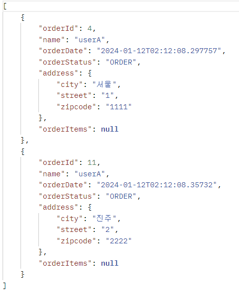
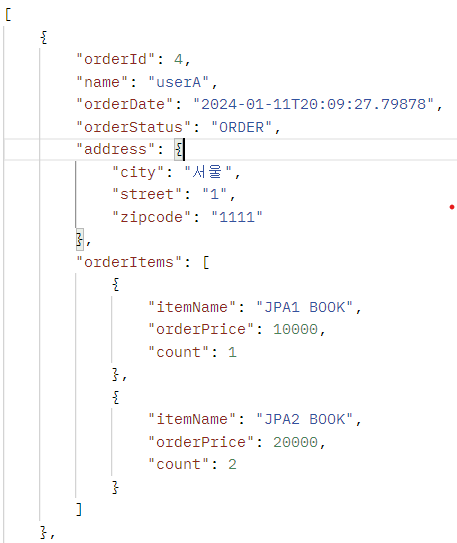

#(Spring+JPA)2.활용(3)

---
---
## ✏️ `API 개발 고급 2. 컬렉션 조회 최적화`
- 주문조회(주문내역에 상품 정보를 추가로 조회하기)
- 컬렉션인 `일대다 관계(OneToMany)`
를 조회하고, 최적화하기

### ✔️ `V1: 엔티티 직접 노출`
```java
@RestController
@RequiredArgsConstructor
public class OrderApiController {
    private final OrderRepository orderRepository;
    private final OrderQueryRepository orderQueryRepository;

    @GetMapping("/api/v1/orders")
    public List<Order> ordersV1(){
        List<Order> all = orderRepository.findAllByString(new OrderSearch());
        for (Order order : all) {
            order.getMember().getName();//초기화
            order.getDelivery().getAddress();//초기화

            List<OrderItem> orderItems = order.getOrderItems();
            orderItems.stream().forEach(o -> o.getItem().getName()); //초기화
        }
        return all;
    }
}
```
- `Hibernate5Module` 모듈 등록, `LAZY=null` 처리
- 양방향 관계 문제 발생 -> `@JsonIgnore`
- `orderItem` , `item` 관계를 직접 초기화하면 `Hibernate5Module` 설정에 의해 엔티티를 JSON으로 생성
- 양방향 연관관계면 무한 루프에 걸리지 않게 한곳에 `@JsonIgnore` 를 추가해야함
- 엔티티를 직접 노출하므로 좋은 방법은 아님


```json
[
    {
        "id": 4,
        "member": {
            "id": 1,
            "name": "userA",
            "address": {
                "city": "서울",
                "street": "1",
                "zipcode": "1111"
            }
        },
        "orderItems": [
            {
                "id": 6,
                "item": {
                    "id": 2,
                    "name": "JPA1 BOOK",
                    "price": 10000,
                    "stockQuantity": 99,
                    "categories": null,
                    "author": null,
                    "isbn": null
                },
                "orderPrice": 10000,
                "count": 1,
                "totalPrice": 10000
            },
            {
                "id": 7,
                "item": {
                    "id": 3,
                    "name": "JPA2 BOOK",
                    "price": 20000,
                    "stockQuantity": 98,
                    "categories": null,
                    "author": null,
                    "isbn": null
                },
                "orderPrice": 20000,
                "count": 2,
                "totalPrice": 40000
            }
        ],
        "delivery": {
            "id": 5,
            "address": {
                "city": "서울",
                "street": "1",
                "zipcode": "1111"
            },
            "status": null
        },
        "orderDate": "2024-01-11T20:09:27.79878",
        "status": "ORDER",
        "totalPrice": 50000
    },
    {
        "id": 11,
        "member": {
            "id": 8,
            "name": "userA",
            "address": {
                "city": "진주",
                "street": "2",
                "zipcode": "2222"
            }
        },
        "orderItems": [
            {
                "id": 13,
                "item": {
                    "id": 9,
                    "name": "SPRING1 BOOK",
                    "price": 20000,
                    "stockQuantity": 197,
                    "categories": null,
                    "author": null,
                    "isbn": null
                },
                "orderPrice": 20000,
                "count": 3,
                "totalPrice": 60000
            },
            {
                "id": 14,
                "item": {
                    "id": 10,
                    "name": "SPRING2 BOOK",
                    "price": 40000,
                    "stockQuantity": 296,
                    "categories": null,
                    "author": null,
                    "isbn": null
                },
                "orderPrice": 40000,
                "count": 4,
                "totalPrice": 160000
            }
        ],
        "delivery": {
            "id": 12,
            "address": {
                "city": "진주",
                "street": "2",
                "zipcode": "2222"
            },
            "status": null
        },
        "orderDate": "2024-01-11T20:09:27.861248",
        "status": "ORDER",
        "totalPrice": 220000
    }
]
```

---
### ✔️ `V2: 엔티티를 DTO로 변환`
```java
@GetMapping("/api/v2/orders")
public List<OrderDto> ordersV2(){
    List<Order> orders = orderRepository.findAllByString(new OrderSearch());
    List<OrderDto> result = orders.stream()
            .map(o -> new OrderDto(o))
            .collect(Collectors.toList());
    return result;
}

@Data
static class OrderDto{

    private Long orderId;
    private String name;
    private LocalDateTime orderDate;
    private OrderStatus orderStatus;
    private Address address;
//  private List<OrderItem> orderItems; --> (1)
//Dto안에 엔티티가 있으면 안됨, 엔티티가 내부로 노출되면 안됨, 엔티티에 대한 의존을 끊어야함, OrderItem도 Dto로 바꾸기
    private List<OrderItemDto> orderItems;

    public OrderDto(Order order) {
        orderId = order.getId();
        name = order.getMember().getName(); //초기화
        orderDate = order.getOrderDate();
        orderStatus = order.getStatus();
        address = order.getDelivery().getAddress(); //초기화

//      order.getOrderItems().stream().forEach(o -> o.getItem().getName()); -->(1)
//초기화, 이거 안하면 orderItems null로 나옴
//      orderItems = order.getOrderItems(); --> (1)
        orderItems = order.getOrderItems().stream()
                .map(orderItem -> new OrderItemDto(orderItem))
                .collect(Collectors.toList());
    }
}

@Getter
static class OrderItemDto{

    private  String itemName; //상품명
    private int orderPrice;   //주문가격
    private int count;        //주문수량

    public OrderItemDto(OrderItem orderItem) {
        itemName = orderItem.getItem().getName();
        orderPrice = orderItem.getItem().getPrice();
        count = orderItem.getCount();
    }
}
```
> **(1) 사용했을때 결과**
>- 초기화를 진행안했을때
>- `OrderItem`은 엔티티이기 때문
>- 초기화 했을때는 결과는 나오지만, `OrderItem`의 모든 속성이 JSON으로 반환됨, 엔티티외부로 노출하지 말기

>


- 트랜잭션 안에서 지연 로딩 필요
- 지연 로딩으로 너무 많은 SQL 실행됨
   - `order` 1번(전체는 2번)
   - `member` , `address` N번(order 조회 수 만큼)
   - `orderItem` N번(order 조회 수 만큼)
   - `item` N번(orderItem 조회 수 만큼)
   - `order`1개 기준: `member` 1개, `address`1개, `orderItem` 1개, `item` 2개 -> 전체 12개 SQL

> 지연 로딩은 영속성 컨텍스트에 있으면 영속성 컨텍스트에 있는 엔티티를 사용하고 없으면 SQL을 실행, 따라서 같은 영속성 컨텍스트에서 이미 로딩한 회원 엔티티를 추가로 조회하면 SQL을 실행하지 않음




---
### ✔️ `V3: 엔티티를 DTO로 변환 - 페치 조인 최적화`

```java
@GetMapping("/api/v3/orders")
public List<OrderDto> ordersV3(){
    List<Order> orders = orderRepository.findAllWithItem();
    List<OrderDto> result = orders.stream()
            .map(o -> new OrderDto(o))
            .collect(Collectors.toList());
    return result;
}
```
```java
//orderRepository
public List<Order> findAllWithItem() {
    return em.createQuery(
            "select distinct o from Order o" +
            " join fetch o.member m" +
            " join fetch o.delivery d" +
            " join fetch o.orderItems oi" +
            " join fetch oi.item i", Order.class
    ).getResultList();  
    // order 2개 orderitems 4개 -> order가 DB에서 4번 나옴
    // distinct 사용하면 애플리케이션 중복 없애줌
}
```

- 페치 조인으로 SQL이 1번만 실행됨
- `distinct` 를 사용한 이유: 1대다 조인이 있으므로 데이터베이스 row가 증가. 그 결과 같은 order 엔티티의 조회 수도 증가하게 됨.
- JPA의 distinct는 SQL에 distinct를 추가하고, 더해서 같은 엔티티가 조회되면, 애플리케이션에서 중복을 걸러줌

**단점**
- 페이징 불가능

> 컬렉션 페치 조인을 사용하면 페이징이 불가능. 하이버네이트는 경고 로그를 남기면서 모든 데이터를 DB에서 읽어오고, 메모리에서 페이징 해버림(매우 위험하다)

> 컬렉션 페치 조인은 1개만 사용할 수 있음. 컬렉션 둘 이상에 페치 조인을 사용하면 안됨.


`//api는 v2와 같음, 사진 생략`


---
### ✔️ `V3.1: 엔티티를 DTO로 변환 - 페이징과 한계 돌파`

- 컬렉션을 페치 조인하면 페이징이 불가능
- 일다대에서 일(1)을 기준으로 페이징을 하는 것이 목적 
- 그러나 데이터는 다(N)를 기준으로 row가 생성됨

**한계 돌파**
- 페이징 + 컬렉션 엔티티를 함께 조회하기
1. **ToOne**(OneToOne, ManyToOne) 관계를 모두 페치조인 함
   - ToOne 관계는 row수를 증가시키지 않으므로 페이징 쿼리에 영향을 주지 않음
2. 컬렉션은 지연 로딩으로 조회
3. 지연 로딩 성능 최적화를 위해 `hibernate.default_batch_fetch_size`, `@BatchSize` 를 적용
    - `hibernate.default_batch_fetch_size`: 글로벌 설정
    - `@BatchSize`: 개별 최적화
- 이 옵션을 사용하면 컬렉션이나, 프록시 객체를 한꺼번에 설정한 size 만큼 IN 쿼리로 조회

```java
@GetMapping("/api/v3.1/orders")
public List<OrderDto> ordersV3_page(
        @RequestParam(value = "offset", defaultValue = "0") int offset,
    // Delivery(offset, limit): fetch join 1개(order, member, address)
    // orderitems in쿼리로 한방에 들고옴, item은 in 쿼리로 한방에 4개 들고옴
    // 전체 쿼리 3개
        @RequestParam(value = "limit", defaultValue = "100") int limit) {

    List<Order> orders = orderRepository.findAllWithMemberDelivery(offset, limit); 
    //Delivery1사용: fetch join 1개(order, member, address), (orderitems 1개, items2개 -> 2번반복, 총 6번), 수정안한상태

    List<OrderDto> result = orders.stream()
            .map(o -> new OrderDto(o))
            .collect(Collectors.toList());
    return result;
}
```
```java
//orderRepository
public List<Order> findAllWithMemberDelivery(int offset, int limit) {
    return em.createQuery(
            "select o from Order o" +
            " join fetch o.member m" +
            " join fetch o.delivery d", Order.class   
    // 위의 join fetch 부분 2줄 없어도 batch있으면 in쿼리 사용
    // order쿼리 1개(in쿼리로 order2개 들고옴), member 쿼리 1개(in 쿼리), delivery 쿼리 1개, orderItems 쿼리 1개, Item 쿼리 1개
    ).setFirstResult(offset)
     .setMaxResults(limit)
     .getResultList();
}
```
```yml
spring:
    jpa:
        properties:
            hibernate:
                default_batch_fetch_size: 1000
```

- 페이징 시에는 N 부분을 포기해야함(대신에 batch fetch size? 옵션 주면 N -> 1 쿼리로 변경 가능)
- 개별로 설정하려면 `@BatchSize` 를 적용하면 됨(컬렉션은 컬렉션 필드에, 엔티티는 엔티티 클래스에 적용)
```java
//Order
@BatchSize(size = 100) //디테일하게 적용하고 싶을 때
@OneToMany(mappedBy = "order", cascade = CascadeType.ALL)
private List<OrderItem> orderItems = new ArrayList<>();

//Item
//@BatchSize(size = 100) //to one일때는 이곳에 적기
@Entity
@Inheritance(strategy = InheritanceType.SINGLE_TABLE)
@DiscriminatorColumn(name = "dtype")
@Getter @Setter
public abstract class Item{
    ...
}
// 글로벌로 사용하는게 편함
```

**장점**
- 쿼리 호출 수가 `1 + N` `1 + 1` 로 최적화 됨
- 조인보다 DB 데이터 전송량이 최적화 됨 (Order와 OrderItem을 조인하면 Order가 OrderItem 만큼 중복해서 조회되지만, 이 방법은 각각 조회하므로 전송해야할 중복 데이터가 없음)
- 페치 조인 방식과 비교해서 쿼리 호출 수가 약간 증가하지만, DB 데이터 전송량이 감소
- 컬렉션 페치 조인은 페이징이 불가능 하지만 이 방법은 페이징이 가능


> 참고: `default_batch_fetch_size` 의 크기는 적당한 사이즈를 골라야 하는데, 100~1000 사이를 선택하는 것을 권장. 1000으로 잡으면 한번에 1000개를 DB에서 애플리케이션에 불러오므로 DB에 순간 부하가 증가할 수 있음. 하지만 애플리케이션은 100이든 1000이든 결국 전체 데이터를 로딩해야 하므로 메모리 사용량이 같음.

> 스프링 3.1이상부터 `in`이 아닌 `array_contains`로 변경됨, 결과는 동일함

`//api는 v2와 같음, 사진 생략`

---
### ✔️ `V4: JPA에서 DTO 직접 조회`
```java
@GetMapping("/api/v4/orders")
public List<OrderQueryDto> ordersV4(){
    return orderQueryRepository.findOrderQueryDtos();
}
```
```java
@Data
public class OrderQueryDto {
    private Long orderId;
    private String name;
    private LocalDateTime orderDate;
    private OrderStatus orderStatus;
    private Address address;
    private List<OrderItemQueryDto> orderItems;

    public OrderQueryDto(Long orderId, String name, LocalDateTime orderDate, OrderStatus orderStatus, Address address) {
        this.orderId = orderId;
        this.name = name;
        this.orderDate = orderDate;
        this.orderStatus = orderStatus;
        this.address = address;
    }
}
```
```java
@Data
public class OrderItemQueryDto {

    @JsonIgnore
    private Long orderId;
    private String itemName;
    private int orderPrice;
    private int count;

    public OrderItemQueryDto(Long orderId, String itemName, int orderPrice, int count) {
        this.orderId = orderId;
        this.itemName = itemName;
        this.orderPrice = orderPrice;
        this.count = count;
    }
}
```
```java
@Repository
@RequiredArgsConstructor
public class OrderQueryRepository {

    private final EntityManager em;

    public List<OrderQueryDto> findOrderQueryDtos(){ 
        //총 3번 쿼리(query 1번 -> N개)

        //루트 조회(toOne 코드를 모두 한번에 조회)
        List<OrderQueryDto> result = findOrders(); //order쿼리 1번

        //루프를 돌면서 컬렉션 추가(추가 쿼리 실행)
        result.forEach(o -> { //query n번
            List<OrderItemQueryDto> orderItems = findOrderItems(o.getOrderId()); //쿼리 각 1번, 총 2번(orderitem, item함께 조회)
            o.setOrderItems(orderItems);
        });
        return result;
    }

    //1:N 관계인 orderItems 조회
    private List<OrderItemQueryDto> findOrderItems(Long orderId) {
        return em.createQuery(
                "select new jpabook.jpashop.repository.order.query.OrderItemQueryDto(oi.order.id, i.name, oi.orderPrice, oi.count)" +
                " from OrderItem oi" +
                " join oi.item i" +
                " where oi.order.id = :orderId", OrderItemQueryDto.class)
                .setParameter("orderId", orderId)
                .getResultList();
    }

    //1:N 관계(컬렉션)를 제외한 나머지를 한번에 조회
    public List<OrderQueryDto> findOrders() {
        return em.createQuery(
                "select new jpabook.jpashop.repository.order.query.OrderQueryDto(o.id, m.name, o.orderDate, o.status, d.address)" +
                " from Order o" +
                " join o.member m" +
                " join o.delivery d", OrderQueryDto.class)
                .getResultList();
    }
}
```
- 페이징 가능
- 컬렉션은 별도로 조회
- 단건 조회에서 많이 사용하는 방식
- Query: 루트 1번, 컬렉션 N 번 실행
- ToOne(N:1, 1:1) 관계들을 먼저 조회하고, ToMany(1:N) 관계는 각각 별도로 처리
   - ToOne 관계는 조인해도 데이터 row 수가 증가하지 않음
   - ToMany(1:N) 관계는 조인하면 row 수가 증가
   - row 수가 증가하지 않는 ToOne 관계는 조인으로 최적화 하기 쉬우므로 한번에 조회하고, ToMany 관계는 최적화 하기 어려우므로 `findOrderItems()` 같은 별도의 메서드로 조회

`//api는 v2와 같음, 사진 생략`


---
### ✔️ `V5: JPA에서 DTO 직접 조회 - 컬렉션 조회 최적화`

- V5에서 `order`가 10개라면 추가 쿼리가 10개가 나감(orderItem, Item같이 있는 쿼리)
- 최적화 해보기

```java
@GetMapping("/api/v5/orders")
public List<OrderQueryDto> ordersV5(){
    return orderQueryRepository.findAllByDto_optimization();
}
```
```java
public List<OrderQueryDto> findAllByDto_optimization() {
    //루트 조회(toOne 코드를 모두 한번에 조회)
    List<OrderQueryDto> result = findOrders();
        
    //orderItem 컬렉션을 MAP 한방에 조회
    //orderItem/Item 조인 + in 쿼리로 한 번에 다 들고옴 -> 쿼리 1개
    Map<Long, List<OrderItemQueryDto>> orderItemMap = findOrderItemMap(toOrderIds(result));
        
    //루프를 돌면서 컬렉션 추가(추가 쿼리 실행X)
    result.forEach(o -> o.setOrderItems(orderItemMap.get(o.getOrderId())));
    return result;

    //v4는 루프 돌리면서 쿼리 날림
    //v5는 쿼리 1번 날리고 메모리에서 맵에 값을 모두 가져온 후 매칭하면서 값을 세팅함, 쿼리 총 2번
}

private List<Long> toOrderIds(List<OrderQueryDto> result) {
    return result.stream()
            .map(o -> o.getOrderId())
            .collect(Collectors.toList());
}

private Map<Long, List<OrderItemQueryDto>> findOrderItemMap(List<Long> orderIds) {
    List<OrderItemQueryDto> orderItems = em.createQuery(
                    "select new jpabook.jpashop.repository.order.query.OrderItemQueryDto(oi.order.id, i.name, oi.orderPrice, oi.count)" + 
                        " from OrderItem oi" +
                        " join oi.item i" +
                        " where oi.order.id in :orderIds", OrderItemQueryDto.class)
            .setParameter("orderIds", orderIds)
            .getResultList();

    return orderItems.stream()
            .collect(Collectors.groupingBy(OrderItemQueryDto::getOrderId));
}
```

- 컬렉션 1 조회 최적화 버전 (1 + 1 Query)
- 페이징 가능
- Query: 루트 1번, 컬렉션 1번
- `ToOne` 관계들을 먼저 조회하고, 여기서 얻은 식별자 orderId로 `ToMany` 관계인 `OrderItem` 을 한꺼번에 조회
- MAP을 사용해서 매칭 성능 향상(O(1))

`//api는 v2와 같음, 사진 생략`


---
### ✔️ `V6: JPA에서 DTO로 직접 조회, 플랫 데이터 최적화`
```java
@GetMapping("/api/v6/orders")
    public List<OrderQueryDto> ordersV6(){
//  return orderQueryRepository.findAllByDto_flat(); 
//중복을 포함해서 SQL 나가게 됨, 1대다조인이기 때문, return이 List<OrderFlatDto>인 경우

    List<OrderFlatDto> flats = orderQueryRepository.findAllByDto_flat();

    return flats.stream()
            .collect(groupingBy(o -> new OrderQueryDto(o.getOrderId(), o.getName(), o.getOrderDate(), o.getOrderStatus(), o.getAddress()),
                    mapping(o -> new OrderItemQueryDto(o.getOrderId(), o.getItemName(), o.getOrderPrice(), o.getCount()), toList())
            )).entrySet().stream()
            .map(e -> new OrderQueryDto(e.getKey().getOrderId(), e.getKey().getName(), e.getKey().getOrderDate(), e.getKey().getOrderStatus(), e.getKey().getAddress(), e.getValue()))
            .collect(toList());
}
```
```java
//OrderQueryRepository
public List<OrderFlatDto> findAllByDto_flat() {
    return em.createQuery(
            "select new jpabook.jpashop.repository.order.query.OrderFlatDto(o.id, m.name, o.orderDate, o.status, d.address, i.name, oi.orderPrice, oi.count)" +
                    " from Order o" +
                    " join o.member m" +
                    " join o.delivery d" +
                    " join o.orderItems oi" +
                    " join oi.item i", OrderFlatDto.class)
            .getResultList();
}
```
```java
//OrderQuertDto 생성자 추가
public List<OrderFlatDto> findAllByDto_flat() {
return em.createQuery(
    "select new
    jpabook.jpashop.repository.order.query.OrderFlatDto(o.id, m.name, o.orderDate,
    o.status, d.address, i.name, oi.orderPrice, oi.count)" +
    " from Order o" +
    " join o.member m" +
    " join o.delivery d" +
    " join o.orderItems oi" +
    " join oi.item i", OrderFlatDto.class)
    .getResultList();
}
```
```java
@Data
public class OrderFlatDto {

    private Long orderId;
    private String name;
    private LocalDateTime orderDate; //주문시간
    private Address address;
    private OrderStatus orderStatus;

    private String itemName;//상품 명
    private int orderPrice; //주문 가격
    private int count; //주문 수량

    public OrderFlatDto(Long orderId, String name, LocalDateTime orderDate, OrderStatus orderStatus, Address address, String itemName, int orderPrice, int count) {
        this.orderId = orderId;
        this.name = name;
        this.orderDate = orderDate;
        this.orderStatus = orderStatus;
        this.address = address;
        this.itemName = itemName;
        this.orderPrice = orderPrice;
        this.count = count;
    }
}
```

- Query: 1번
- `@EqualsAndHashCode(of = "orderId")
public class OrderQueryDto {...` 이렇게 작성해야 중복이 사라지고, v2와 같은 결과가 나옴

**단점**
- 쿼리는 한번이지만 조인으로 인해 DB에서 애플리케이션에 전달하는 데이터에 중복 데이터가 추가되므로 상황에 따라 V5 보다 더 느릴 수 도 있음
- 애플리케이션에서 추가 작업이 큼
- 페이징 불가능(order가 DB에서 중복되어 있기 때문)


---
### ✔️ `정리`
- 엔티티 조회
   - 엔티티를 조회해서 그대로 반환: V1
   - 엔티티 조회 후 DTO로 변환: V2
   - 페치 조인으로 쿼리 수 최적화: V3(페이징 불가)
   - 컬렉션 페이징과 한계 돌파: V3.1
- DTO 직접 조회
   - JPA에서 DTO를 직접 조회: V4
   - 컬렉션 조회 최적화 - 일대다 관계인 컬렉션은 IN 절을 활용해서 메모리에 미리 조회해서 최적화: V5
   - 플랫 데이터 최적화 - JOIN 결과를 그대로 조회 후 애플리케이션에서 원하는 모양으로 직접 변환: V6


**권장 순서**
1. 엔티티 조회 방식으로 우선 접근
   1. 페치조인으로 쿼리 수를 최적화
   2. 컬렉션 최적화
      1. 페이징 필요 `hibernate.default_batch_fetch_size` , `@BatchSize` 로 최적화
      2. 페이징 필요X -> 페치 조인 사용
2. 엔티티 조회 방식으로 해결이 안되면 DTO 조회 방식 사용
3. DTO 조회 방식으로 해결이 안되면 NativeSQL or 스프링 JdbcTemplate


> 엔티티 조회 방식은 페치 조인이나, `hibernate.default_batch_fetch_size` , `@BatchSize` 같이 코드를 거의 수정하지 않고, 옵션만 약간 변경해서, 다양한 성능 최적화를 시도할 수 있음<br>
> 반면에 DTO를 직접 조회하는 방식은 성능을 최적화 하거나 성능 최적화 방식을 변경할 때 많은 코드를 변경해야함


**DTO 조회 방식의 선택지**
1. V4
- 코드가 단순함
- 특정 주문 한건만 조회하면 이 방식을 사용해도 성능이 좋음
- 조회한 Order 데이터가 1건이면 OrderItem을 찾기 위한 쿼리도 1번만 실행하면 됨
2. V5
- 코드가 복잡함
- 여러 주문을 한꺼번에 조회하는 경우에는 V4 대신에 이것을 최적화한 V5 방식을 사용
- 조회한 Order 데이터가 1000건인데, V4 방식을 그대로 사용하면, 쿼리가 총 1(order조회 쿼리) + 1000(조회된 order row 숫자)번 실행됨 
- V5 방식으로 최적화 하면 쿼리가 총 1 + 1번만 실행
3. V6
- 쿼리 한번으로 최적화 되어서 상당히 좋아보이지만, Order를 기준으로 페이징이 불가능
- 데이터가 많으면 중복 전송이 증가해서 V5와 비교해서 성능 차이도 미비

---
---
## ✏️ `API 개발 고급 3. 실무 최적화`
### ✔️ `Test`


---
 


