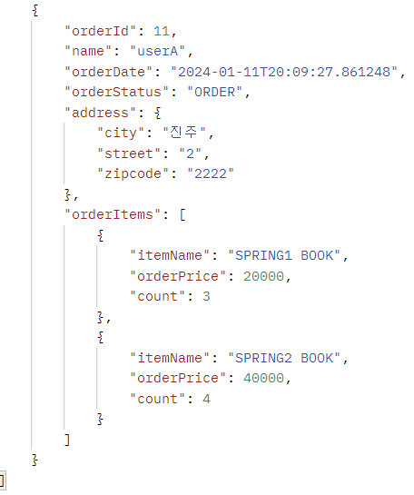

#(Spring+JPA)2.활용(3)

---
---
## ✏️ `API 개발 고급 2. 컬렉션 조회 최적화`
- 주문조회(주문내역에 상품 정보를 추가로 조회하기)
- 컬렉션인 `일대다 관계(OneToMany)`
를 조회하고, 최적화하기

### ✔️ `V1: 엔티티 직접 노출`
```java
@RestController
@RequiredArgsConstructor
public class OrderApiController {
    private final OrderRepository orderRepository;
    private final OrderQueryRepository orderQueryRepository;

    @GetMapping("/api/v1/orders")
    public List<Order> ordersV1(){
        List<Order> all = orderRepository.findAllByString(new OrderSearch());
        for (Order order : all) {
            order.getMember().getName();//초기화
            order.getDelivery().getAddress();//초기화

            List<OrderItem> orderItems = order.getOrderItems();
            orderItems.stream().forEach(o -> o.getItem().getName()); //초기화
        }
        return all;
    }
}
```
- `Hibernate5Module` 모듈 등록, `LAZY=null` 처리
- 양방향 관계 문제 발생 -> `@JsonIgnore`
- `orderItem` , `item` 관계를 직접 초기화하면 `Hibernate5Module` 설정에 의해 엔티티를 JSON으로 생성
- 양방향 연관관계면 무한 루프에 걸리지 않게 한곳에 `@JsonIgnore` 를 추가해야함
- 엔티티를 직접 노출하므로 좋은 방법은 아님


```json
[
    {
        "id": 4,
        "member": {
            "id": 1,
            "name": "userA",
            "address": {
                "city": "서울",
                "street": "1",
                "zipcode": "1111"
            }
        },
        "orderItems": [
            {
                "id": 6,
                "item": {
                    "id": 2,
                    "name": "JPA1 BOOK",
                    "price": 10000,
                    "stockQuantity": 99,
                    "categories": null,
                    "author": null,
                    "isbn": null
                },
                "orderPrice": 10000,
                "count": 1,
                "totalPrice": 10000
            },
            {
                "id": 7,
                "item": {
                    "id": 3,
                    "name": "JPA2 BOOK",
                    "price": 20000,
                    "stockQuantity": 98,
                    "categories": null,
                    "author": null,
                    "isbn": null
                },
                "orderPrice": 20000,
                "count": 2,
                "totalPrice": 40000
            }
        ],
        "delivery": {
            "id": 5,
            "address": {
                "city": "서울",
                "street": "1",
                "zipcode": "1111"
            },
            "status": null
        },
        "orderDate": "2024-01-11T20:09:27.79878",
        "status": "ORDER",
        "totalPrice": 50000
    },
    {
        "id": 11,
        "member": {
            "id": 8,
            "name": "userA",
            "address": {
                "city": "진주",
                "street": "2",
                "zipcode": "2222"
            }
        },
        "orderItems": [
            {
                "id": 13,
                "item": {
                    "id": 9,
                    "name": "SPRING1 BOOK",
                    "price": 20000,
                    "stockQuantity": 197,
                    "categories": null,
                    "author": null,
                    "isbn": null
                },
                "orderPrice": 20000,
                "count": 3,
                "totalPrice": 60000
            },
            {
                "id": 14,
                "item": {
                    "id": 10,
                    "name": "SPRING2 BOOK",
                    "price": 40000,
                    "stockQuantity": 296,
                    "categories": null,
                    "author": null,
                    "isbn": null
                },
                "orderPrice": 40000,
                "count": 4,
                "totalPrice": 160000
            }
        ],
        "delivery": {
            "id": 12,
            "address": {
                "city": "진주",
                "street": "2",
                "zipcode": "2222"
            },
            "status": null
        },
        "orderDate": "2024-01-11T20:09:27.861248",
        "status": "ORDER",
        "totalPrice": 220000
    }
]
```

---
### ✔️ `V2: 엔티티를 DTO로 변환`
```java
@GetMapping("/api/v2/orders")
public List<OrderDto> ordersV2(){
    //order 조회 sql(2개) -> order1루프: Member 1번, Delivery 1번 -> Orderitems 1번: item 각 1번씩
    List<Order> orders = orderRepository.findAllByString(new OrderSearch());
    List<OrderDto> result = orders.stream()
            .map(o -> new OrderDto(o))
            .collect(Collectors.toList());
    return result;
}

@Data
static class OrderDto{

    private Long orderId;
    private String name;
    private LocalDateTime orderDate;
    private OrderStatus orderStatus;
    private Address address;
//  private List<OrderItem> orderItems; 
//Dto안에 엔티티가 있으면 안됨, 엔티티가 내부로 노출되면 안됨, 엔티티에 대한 의존을 끊어야함, OrderItem도 Dto로 바꾸기
    private List<OrderItemDto> orderItems;

    public OrderDto(Order order) {
        orderId = order.getId();
        name = order.getMember().getName(); //초기화
        orderDate = order.getOrderDate();
        orderStatus = order.getStatus();
        address = order.getDelivery().getAddress(); //초기화

//      order.getOrderItems().stream().forEach(o -> o.getItem().getName()); //초기화, 이거 안하면 orderItem null로 나옴
//      orderItems = order.getOrderItems();
        orderItems = order.getOrderItems().stream()
                .map(orderItem -> new OrderItemDto(orderItem))
                .collect(Collectors.toList());
    }
}

@Getter
static class OrderItemDto{

    private  String itemName; //상품명
    private int orderPrice;   //주문가격
    private int count;        //주문수량

    public OrderItemDto(OrderItem orderItem) {
        itemName = orderItem.getItem().getName();
        orderPrice = orderItem.getItem().getPrice();
        count = orderItem.getCount();
    }
}
```
- 트랜잭션 안에서 지연 로딩 필요

지연 로딩으로 너무 많은 SQL 실행
SQL 실행 수
`order` 1번
`member` , `address` N번(order 조회 수 만큼)
`orderItem` N번(order 조회 수 만큼)
`item` N번(orderItem 조회 수 만큼)
참고: 지연 로딩은 영속성 컨텍스트에 있으면 영속성 컨텍스트에 있는 엔티티를 사용하고 없으면 SQL을 실행한
다. 따라서 같은 영속성 컨텍스트에서 이미 로딩한 회원 엔티티를 추가로 조회하면 SQL을 실행하지 않는다.



---
### ✔️ `V3: 엔티티를 DTO로 변환 - 페치 조인 최적화`


---
### ✔️ `V3.1: 엔티티를 DTO로 변환 - 페이징과 한계 돌파`


---
### ✔️ `V4: JPA에서 DTO 직접 조회`


---
### ✔️ `V5: JPA에서 DTO 직접 조회 - 컬렉션 조회 최적화`


---
### ✔️ `V6: JPA에서 DTO로 직접 조회, 플랫 데이터 최적화`


---
---
## ✏️ `API 개발 고급 3. 실무 최적화`
### ✔️ `Test`


---
 


