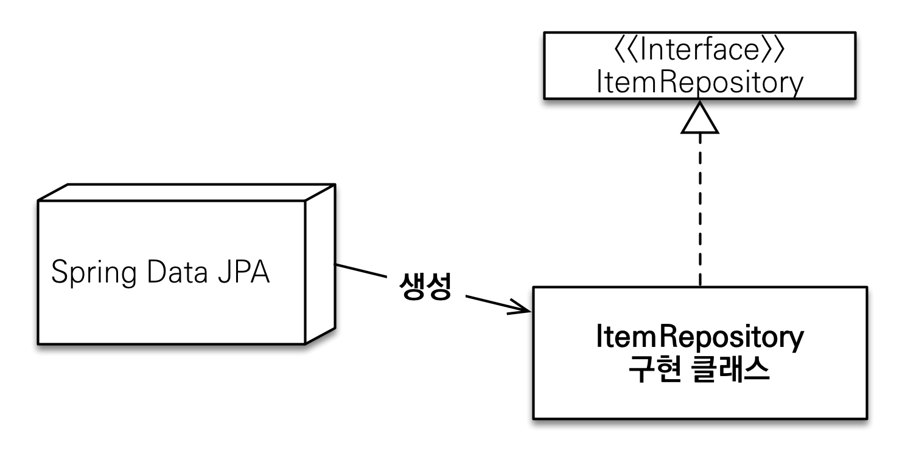
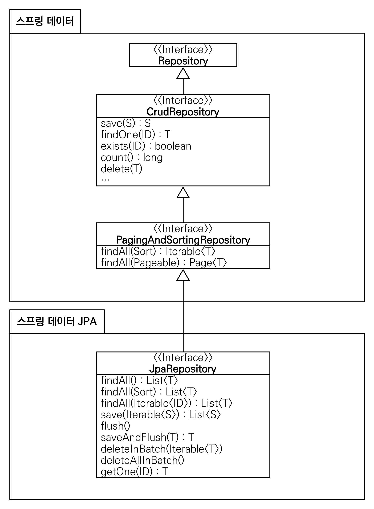

#(SpringDataJPA)1.공통인터페이스,쿼리메소드

---
---
## ✏️ `도메인 설정`
```java
@Entity
@Getter @Setter
@NoArgsConstructor(access = AccessLevel.PROTECTED)
@ToString(of = {"id", "username", "age"}) //연관관계 필드는 가급적 toString하지 말기
@NamedQuery(
        name="Member.findByUsername",
        query="select m from Member m where m.username = :username")
public class Member {

    @Id @GeneratedValue
    @Column(name = "member_id")
    private Long id;
    private String username;
    private int age;

    @ManyToOne(fetch = FetchType.LAZY)
    @JoinColumn(name = "team_id")
    private Team team;

    public Member(String username) {
        this.username = username;
    }

    public Member(String username, int age) {
        this.username = username;
        this.age = age;
    }

    public Member(String username, int age, Team team) {
        this.username = username;
        this.age = age;
        if(team != null){
            changeTeam(team);
        }
    }

    public void changeTeam(Team team){
        this.team = team;
        team.getMembers().add(this);
    }

}
```
- `@NoArgsConstructor AccessLevel.PROTECTED`: 기본 생성자, PROTECTED
- `@ToString`은 가급적 내부 필드만(연관관계 없는 필드만)

```java
@Entity
@Getter @Setter
@NoArgsConstructor(access = AccessLevel.PROTECTED)
@ToString(of = {"id", "name"})
public class Team {

    @Id @GeneratedValue
    @Column(name = "team_id")
    private Long id;
    private String name;

    @OneToMany(mappedBy = "team")
    private List<Member> members = new ArrayList<>();

    public Team(String name) {
        this.name = name;
    }
}
```
- Member와 Team은 양방향 연관관계, `Member.team` 이 연관관계의 주인, `Team.members` 는 연관관계의 주인이 아님
- 따라서 `Member.team` 이 데이터베이스 외래키 값을 변경, 반대편은 읽기만 가능
```java
@SpringBootTest
@Transactional
@Rollback(value = false)
class MemberTest {

    @PersistenceContext
    EntityManager em;

    @Test
    public void testEntity(){
        Team teamA = new Team("teamA");
        Team teamB = new Team("teamB");
        em.persist(teamA);
        em.persist(teamB);

        Member member1 = new Member("member1", 10, teamA);
        Member member2 = new Member("member2", 20, teamA);
        Member member3 = new Member("member3", 30, teamB);
        Member member4 = new Member("member4", 40, teamB);
        em.persist(member1);
        em.persist(member2);
        em.persist(member3);
        em.persist(member4);

        //초기화
        em.flush();
        em.clear();

        //확인
        List<Member> members = em.createQuery("select m from Member m", Member.class)
                .getResultList();

        for (Member member : members) { //쿼리 3개, Member 1번 Team 2번
            System.out.println("member = " + member);
            System.out.println("member.getTeam() = " + member.getTeam());
        }
    }
}
```
- 모든 `Member` 들고오는 SQL 쿼리 1개
- `member.getTeam()`으로 프록시 상태 초기화 하면서 SQL쿼리 2개 날림(`@ToString`이 존재하므로, 호출하면서 바로 초기화)

---
---
## ✏️ `공통 인터페이스 기능`
### ✔️ `순수 JPA 기반 리포지토리 만들기`
> JPA에서 수정은 변경감지 기능을 사용하면 됨.
트랜잭션 안에서 엔티티를 조회한 다음에 데이터를 변경하면, 트랜잭션 종료 시점에 변경감지 기능이 작동해서 변경된 엔티티를 감지하고 UPDATE SQL을 실행
```java

```
```java
@Repository
public class MemberJpaRepository {

    @PersistenceContext
    private EntityManager em;

    //JPA는 변경감지로 업데이트가 발생하므로, 업데이트를 따로 만들 필요는 없음
    
    public Member save(Member member){
        em.persist(member);
        return member;
    }

    public void delete(Member member){
        em.remove(member);
    }

    public List<Member> findAll(){
        return em.createQuery("select m from Member m", Member.class)
                .getResultList();
    }

    public Optional<Member> findById(Long id){
        Member member = em.find(Member.class, id);
        return Optional.ofNullable(member);
    }

    public long count(){
        return em.createQuery("select count(m) from Member m", Long.class)
                .getSingleResult();
    }

    public Member find(Long id){
        return em.find(Member.class, id);
    }
}
```
- `TeamJpaRepository`도 위 코드와 거의 동일함
```java
@SpringBootTest
@Transactional
class MemberJpaRepositoryTest {

    @Autowired MemberJpaRepository memberJpaRepository;

    @Test
    public void testMember(){
        Member member = new Member("memberA");
        Member savedMember = memberJpaRepository.save(member);

        Member findMember = memberJpaRepository.find(savedMember.getId());

        assertThat(findMember.getId()).isEqualTo(member.getId());
        assertThat(findMember.getUsername()).isEqualTo(member.getUsername());
        assertThat(findMember).isEqualTo(member);
    }

    @Test
    public void basicCRUD(){
        Member member1 = new Member("member1");
        Member member2 = new Member("member2");
        memberJpaRepository.save(member1);
        memberJpaRepository.save(member2);

        //단건 조회 검증
        Member findMember1 = memberJpaRepository.findById(member1.getId()).get();
        Member findMember2 = memberJpaRepository.findById(member2.getId()).get();
        assertThat(findMember1).isEqualTo(member1);
        assertThat(findMember2).isEqualTo(member2);

        //findMember1.setUsername("member1111"); //Update, 변경감지 기능을 이용
        
        //리스트 조회 검증
        List<Member> all = memberJpaRepository.findAll();
        assertThat(all.size()).isEqualTo(2);

        //카운트 검증
        long count = memberJpaRepository.count();
        assertThat(count).isEqualTo(2);

        //삭제 검증
        memberJpaRepository.delete(member1);
        memberJpaRepository.delete(member2);

        long deletedCount = memberJpaRepository.count();
        assertThat(deletedCount).isEqualTo(0);
    }
}
```

---
### ✔️ `공통 인터페이스`
#### ✨ 설정

- 스프링 부트 사용시 `@SpringBootApplication` 위치를 지정(해당 패키지와 하위 패키지 인식)
- 만약 위치가 달라지면 `@EnableJpaRepositories` 추가적으로 필요

**스프링 데이터 JPA가 구현 클래스 대신 생성**



- `org.springframework.data.repository.Repository` 를 구현한 클래스는 스캔 대상
    - 따라서 MemberRepository 인터페이스가 동작함
    - 실제 출력하면 Proxy로 나옴
- `@Repository` 애노테이션 생략 가능
    - 컴포넌트 스캔을 스프링 데이터 JPA가 자동으로 처리
    - JPA 예외를 스프링 예외로 변환하는 과정도 자동으로 처리

#### ✨ 적용
```java
import org.springframework.data.jpa.repository.JpaRepository;

public interface MemberRepository extends JpaRepository<Member, Long> {
}
```
```java
@SpringBootTest
@Rollback(value = false)
@Transactional
class MemberRepositoryTest {
    @Autowired MemberRepository memberRepository;
    @Autowired TeamRepository teamRepository;
    @PersistenceContext EntityManager em;

    @Test
    public void testMember(){
        System.out.println("memberRepository.getClass() = " + memberRepository.getClass()); 
        //class com.sun.proxy.$Proxy107
        
        //...MemberJpaRepositoryTest와 같은 코드
    }

    @Test
    public void basicCRUD(){
        //...MemberJpaRepositoryTest와 같은 코드
    }
}
```
- `TeamRepository`도 동일하게 작성
- `JpaRepository<T, ID>`: T(엔티티 타입), ID(식별자 타입(PK))
- `JpaRepository 인터페이스`: 공통 CRUD 제공

#### ✨ 분석


- `T findOne(ID)` -> `Optional<T> findById(ID)` 변경
- `boolean exists(ID)` -> `boolean existsById(ID)` 변경

**제네릭 타입**
`T` : 엔티티
`ID` : 엔티티의 식별자 타입
`S` : 엔티티와 그 자식 타입

**주요 메서드**
- `save(S)` : 새로운 엔티티는 저장하고 이미 있는 엔티티는 병합
- `delete(T)` : 엔티티 하나를 삭제. 내부에서 `EntityManager.remove()` 호출
- `findById(ID)` : 엔티티 하나를 조회. 내부에서 `EntityManager.find()` 호출
- `getOne(ID)` : 엔티티를 프록시로 조회. 내부에서 `EntityManager.getReference()` 호출
- `findAll(…)` : 모든 엔티티를 조회. 정렬(`Sort`)이나 페이징(`Pageable`) 조건을 파라미터로 제공할 수 있음


---
---
## ✏️ `쿼리 메서드 기능`

**1. 메소드 이름으로 쿼리 생성**

**2. 메소드 이름으로 `JPA NamedQuery` 호출**

**3. `@Query` 어노테이션을 사용해서 리포지토리 인터페이스에 쿼리 직접 정의**


### ✔️ `1. 메소드 이름으로 쿼리 생성`
**순수 JPA 리포지토리, 테스트 코드**
```java
//MemberJpaRepository
public List<Member> findByUsernameAndAgeGreaterThen(String username, int age){
    return em.createQuery("select m from Member m where m.username = :username and m.age > :age")
            .setParameter("username", username)
            .setParameter("age", age)
            .getResultList();
}
//MemberJpaRepositoryTest
@Test
public void findByUsernameAndAgeGreaterThen(){
    Member m1 = new Member("AAA", 10);
    Member m2 = new Member("AAA", 20);
    memberJpaRepository.save(m1);
    memberJpaRepository.save(m2);

    List<Member> result = memberJpaRepository.findByUsernameAndAgeGreaterThen("AAA", 15);

    assertThat(result.get(0).getUsername()).isEqualTo("AAA");
    assertThat(result.get(0).getAge()).isEqualTo(20);
    assertThat(result.size()).isEqualTo(1);
}
```

**스프링 데이터 JPA**
```java
public interface MemberRepository extends JpaRepository<Member, Long> {
    List<Member> findByUsernameAndAgeGreaterThan(String username, int age);
}
```
**스프링 데이터 JPA가 제공하는 쿼리 메소드 기능**
- 조회: `find…By, read…By ,query…By, get…By`
   - findHelloBy 처럼 ...에 식별하기 위한 내용(설명)이 들어가도 됨
- COUNT: `count…By` 반환타입 `long`
- EXISTS: `exists…By` 반환타입 `boolean`
- 삭제: `delete…By`, `remove…By` 반환타입 `long`
- DISTINCT: `findDistinct`, `findMemberDistinctBy`
- LIMIT: `findFirst3`, `findFirst`, `findTop`, `findTop3`
<br><br>

- `By`하고 아무것도 없으면 전체 조회
- `By`뒤에 `where`에 넣을 컨디션을 넣어주기
- `findTop3HelloBy`
<br><br>
- 스프링 데이터 JPA는 메소드 이름을 분석해서 JPQL을 생성하고 실행
- 엔티티의 필드명이 변경되면 인터페이스에 정의한 메서드 이름도 꼭 함께 변경해야 함. 그렇지
않으면 애플리케이션을 시작하는 시점에 오류가 발생

---
### ✔️ `2. JPA NamedQuery`
```java
@NamedQuery(
        name="Member.findByUsername",
        query="select m from Member m where m.username = :username")
public class Member {
}
```
- `@NamedQuery` 어노테이션으로 Named 쿼리 정의

**JPA를 사용해서 쿼리 호출**
```java
//MemberJpaRepository
public List<Member> findByUsername(String username){
    return em.createQuery("Member.findByUsername", Member.class)
            .setParameter("username", username)
            .getResultList();
}
//MemberJpaRepositoryTest
@Test
public void testNamedQuery(){
    Member m1 = new Member("AAA", 10);
    Member m2 = new Member("BBB", 20);
    memberJpaRepository.save(m1);
    memberJpaRepository.save(m2);

    List<Member> result = memberJpaRepository.findByUsername("AAA");
    Member findMember = result.get(0);
    assertThat(findMember).isEqualTo(m1);
}
```

**스프링 데이터 JPA를 사용해서 쿼리 호출**
```java
@Query(name = "Member.findByUsername") //생략가능
List<Member> findByUsername(@Param("username") String username);
```
- `@Query` 를 생략하고 메서드 이름만으로 Named 쿼리를 호출할 수 있음
- `NamedQuery`의 장점: 애플리케이션 로딩 시점에 오류가 있으면 오류 발생시킴

```java
public interface MemberRepository
extends JpaRepository<Member, Long> { //** 여기 선언한 Member 도메인 클래스
    List<Member> findByUsername(@Param("username") String username);
}
```
- 스프링 데이터 JPA는 선언한 `도메인 클래스 + .(점) + 메서드 이름`으로 Named 쿼리를 찾아서 실행가능
- 만약 실행할 Named 쿼리가 없으면 메서드 이름으로 쿼리 생성 전략을 사용

---
### ✔️ `3. @Query, 리포지토리 메소드에 쿼리 정의하기`

```java
public interface MemberRepository extends JpaRepository<Member, Long> {
    @Query("select m from Member m where m.username= :username and m.age = :age")
    List<Member> findUser(@Param("username") String username, @Param("age") int
    age);
}
```
```java
@Test
public void testQuery(){
    Member m1 = new Member("AAA", 10);
    Member m2 = new Member("BBB", 20);
    memberRepository.save(m1);
    memberRepository.save(m2);

    List<Member> result = memberRepository.findUser("AAA", 10);
    assertThat(result.get(0)).isEqualTo(m1);
}
```
- 실행할 메서드에 정적 쿼리를 직접 작성하므로 이름 없는 Named 쿼리라 할 수 있음
- JPA Named 쿼리처럼 애플리케이션 실행 시점에 문법 오류를 발견할 수 있음(매우 큰 장점)


#### ✨ @Query, 값, DTO 조회하기
```java
//단순히 값 하나 조회
@Query("select m.username from Member m")
List<String> findUsernameList();

//DTO로 직접 조회
@Query("select new study.datajpa.dto.MemberDto(m.id, m.username, t.name) from Member m join m.team t")
List<MemberDto> findMemberDto();
```
```java
@Data
public class MemberDto {
    private Long id;
    private String username;
    private String teamName;

    public MemberDto(Long id, String username, String teamName) {
        this.id = id;
        this.username = username;
        this.teamName = teamName;
    }
}
```
```java
@Test
public void findUsernameList(){
    Member m1 = new Member("AAA", 10);
    Member m2 = new Member("BBB", 20);
    memberRepository.save(m1);
    memberRepository.save(m2);

    List<String> usernameList = memberRepository.findUsernameList();
    for (String s : usernameList) {
        System.out.println("s = " + s);
    }
}

@Test
public void findMemberDto(){
    Team team = new Team("teamA");
    teamRepository.save(team);

    Member m1 = new Member("AAA", 10);
    m1.setTeam(team);
    memberRepository.save(m1);

    List<MemberDto> memberDto = memberRepository.findMemberDto();
    for (MemberDto dto : memberDto) {
        System.out.println("dto = " + dto);
    }
}
```
- JPA 값 타입(`@Embedded`)도 이 방식으로 조회가능


#### ✨ 파리미터 바인딩
- 위치 기반 `select m from Member m where m.username = ?0`
- 이름 기반 `select m from Member m where m.username = :name`

```java
@Query("select m from Member m where m.username in :names")
List<Member> findByNames(@Param("names") Collection<String> names);
```
```java
@Test
public void findByNames(){
    Member m1 = new Member("AAA", 10);
    Member m2 = new Member("BBB", 20);
    memberRepository.save(m1);
    memberRepository.save(m2);

    List<Member> result = memberRepository.findByNames(Arrays.asList("AAA", "BBB"));
    for (Member member : result) {
        System.out.println("member = " + member);
    }
}
```

#### ✨ 반환타입
- 스프링 데이터 JPA는 유연한 반환 타입 지원
- `Optional` 값이 있는지 없는지 모를때 사용 권장
```java
List<Member> findListByUsername(String username);//컬렉션
Member findMemberByUsername(String username); //단건
Optional<Member> findOptionalByUsername(String username); //optional
```
```java
@Test
public void returnType(){
    Member m1 = new Member("AAA", 10);
    Member m2 = new Member("BBB", 20);
    memberRepository.save(m1);
    memberRepository.save(m2);

    List<Member> aaa = memberRepository.findListByUsername("AAA"); //값이 없으면, null이 아니라 빈 컬렉션 반환
    Member findMember = memberRepository.findMemberByUsername("AAA");
    Optional<Member> a = memberRepository.findOptionalByUsername("AAA");
}
```
- 컬렉션
   - 결과 없음: 빈 컬렉션 반환
- 단건 조회
   - 결과 없음: `null` 반환
   - 결과가 2건 이상: `javax.persistence.NonUniqueResultException` 예외 발생
>  단건으로 지정한 메서드를 호출하면 스프링 데이터 JPA는 내부에서 JPQL의 `Query.getSingleResult()` 메서드를 호출. 이 메서드를 호출했을 때 조회 결과가 없으면 `javax.persistence.NoResultException` 예외가 발생하는데 개발자 입장에서 다루기가 불편하므로 예외를 무시하고 대신에 `null` 을 반환


---
### ✔️ `페이징과 정렬`
#### ✨ `순수 JPA 페이징과 정렬`
- 검색 조건: 나이 10살
- 정렬 조건: 이름으로 내림차순
- 페이징 조건: 첫 번째 페이지, 페이지당 보여줄 데이터는 3건
```java
public List<Member> findByPage(int age, int offset, int limit){
    return em.createQuery("select m from Member m where m.age = :age order by m.username desc")
            .setParameter("age", age)
            .setFirstResult(offset)
            .setMaxResults(limit)
            .getResultList();
}

public long totalCount(int age){
    return em.createQuery("select count(m) from Member m where m.age = :age", Long.class)
            .setParameter("age", age)
            .getSingleResult();
}
```
```java
@Test
public void paging(){
    //given
    memberJpaRepository.save(new Member("member1", 10));
    memberJpaRepository.save(new Member("member2", 10));
    memberJpaRepository.save(new Member("member3", 10));
    memberJpaRepository.save(new Member("member4", 10));
    memberJpaRepository.save(new Member("member5", 10));

    int age = 10;
    int offset = 0;
    int limit = 3;

    //when
    List<Member> members = memberJpaRepository.findByPage(age, offset, limit);
    long totalCount = memberJpaRepository.totalCount(age);

    //then
    assertThat(members.size()).isEqualTo(3);
    assertThat(totalCount).isEqualTo(5);
}
```


#### ✨ `스프링 데이터 JPA 페이징과 정렬`

**페이징과 정렬 파라미터**
- `org.springframework.data.domain.Sort` : 정렬 기능
- `org.springframework.data.domain.Pageable` : 페이징 기능 (내부에 `Sort` 포함)

**특별한 반환 타입**
- `org.springframework.data.domain.Page` : 추가 count 쿼리 결과를 포함하는 페이징
- `org.springframework.data.domain.Slice` : 추가 count 쿼리 없이 다음 페이지만 확인 가능(내부적으로 limit + 1조회)
    - 다음 페이지 여부 확인
- `List` (자바 컬렉션): 추가 count 쿼리 없이 결과만 반환

```java
Page<Member> findByAge(int age, Pageable pageable);
Slice<Member> findByAge(int age, Pageable pageable);
List<Member> findByAge(int age, Pageable pageable);
List<Member> findByAge(int age, Sort sort);
```

```java
@Test
public void paging(){
    //given
    memberRepository.save(new Member("member1", 10));
    memberRepository.save(new Member("member2", 10));
    memberRepository.save(new Member("member3", 10));
    memberRepository.save(new Member("member4", 10));
    memberRepository.save(new Member("member5", 10));

    int age = 10;
    PageRequest pageRequest = PageRequest.of(0, 3, Sort.by(Sort.Direction.DESC, "username"));

    //when
    Page<Member> page = memberRepository.findByAge(age, pageRequest); 
    //전체 갯수 자동으로 받아줌
    //SQL쿼리 + count SQL 쿼리

    //페이지를 유지하면서 엔티티를 DTO로 변환하기
    // Page<MemberDto> toMap = page.map(m -> new MemberDto(m.getId(), m.getUsername(), null));

    //then
    List<Member> content = page.getContent(); //조회된 데이터
    long totalElements = page.getTotalElements(); //전체 데이터 수

    for (Member member : content) {
        System.out.println("member = " + member); //member5,4,3
    }
    System.out.println("totalElements = " + totalElements); //5개

    assertThat(content.size()).isEqualTo(3); //조회된 데이터 수
    assertThat(page.getTotalElements()).isEqualTo(5);
    assertThat(page.getNumber()).isEqualTo(0); //페이지 번호 가져오기
    assertThat(page.getTotalPages()).isEqualTo(2); //전체 페이지 2개
    assertThat(page.isFirst()).isTrue(); //첫 번째 항목인가
    assertThat(page.hasNext()).isTrue(); //다음 페이지가 있는가
}
```
- `Page는 1부터 시작이 아니라 0부터 시작`
- 두 번째 파라미터로 받은 `Pageable` 은 인터페이스임. 따라서 실제 사용할 때는 해당 인터페이스를 구현한 `PageRequest` 객체를 사용
- `PageRequest` 생성자의 첫 번째 파라미터에는 `현재 페이지`를, 두 번째 파라미터에는 `조회할 데이터 수`를 입력
- 추가로 정렬 정보도 파라미터로 사용할 수 있음

**Page 인터페이스**
```java
public interface Page<T> extends Slice<T> {
    int getTotalPages(); //전체 페이지 수
    long getTotalElements(); //전체 데이터 수
    <U> Page<U> map(Function<? super T, ? extends U> converter); //변환기
}
```

**Slice 사용**
```java
@Test
public void slicing(){
    ...
    PageRequest pageRequest = PageRequest.of(0, 3, Sort.by(Sort.Direction.DESC, "username"));
    //limit 4로 SQL나감

    //when
    Slice<Member> page = memberRepository.findByAge(age, pageRequest);

    //then
    List<Member> content = page.getContent();
    assertThat(content.size()).isEqualTo(3);
    assertThat(page.getNumber()).isEqualTo(0);
    assertThat(page.isFirst()).isTrue();
    assertThat(page.hasNext()).isTrue();
}
```

**count쿼리 분리하고 싶다면**
```java
@Query(value = "select m from Member m left join m.team t",
        countQuery = "select count(m.username) from Member m") //left join이므로 성능위해 join안하는 count쿼리 따로 날려줌
Page<Member> findByAge(int age, Pageable pageable);
- 카운트 쿼리 분리(복잡한 sql에서 사용, 데이터는 left join, 카운트는 left join 안해도 됨)
- 전체 count 조회 쿼리는 무겁기 때문에 분리해서 사용

```
```java
List<Member> findTop3By();
```
- `List<Member> findTop3ByAge(age)`; 페이징 안넘길때, 단순 3건만 조회할때


---
### ✔️ `벌크성 수정 쿼리`
#### ✨ `순수 JPA 페이징과 정렬`
```java
public int bulkAgePlus(int age){
    int resultCount = em.createQuery("update Member m set m.age = m.age + 1" +
            " where m.age >= :age")
            .setParameter("age", age)
            .executeUpdate();
    return resultCount;
}
```
```java
@Test
public void bulkUpdate(){
    //given
    memberJpaRepository.save(new Member("member1", 10));
    memberJpaRepository.save(new Member("member2", 19));
    memberJpaRepository.save(new Member("member3", 20));
    memberJpaRepository.save(new Member("member4", 21));
    memberJpaRepository.save(new Member("member5", 40));
    //when
    int resultCount = memberJpaRepository.bulkAgePlus(20);
    //then
    assertThat(resultCount).isEqualTo(3);
}
```
#### ✨ `스프링 데이터 JPA 페이징과 정렬`
```java
@Modifying(clearAutomatically = true)
@Query("update Member m set m.age = m.age + 1 where m.age >= :age")
int bulkAgePlus(@Param("age") int age);
```
```java
@Test
public void bulkUpdate(){
    ...순수 JPA테스트와 코드 같음    
    //when
    int resultCount = memberRepository.bulkAgePlus(20);
    //JPQL이라 DB에 INSERT(save한것) 날리고(flush) UPDATE날림
//  em.flush(); //혹시 DB에 반영되지 않은게 있다면 flush해줌, save한것들은 이미 쓰기지연저장소에 있는 쿼리를 날려줬기 때문에 새롭게 flush안됨
//  em.clear();

    List<Member> result = memberRepository.findByUsername("member5");
    Member member5 = result.get(0);
    System.out.println("member5 = " + member5); //41로 변경됨

    assertThat(resultCount).isEqualTo(3);
}
```
- 벌크성 수정, 삭제 쿼리는 `@Modifying` 어노테이션을 사용
    - 사용하지 않으면 예외 발생
- 벌크성 쿼리를 실행하고 나서 영속성 컨텍스트 초기화: `@Modifying(clearAutomatically = true)`(기본값은 `false`)
    - 이 옵션 사용안하고 `em.clear()`사용해도 됨
    - 이 옵션 없이 회원을 다시 조회하면 영속성 컨텍스트에 과거 값이 남아서 문제가 될 수 있음
- 벌크 연산은 영속성 컨텍스트를 무시하고 실행하기 때문에, 영속성 컨텍스트에 있는 엔티티의 상태와 DB에 엔티티 상태가 달라질 수 있음
    1. 영속성 컨텍스트에 엔티티가 없는 상태에서 벌크 연산을 먼저 실행
    2. 부득이하게 영속성 컨텍스트에 엔티티가 있으면 벌크 연산 직후 영속성 컨텍스트를 초기화

---
### ✔️ `@EntityGraph`

```java
@Test
public void findMemberLazy(){
    //member1 -> teamA
    //member2 -> teamB
    Team teamA = new Team("teamA");
    Team teamB = new Team("teamB");
    teamRepository.save(teamA);
    teamRepository.save(teamB);
    Member member1 = new Member("member1", 10, teamA);
    Member member2 = new Member("member2", 10, teamB);
    memberRepository.save(member1);
    memberRepository.save(member2);

    em.flush();
    em.clear();

    List<Member> members = memberRepository.findAll(); //SQL쿼리 한번

    for(Member member : members){
        System.out.println("member.getUsername() = " + member.getUsername());
        System.out.println("member.getTeam().getClass() = " + member.getTeam().getClass()); //프록시
        System.out.println("member.getTeam().getName() = " + member.getTeam().getName()); //루프 마다 team SQL쿼리 날아감
    }
}
```
- member, team은 지연로딩 관계
- team의 데이터를 조회할 때 마다 쿼리가 실행됨(N+1 문제 발생)

**해결**
```java
//MemberRepository
//JPQL페치 조인
@Query("select m from Member m left join fetch m.team")
List<Member> findMemberFetchJoin();
//공통 메서드 오버라이드
@Override
@EntityGraph(attributePaths = {"team"})
List<Member> findAll();
//JPQL+엔티티그래프
@EntityGraph(attributePaths = {"team"})
@Query("select m from Member m")
List<Member> findMemberEntityGraph();
//메서드 이름으로 쿼리
@EntityGraph(attributePaths = ("team"))
List<Member> findEntityGraphByUsername(@Param("username") String username);
```

**EntityGraph 정리**
- 사실상 페치 조인(FETCH JOIN)의 간편 버전
- LEFT OUTER JOIN 사용

```java
//NamedEntityGraph
@EntityGraph("Member.all")
List<Member> findEntityGraphByUsername(@Param("username") String username);
```
```java
@NamedEntityGraph(name = "Member.all", attributeNodes = @NamedAttributeNode("team"))
public class Member{...}
```


---
### ✔️ `JPA Hint & Lock`

#### ✨ `JPA Hint`
- JPA 쿼리 힌트
- SQL 힌트가 아니라 JPA 구현체에게 제공하는 힌트

```java
@QueryHints(value =@QueryHint(name = "org.hibernate.readOnly", value = "true"))
Member findReadOnlyByUsername(String username);
```
```java
@Test
public void queryHint(){
    Member member1 = new Member("member1", 10);
    memberRepository.save(member1);
    em.flush();
    em.clear();

//  Member findMember = memberRepository.findById(member1.getId()).get();
    Member findMember = memberRepository.findReadOnlyByUsername("member1"); //스냅샷 안만듦
    findMember.setUsername("member2");

    em.flush(); //Update Query 실행X
}
```

**쿼리 힌트 Page 추가 예제**
```java
@QueryHints(value = { @QueryHint(name = "org.hibernate.readOnly",
value = "true")},
forCounting = true)
Page<Member> findByUsername(String name, Pageable pageable);
```
- `forCounting` : 반환 타입으로 `Page` 인터페이스를 적용하면 추가로 호출하는 페이징을 위한 count 쿼리도 쿼리 힌트 적용(기본값 `true`)


#### ✨ `Lock`
```java
@Lock(LockModeType.PESSIMISTIC_WRITE)
List<Member> findLockByUsername(String username);
```
```java
@Test
public void lock(){
    Member member1 = new Member("member1", 10);
    memberRepository.save(member1);
    em.flush();
    em.clear();

    List<Member> findMember = memberRepository.findLockByUsername("member1");
    //select .. for update 쿼리 날아감
}
```
- 데이터를 수정하는 즉시 트랜잭션 충돌을 감지할 수 있다(비관적 락)

