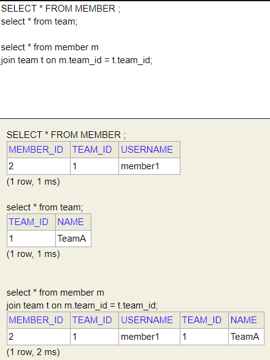
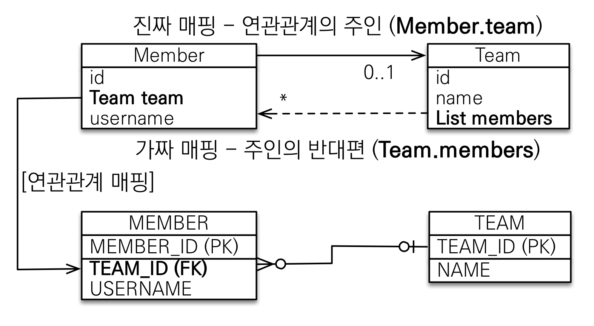
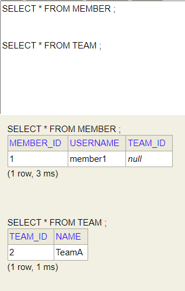

#(JPA)3.연관관계매핑1

---

## ✏️ `연관관계 없음`
### ✔️ 객체를 테이블에 맞춰 모델링
```java
@Entity
public class Member {
    @Id @GeneratedValue
    @Column(name = "MEMBER_ID")
    private Long id;

    @Column(name = "USERNAME")
    private String name;

    @Column(name = "TEAM_ID")
    private Long teamId;
    …
}

@Entity
public class Team {
    @Id @GeneratedValue
    @Column(name = "TEAM_ID")
    private Long id;

    private String name;
    …
}
```
- 참조 대신 외래키를 그대로 사용
```java
EntityManagerFactory emf = Persistence.createEntityManagerFactory("hello");

EntityManager em = emf.createEntityManager();

EntityTransaction tx = em.getTransaction();
tx.begin();

try{
    Team team = new Team();
    team.setName("TeamA");
    em.persist(team);

    Member member = new Member();
    member.setUsername("member1");
    member.setTeamId(team.getId());
    //외래키 식별자를 직접 다룸
    em.persist(member);

    //조회
    Member findMember = em.find(Member.class, member.getId());
    //연관관계가 없음
    Long findTeamId = findMember.getTeamId();
    Team findTeam = em.find(Team.class, findTeamId);

    tx.commit();

    }catch(Exception e){
        tx.rollback();
    }finally {
        em.close();
    }
emf.close();
```
- **외래키 식별자로 다시 조회함, 객체 지향적인 방법이 아님**
- 객체를 테이블에 맞추어 데이터 중심으로 모델링하면,
협력 관계를 만들 수 없음
- 테이블은 외래 키로 조인을 사용해서 연관된 테이블을 찾음
- 객체는 참조를 사용해서 연관된 객체를 찾음

---
## ✏️ `단방향 연관관계 매핑`
### ✔️ 객체 연관관계 사용
```java
//Member
@ManyToOne(fetch = FetchType.LAZY)
@JoinColumn(name = "TEAM_ID")
private Team team;
```
```java
//팀 저장
Team team = new Team();
team.setName("TeamA");
em.persist(team);
//회원 저장
Member member = new Member();
member.setUsername("member1");
member.setTeam(team); //단방향 연관관계 설정, 참조 저장
em.persist(member);

em.flush(); //db로 정보 바로 보내기
em.clear(); //영속성 컨텍스트 내용 지우기
```
```java
//flush/clear진행 후
//조회
Member findMember = em.find(Member.class, member.getId());  

//참조를 사용해서 연관관계 조회
Team findTeam = findMember.getTeam();
System.out.println("findTeam.getName() = " + findTeam.getName());
```
```
- Lazy아닐때 이런 쿼리 날아감
select member_id, team_id(member), username, team_id(team), name
from Member
left outer join Team
on team_id(member) = team_id(team)
where member_id = ?
```
<span style="color: #2D3748; background-color: #fff5b1;"> 
- `member`를 DB에서 찾을 때, `Member`객체가 `Team`을 가지고 있으므로 `join` 사용한 `SELECT`쿼리가 DB로 들어감<br>
- member, team 2개 들고옴<br>
- LAZY라면 쿼리 분리하기<br>
</span>

```
- Lazy 일때 쿼리
select member_id, team_id, username
from Member
where member_id = ?

select team_id, name
from Team
where team_id = ?
```


**연관관계 수정**
```java
// 새로운 팀B
Team teamB = new Team();
teamB.setName("TeamB");
em.persist(teamB);
// 회원1에 새로운 팀B 설정, DB에 업데이트 됨(변경 감지)
member.setTeam(teamB);
```

---
## ✏️ `양방향 연관관계 매핑`
### ✔️ 기본
```java
//Team
@OneToMany(mappedBy = "team")
private List<Member> members = new ArrayList<>();
```
```java
//조회
Member findMember = em.find(Member.class, member.getId());

//역방향 조회
List<Member> members = findMember.getTeam().getMembers();
for(Member m : members){
    System.out.println("m.getUsername() = " + m.getUsername());
}
```

**객체 연관관계 = 2개**
- 회원 -> 팀 연관관계 1개(단방향)
- 팀 -> 회원 연관관계 1개(단방향)
- 객체의 양방향 관계는 단뱡향 관계 2개
- _객체는 단방향/양방향 둘다 가능_

**테이블 연관관계 = 1개**
- 회원 <-> 팀의 연관관계 1개(양방향)
- 단방향, 양방향 의미없이 양방향이 기본
   - Foreign key와 Primary Key를 Join하면 두 테이블 정보 모두 알 수 있음

ex.


<br>

**Member(team)/Team(members) 둘 중 하나로 외래키 관리해야 함**
- 만약 멤버의 team을 바꾸고 싶을때
1. Member의 team을 변경해야하는가?
2. Team의 members를 변경해야하는가?

- 만약 Team의 members에는 값을 넣고, Member객체는 생성 안함
-> 테이블의 외래키(TEAM_ID)를 무엇으로 업데이트 해야함?

### ✔️ 연관관계 주인


**양방향 매핑 규칙**

- 객체의 두 관계중 하나를 연관관계의 주인으로 지정
- `연관관계의 주인만이 외래 키를 관리(등록, 수정)`
- `주인이 아닌쪽은 **읽기**만 가능`
- 주인은 `mappedBy` 속성 사용X

**`외래키가 있는 곳을 주인으로 정하기!!`**

왜냐하면) Team의 members가 주인일때, 값을 변경하면 Team 테이블이 아닌 다른 테이블(Member) 업데이트 쿼리가 나감, 헷갈림

- 테이블에서 `Foreign Key`있는 부분이 `Many`, 없는 쪽이 `One`
- 테이블이 `Many`인 것에 대응하는 객체는 연관관계 주인이 됨

### ✔️ 주의점
#### ✨ 연관관계 주인에 값 입력하지 않음
```java
//연관관계 주인이 아닌곳에 값 넣으면 null됨
Member member = new Member();
member.setUsername("member1");
em.persist(member);

Team team = new Team();
team.setName("TeamA");
//역방향(주인이 아닌 방향)만 연관관계 설정
team.getMembers().add(member);
em.persist(team);
```



#### ✨ 양방향 매핑시 연관관계 주인에 값 입력하기
```java
Team team = new Team();
team.setName("TeamA");
em.persist(team);

Member member = new Member();
member.setUsername("member1");
member.setTeam(team);//중요(연관관계 주인 값 설정)
em.persist(member);

//team.getMembers().add(member);
//이거 없어도 테이블은 잘 동작함, 테이블에 속성이 없기 때문
//읽기 전용이므로 JPA에서 외래키 테이블 Update, Insert쿼리 안날림
```

```java
Team team = new Team();
team.setName("TeamA");
em.persist(team);

Member member = new Member();
member.setUsername("member1");
member.setTeam(team);
em.persist(member);

Member member1 = new Member();
member1.setUsername("member2");
member1.setTeam(team);
em.persist(member1);

//team.getMembers().add(member);

em.flush();
em.clear();


Team findTeam = em.find(Team.class, team.getId()); //쿼리 1개(select team_id, name ...)

System.out.println("hello");
List<Member> members = findTeam.getMembers();
System.out.println("good");
for(Member m : members){                       
    System.out.println("m.getUsername() = " + m.getUsername());
}
```

```
//Lazy, Eager 쿼리 같음
Hibernate: 
    select
        t1_0.team_id,
        t1_0.name 
    from
        Team t1_0 
    where
        t1_0.team_id=?
hello
good
Hibernate: 
    select
        m1_0.team_id,
        m1_0.member_id,
        m1_0.username 
    from
        Member m1_0 
    where
        m1_0.team_id=?
m.getUsername() = member1
m.getUsername() = member2
```
<span style="color: #2D3748; background-color: #fff5b1;">
JPA가 List 값을 실사용할때(m.getUsername()) 지연로딩으로 값을 가지고오는 기능을 함 
</span>

데이터베이스에서 `Team`, `Member`객체 들고옴
- `team.getMembers().add(member)`코드가 없어도 JPA에서 `Team`과 `Team의 members`에 해당하는 값에 대한 쿼리를 날려서 값 들고옴 <br>
-> 이미 DB에 데이터 저장했기 때문에 가능<br>
-> `findTeam.getMembers()`해도 원하는 값 얻을 수 있음
- 그러나 오류가 발생할 수 있음
```java
...위 코드와 같음
em.persist(member);

//team.getMembers().add(member);

// em.flush();
// em.clear();

Team findTeam = em.find(Team.class, team.getId());
List<Member> members = findTeam.getMembers(); 
...위 코드와 같음
```
- 이 상태라면 `Team`객체를 1차캐시에서 바로 가져오기 때문에 제대로 값(Member)이 나오지 않음(DB에서 꺼내면 알 수 있음)
- 따라서 양방향 연관관계에서 순수 객체 상태를 고려해 항상 `양쪽에 값을 설정`하자
- `연관관계 편의 메서드 생성해도 됨`


#### ✨ 연관관계 메서드
- `member.setTeam(team);`
- `team.getMembers.add(member);`
- 두 개 넣으면 되지만 불편함->연관관계 메서드 사용
```java
//Team 클래스 내부
public void addMember(Member member) {
    member.setTeam(this);
    members.add(member);
}

//Member 클래스 내부
public void changeTeam(Team team) {
    this.team = team;
    team.getMembers().add(this);
}
```

```java
...
member.changeTeam(team);
em.persist(member);

team.addMember(member);   
//이것도 가능, team이나 member 클래스 둘 중 하나만 만들기

em.flush();
em.clear();
...
```
- `member.changeTeam(team)`, `team.addMember(member)`둘 중 하나 사용하기

#### ✨ 무한루프 조심하기(`toString(), lombok, JSON생성 라이브러리`)
```java
//Team
@Override
public String toString() {
    return "Team{" +
            "id=" + id +
            ", name='" + name + '\'' +
            ", members=" + members + 
            '}';
}
//Member도 toString()있음

//JPAMain
System.out.println(findTeam);//무한 호출
```
 - `member`, `team` 둘 다 `toString`이 존재함
 - `Team`의 `toString`의 `members`호출할때 `Member` `toString`도 호출되고 계속 무한호출 됨
 - lombok은 tostring자동 생성(조심히 사용하기)
 - 컨트롤러에서 응답에 엔티티 직접 보내면(양방향일때) 무한루프 발생
 - 컨트롤러에는 엔티티 절대 반환하지 말것(JSON목적으로)

---
**정리**
- 단방향 매핑만으로도 이미 연관관계 매핑은 완료
- 양방향 매핑은 반대 방향으로 조회(객체 그래프 탐색) 기능이 추가된 것 뿐(읽기만 가능)
- JPQL에서 역방향으로 탐색할 일이 많음
- 단방향 매핑을 잘 하고 양방향은 필요할 때 추가해도 됨(테이블에 영향을 주지 않기 때문)

**`비즈니스 로직을 기준으로 연관관계의 주인을 선택하면 안됨`**

**`연관관계의 주인은 외래 키의 위치를 기준으로 정해야함`**