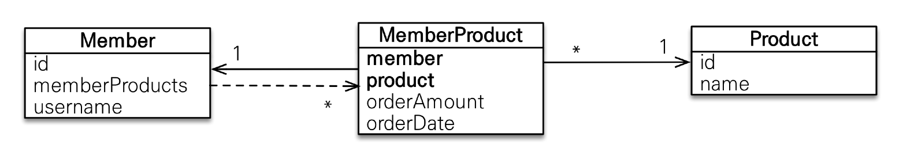
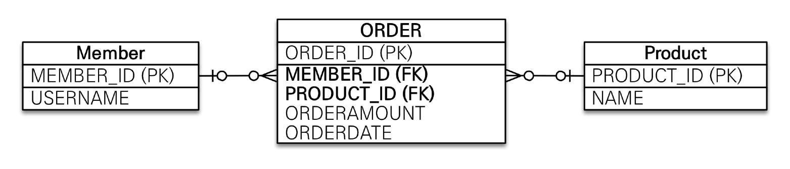

#(JPA)4.연관관계매핑2

---

> **다중성**
> - `@ManyToOne`
> - `@OneToMany`
> - `@OneToOne`
> - `@ManyToMany`

> **단방향,양방향**<br>
> **테이블**
> - 외래 키 하나로 양쪽 조인 가능
> - 방향 개념이 없음<br>
> 
> **객체**
> - 한쪽 참조하면 단방향
> - 양쪽 참조하면 양방향

> **연관관계 주인**<br>
> - 테이블은 외래 키 하나로 두 테이블이 연관관계 맺음
> - 객체 양방향 관계는 A->B, B->A 처럼 참조가 2군데, 둘 중 하나 외래 키 관리할 곳 지정해야함
> - 연관관계의 주인: 외래 키를 관리하는 참조
> - 주인의 반대편: 외래 키에 영향을 주지 않음, 단순 조회만 가능

**`@JoinColumn`**
](image/image-36.png)


---
## ✏️ `다대일[N:1]`
**`@ManyToOne`**
](image/image-34.png)
- `@ManyToOne`은 `mappedBy`없음
- 다대일을 쓰면 연관관계 주인이 되어야 한다는 뜻

### ✔️ 다대일 단방향
](image/image-23.png)

- **다대일**의 반대는 **일대다**

### ✔️ 다대일 양방향
](image/image-24.png)

- 외래키가 있는 쪽이 연관관계 주인이 됨(Member)
- 양쪽을 서로 참조함

---
## ✏️ `일대다[1:N]`
**`@OneToMany`**
](image/image-35.png)

### ✔️ 일대다 단방향
](image/image-25.png)

```java
//Team
@OneToMany
@JoinColumn(name = "TEAM_ID")
private List<Member> members = new ArrayList<>();
```
```java
Member member = new Member();
member.setUsername("member1");
em.persist(member);

Team team = new Team();
team.setName("teamA");
team.getMembers().add(member); 
em.persist(team);
```
- `team.getMembers().add(member);`:    
   - persist할때 `UPDATE`쿼리(member)가 날아감
   - team에 값을 업데이트했지만 member값 추가되었으므로 member도 업데이트
   - 모르는 사람이 개발할때 왜 다른 부분에서 쿼리가 발생하는지 헷갈림 -> `OneToMany`사용 지양하기

- 일대다 단방향은 일대다(1:N)에서 일(1)이 연관관계의 주인
- 테이블 일대다 관계는 항상 다(N) 쪽에 외래 키가 있음
- `@JoinColumn`을 꼭 사용해야 함. 그렇지 않으면 조인 테이블방식을 사용함(중간에 테이블을 하나 추가함)

**단점**
- 엔티티가 관리하는 외래 키가 다른 테이블에 있음
- 연관관계 관리를 위해 추가로 `UPDATE SQL` 실행
- 일대다 단방향 매핑보다는 다대일 양방향 매핑을 사용하기

### ✔️ 일대다 양방향
](image/image-26.png)

```java
//Team
@OneToMany
@JoinColumn(name = "TEAM_ID")
private List<Member> members = new ArrayList<>();

//Member
@ManyToOne
@JoinColumn(name  = "TEAM_ID", insertable = false, updatable = false)
private Team team;
```

- 이런 매핑은 공식적으로 존재X
- `@JoinColumn(insertable=false, updatable=false)`
- 읽기 전용 필드를 사용해서 양방향 처럼 사용하는 방법
- 다대일 양방향을 사용하기

---
---
## ✏️ `일대일[1:1]`

- 일대일 관계는 그 반대도 일대일
- _주 테이블_ 이나 _대상 테이블_ 중에 외래 키 선택 가능
- 외래 키에 데이터베이스 유니크(UNI) 제약조건 추가

### ✔️ 주 테이블에 외래키 단방향
](image/image-27.png)

```java
//member
@OneToOne
@JoinColumn(name = "LOCKER_ID")
private Locker locker;
```
- 다대일(`@ManyToOne`) 단방향 매핑과 유사

### ✔️ 주 테이블에 외래키 양방향
](image/image-28.png)

```java
//member
@OneToOne
@JoinColumn(name = "LOCKER_ID")
private Locker locker;

//locker
@OneToOne(mappedBy = "locker")
private Member member;
```
- 다대일 양방향 매핑 처럼 외래 키가 있는 곳이 연관관계의 주인
- 반대편은 `mappedBy` 적용

---
### ✔️ 대상 테이블에 외래키 단방향
](image/image-29.png)

- 단방향 관계는 JPA 지원X
- 양방향 관계는 지원해줌

### ✔️ 대상 테이블에 외래키 양방향
](image/image-30.png)

- 일대일 주 테이블 외래 키 양방향과 매핑 방법이 같음

---
**주 테이블에 외래 키**
- 주 객체가 대상 객체의 참조를 가지는 것 처럼 주 테이블에 외래 키를 두고 대상 테이블을 찾음
- 객체지향 개발자 선호
- JPA 매핑 편리
- 장점: 주 테이블만 조회해도 대상 테이블에 데이터가 있는지 확인 가능
- 단점: 값이 없으면 외래 키에 `null` 허용

**대상 테이블에 외래 키**
- 대상 테이블에 외래 키가 존재
- 전통적인 데이터베이스 개발자 선호
- 장점: 주 테이블과 대상 테이블을 일대일에서 일대다 관계로 변경할 때 테이블 구조 유지(대상 테이블에 외래키 있는데 외래키 있는 테이블이 항상 Many이기 때문)
- 단점: 프록시 기능의 한계로 지연 로딩으로 설정해도 항상 즉시 로딩됨
    - 주테이블 외래키 단방향 그림에서 Member의 locker값을 알려면 Member테이블만 조회해도 됨
    - 대상테이블 외래키 양방향 그림에서 Member에 locker를 조회했을때 Locker테이블을 뒤져서 있는지 없는지 꼭 확인해야함(어차피 확인이 필수라 쿼리가 날아가는데 지연 로딩을 할 필요가 없음)

**일대일: 내 엔티티에 해당하는 테이블에 외래키 있으면 해당 엔티티에서 직접 관리하기**

---
---
## ✏️ `다대다[N:M]`
- 관계형 데이터베이스는 정규화된 테이블 2개로 다대다 관계를 표현할 수 없음
- 연결 테이블을 추가해서 일대다, 다대일 관계로 풀어내야함
- **객체는 컬렉션을 사용해서 객체2개로 다대다 관계가 가능함**
- 테이블은 2개로 불가능

](image/image-31.png)

**특징**
- `@ManyToMany` 사용
- `@JoinTable`로 연결 테이블 지정
- 다대다 매핑: 단방향, 양방향 가능

```java
<단방향관계>
//Product
@Id @GeneratedValue
private Long id;
private String name;

//Member
@ManyToMany
@JoinTable(name = "MEMBER_PRODUCT")
private List<Product> products = new ArrayList<>();
```
```java
<양방향관계>
//Product
@ManyToMany(mappedBy = "products")
private List<Member> members = new ArrayList<>();

//Member
@ManyToMany
@JoinTable(name = "MEMBER_PRODUCT")
private List<Product> products = new ArrayList<>();
```


**한계**
- 편리해 보이지만 실무에서 사용X
- 실무에서 연결 테이블이 단순히 연결만 하고 끝나지 않음
- 생성된 중간 테이블에 속성 원할때 더 추가 불가능

**극복**
- 연결 테이블용 엔티티 추가(연결 테이블을 엔티티로 승격)
- `@ManyToMany` -> `@OneToMany, @ManyToOne`


```java
//Product
@OneToMany(mappedBy = "product")
private List<MemberProduct> memberProducts = new ArrayList<>();

//Member
@OneToMany(mappedBy = "member")
private List<MemberProduct> memberProducts = new ArrayList<>();
```
```java
//MemberProduct
@Entity
public class MemberProduct {
    @Id @GeneratedValue
    private Long id;

    @ManyToOne
    @JoinColumn(name = "MEMBER_ID")
    private Member member;

    @ManyToOne
    @JoinColumn(name = "PRODUCT_ID")
    private Product product;

    private int count;
    private int price;
    private LocalDateTime orderDateTime;
}
```

---

