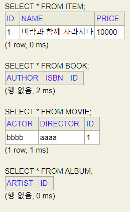
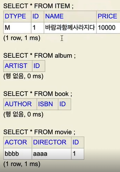
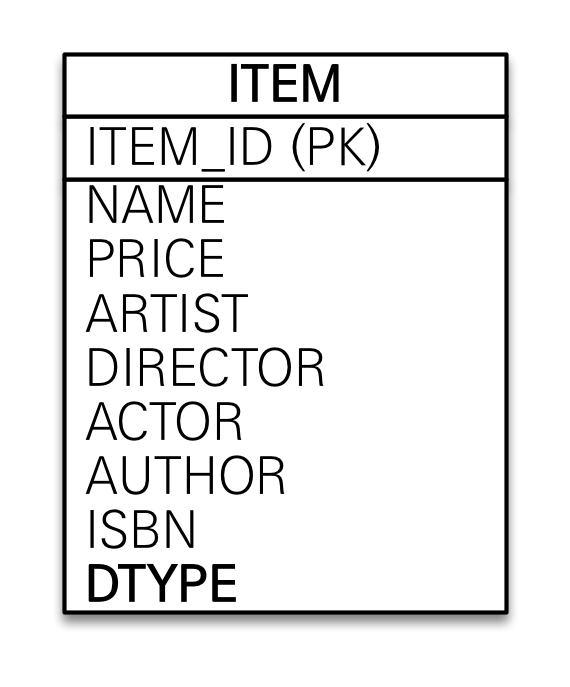
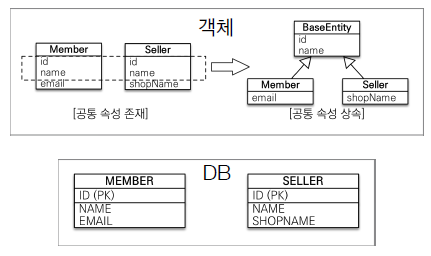

#(JPA)5.고급매핑

---
## ✏️ `상속관계 매핑`

- 관계형 데이터베이스는 상속 관계 없음
- 슈퍼타입, 서브타입이 DB 모델링 기법에 존재, 객체 상속과 비슷함
- 상속관계 매핑: 객체의 상속과 구조와 DB의 슈퍼타입 서브타입 관계를 매핑

**주요 어노테이션**
- `@Inheritance(strategy=InheritanceType.XXX)`
   - `JOINED`: 조인 전략
   - `SINGLE_TABLE`: 단일 테이블 전략
   - `TABLE_PER_CLASS`: 구현 클래스마다 테이블 전략
- `@DiscriminatorColumn(name=“DTYPE”)`
- `@DiscriminatorValue(“XXX”)`


### ✔️ 조인전략(각각 테이블 변환)
](image/image-37.png)
](image/image-38.png)

```java
@Entity
@Inheritance(strategy = InheritanceType.JOIN)
@DiscriminatorColumn //DTYPE생성, (옵션)
public class Item {
    @Id @GeneratedValue
    private Long id;
    private String name;
    private int price;
}

//Album
@Entity
@DiscriminatorValue("A") //옵션, (없으면 기본값 Album사용) 
public class Album extends Item{
    private String artist;
}

//Movie
@Entity
@DiscriminatorValue("M")
public class Movie extends Item{
    private String director;
    private String actor;
}

//Book
@Entity
@DiscriminatorValue("B")
public class Book extends Item{
    private String author;
    private String isbn;
}
```
```java
//이 코드는 strategy 3개를 바꿔도 똑같이 사용할 수 있음
Movie movie = new Movie();
movie.setDirector("aaaa");
movie.setActor("bbbb");
movie.setName("바람과함께사라지다");
movie.setPrice(10000);
em.persist(movie);

em.flush(); //Insert쿼리가 2개 나감(Movie/Item)
em.clear();

Movie findMovie = em.find(Movie.class, movie.getId());  //inner join으로 item과 movie들고옴
System.out.println("findMovie = " + findMovie); //Movie...
```
**DTYPE 없을때**


**DTYPE 있을때**


**장점**
- 테이블 정규화
- 외래 키 참조 무결성 제약조건 활용가능
- 저장공간 효율화

**단점**
- 조회시 조인을 많이 사용, 성능 저하
- 조회 쿼리가 복잡함
- 데이터 저장시 INSERT SQL 2번 호출

---
### ✔️ 단일 테이블 전략(통합 테이블 변환)


```java
@Entity
@Inheritance(strategy = InheritanceType.SINGLE_TABLE)
@DiscriminatorColumn
public class Item {
    @Id @GeneratedValue
    private Long id;
    private String name;
    private int price;
}

//Album
@Entity
@DiscriminatorValue("A")
public class Album extends Item{
    private String artist;
}

//Movie
@Entity
@DiscriminatorValue("M")
public class Movie extends Item{
    private String director;
    private String actor;
}

//Book
@Entity
@DiscriminatorValue("B")
public class Book extends Item{
    private String author;
    private String isbn;
}
```


- `DTYPE`은 설정안해줘도 자동으로 생성됨(DTYPE있는게 기본)

**장점**
- 조인이 필요 없으므로 일반적으로 조회 성능이 빠름
- 조회 쿼리가 단순함


**단점**
- 자식 엔티티가 매핑한 컬럼은 모두 null 허용
- 단일 테이블에 모든 것을 저장하므로 테이블이 커질 수 있음. 상황에 따라서 조회 성능이 오히려 느려질 수 있음

---
### ✔️ 구현 클래스마다 테이블 전략(서브타입 테이블)


```java
@Entity
@Inheritance(strategy = InheritanceType.TABLE_PER_CLASS)
@DiscriminatorColumn
public abstract class Item {
    @Id @GeneratedValue
    private Long id;
    private String name;
    private int price;
}

//Album
...같음

//Movie
...같음

//Book
...같음
```
- `Item`테이블은 안만들어짐
- `Discriminator..`넣어도 값이 생성되지 않음(DTYPE의미 없음)
- `ITEM item = em.find(Item.class, movie.getId());`: 이런 코드를 사용하면 모든 테이블 다 찾아봄(단점)


**장점**
- 서브 타입을 명확하게 구분해서 처리할 때 효과적
- `not null` 제약조건 사용 가능

**단점**
- 여러 자식 테이블을 함께 조회할 때 성능이 느림(UNION SQL 필요)
- 자식 테이블을 통합해서 쿼리하기 어려움
- 추천하지 않는 전략
---
---
## ✏️ `Mapped Superclass`
- 공통 매핑 정보가 필요할때 사용



```java
@MappedSuperclass
public abstract class BaseEntity {

    @Column(name = "INSERT_MEMBER")
    private String createdBy;
    private LocalDateTime createdDate;
    @Column(name = "UPDATE_MEMBER")
    private String lastModifiedBy;
    private LocalDateTime lastModifiedDate;
}

//Member
@Entity
public class Member extends BaseEntity...

//Team
@Entity
public class Team extends BaseEntity...
```
```java
Member member = new Member();
member.setUsername("user1");
member.setCreatedBy("kim");
member.setCreatedDate(LocalDateTime.now());
em.persist(member);

em.flush();
em.clear();
//Member와 Team테이블에 모두 공통된 값을 넣어줌
```

- 상속관계 매핑X
- 엔티티X, 테이블과 매핑X
- 부모 클래스는 상속 받는 자식 클래스에 매핑 정보만 제공
- 조회, 검색 불가(`em.find(BaseEntity)` 불가)
- 직접 생성해서 사용할 일이 없으므로 추상 클래스 권장
- 테이블과 관계 없고, 단순히 엔티티가 공통으로 사용하는 매핑정보를 모으는 역할
- 주로 등록일, 수정일, 등록자, 수정자 같은 전체 엔티티에서 공통으로 적용하는 정보를 모을 때 사용

> JPA에서 extends는 `@Entity`또는 `@MappedSuperclass`로 지정한 클래스를 상속받을때만 사용가능 