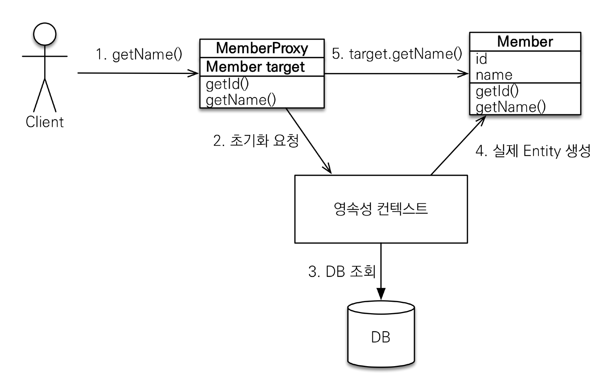
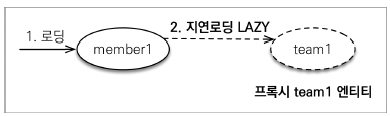
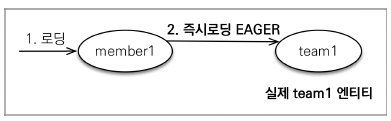
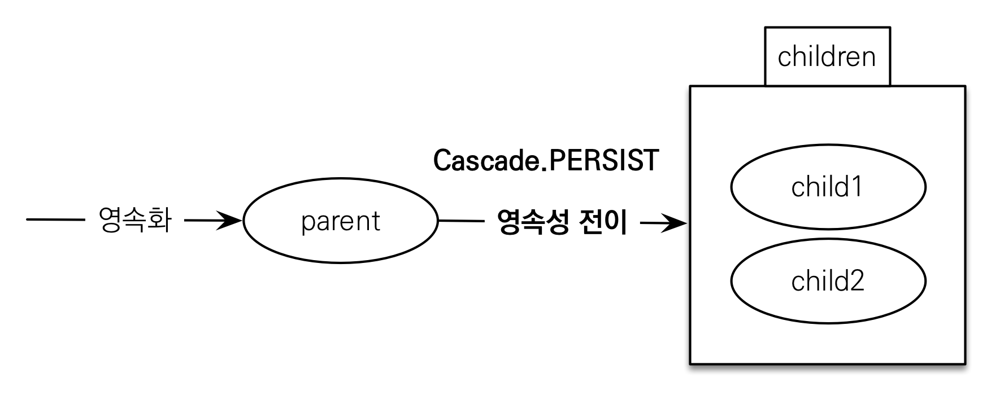

#(JPA)6.프록시와연관관계관리

---
## ✏️ `프록시`
### ✔️ 기초
```java
//멤버만 출력하는 비즈니스 로직
Member member = em.find(Member.class, 1L);
System.out.println("member = " + member.getUsername());

//멤버와 팀 함께 출력하는 비즈니스 로직
Member member = em.find(Member.class, 1L);
String username = member.getUsername();
System.out.println("username = " + username);
Team team = member.getTeam();
System.out.println("team = " + team.getName());
```
- 위 코드에서 find하면 member, team 둘다 DB에서 가져옴
- 그러나 상황에 따라 member만 쿼리로 들고 나오고 싶을때, member,team 한 번에 둘다 쿼리로 들고나오고 싶을때 다른 상황이 발생할 수 있음


**`em.find()` vs `em.getReference()`**
- `em.find()`: 데이터베이스를 통해서 실제 엔티티 객체 조회
- `em.getReference()`: 데이터베이스 조회를 미루는 가짜(프록시)엔티티 객체 조회

---
### ✔️ 프록시 객체 초기화
](image/image-46.png)
> 최초 지연 로딩 시점에는 당연히 참조 값이 없음


<br><br>



- 실제 클래스를 `상속` 받아서 만들어짐
- 실제 클래스와 겉 모양이 같음
- 사용하는 입장에서는 진짜 객체인지 프록시 객체인지 구분하지 않고 사용하면 됨(이론상)
- 프록시 객체는 실제 객체의 참조(target)를 보관
- 프록시 객체를 호출하면 프록시 객체는 실제 객체의 메소드 호출

```java
//1,2,3 공통으로 사용=======
Member member= new Member();
member.setUsername("hello");
em.persist(member);

em.flush();
em.clear();
//=========================

// 1. member와 team을 JPA가 join해서 다 들고옴
Member findMember = em.find(Member.class, member.getId());
            
// 2. select쿼리가 안날아감
Member findMember = em.getReference(Member.class, member.getId());

// 3. select쿼리가 날아감(실제 사용되는 시점, username시점)(id는 이미 존재하기때문에 username시점에 쿼리 나감)
Member findMember = em.getReference(Member.class, member.getId()); 
System.out.println("findMember.getClass() = " + findMember.getClass());   //Member$HibernateProxy... (가짜)

System.out.println("findMember.id = " + findMember.getId());//1(ID값을 getReference할때 값을 넣음, 이미 있기 때문에 쿼리 안날림)
System.out.println("findMember.username = " + findMember.getUsername()); //db에 있는것 들고오기 위해 쿼리 날림
```
- 한번 `getName`초기화했으면 db에 다시 조회할 필요없음

---
### ✔️ 특징
1. `프록시 객체는 처음 사용할 때 한 번만 초기화`
2. `프록시 객체를 초기화 할 때, 프록시 객체가 실제 엔티티로 바뀌는 것은 아님, 초기화되면 프록시 객체를 통해서 실제 엔티티에 접근 가능`
3. `프록시 객체는 원본 엔티티를 상속받음, 따라서 타입 체크시 주의해야함 (== 비교 실패, 대신 instance of 사용)`
   - 타입비교는 `==`으로 하지않기, 실제 비즈니스에서는 메서드 등에서 어떤값이 오는지 헷갈리고 모름

```java
//공통사용=====================
Member member1 = new Member();
member1.setUsername("member1");
em.persist(member1);
Member member2 = new Member();
member2.setUsername("member2");
em.persist(member2);

em.flush();
em.clear();
//============================
Member m1 = em.find(Member.class, member1.getId());
Member m2 = em.find(Member.class, member2.getId());
System.out.println("(m1.getClass() == m2.getClass()) = " + (m1.getClass() == m2.getClass())); // true(엔티티)
```
```java
Member m1 = em.find(Member.class, member1.getId());
Member m2 = em.getReference(Member.class, member2.getId());
System.out.println("(m1.getClass() == m2.getClass()) = " + (m1.getClass() == m2.getClass())); //false
System.out.println(" (m1 instanceof Member) = " + (m1 instanceof Member)); //true
System.out.println("(m2 instanceof Member) = " + (m2 instanceof Member)); //true
```
<br><br>

4. `영속성 컨텍스트에 찾는 엔티티가 이미 있으면 em.getReference()를 호출해도 실제 엔티티 반환`
```java
Member m1 = em.find(Member.class, member1.getId());
System.out.println("m1.getClass() = " + m1.getClass()); //member객체, 영속성 컨텍스트에 올라가게 됨

Member reference = em.getReference(Member.class, member1.getId());
System.out.println("reference.getClass() = " + reference.getClass()); //실제 엔티티 객체, 영속성 컨텍스트에 올라와 있기 때문

System.out.println("(m1 == reference) = " + (m1 == reference)); //true, 같은 영속성컨텍스트 안에서 가져오고,pk같으면 jpa는 true반환
```

```java
Member m1 = em.getReference(Member.class, member1.getId()); //proxy
Member reference = em.getReference(Member.class, member1.getId()); //proxy
System.out.println("(m1 == reference) = " + (m1 == reference)); //true(같은 proxy)
```
```java
Member refMember = em.getReference(Member.class, member1.getId());//proxy
Member findMember = em.find(Member.class, member1.getId()); //실제 DB에 select쿼리 날아감, 그러나 proxy가 반환됨
System.out.println("(m1 == reference) = " + (refMember == findMember)); //true(JPA가 true보장해주기 위해 값들 조정함)
```

<br><br>

5. `영속성 컨텍스트의 도움을 받을 수 없는 준영속 상태일 때, 프록시를 초기화하면 문제 발생`
- (하이버네이트는 org.hibernate.LazyInitializationException 예외를 터트림)

```java
Member refMember = em.getReference(Member.class, member1.getId());
System.out.println("refMember.getClass() = " + refMember.getClass()); //proxy

//셋 중 하나 사용
em.detach(refMember); //영속성컨텍스트에서 관리안함
em.clear();
em.close();

System.out.println("refMember.getUsername() = " + refMember.getUsername()); //초기화 시도, exception이라서 exception보기

//===============
catch(Exception e){
    tx.rollback();
    e.printStackTrace();
}
```
---
### ✔️ 확인
- 프록시 인스턴스의 초기화 여부 확인
PersistenceUnitUtil.isLoaded(Object entity)
```java
//초기화 확인
Member refMember = em.getReference(Member.class, member1.getId());
System.out.println("emf.getPersistenceUnitUtil().isLoaded(refMember) = " + emf.getPersistenceUnitUtil().isLoaded(refMember)); //false(아직 초기화 안함)
```


- 프록시 클래스 확인 방법
entity.getClass().getName() 출력(..javasist.. or
HibernateProxy…)
- 프록시 강제 초기화
org.hibernate.Hibernate.initialize(entity);
- 참고: JPA 표준은 강제 초기화 없음
    - 강제 호출: `member.getName()`

```java
Member refMember = em.getReference(Member.class, member1.getId());
//둘 중 하나
refMember.getUsername(); //강제초기화한것임
Hibernate.initialize(refMember); //좀 세려된 강제초기화 방법
System.out.println("emf.getPersistenceUnitUtil().isLoaded(refMember) = " + emf.getPersistenceUnitUtil().isLoaded(refMember)); //true, username탐색하면서 초기화함
```
---
---
## ✏️ `지연로딩과 즉시로딩`
### ✔️ 지연로딩
- 원래 Member/Team 연결되어있으면, `find(member)`할때 두 엔티티모두 조인으로 찾음
- 그러나 엔티티끼리 따로 사용하고 싶다면?
- `LAZY`을 사용해서 프록시로 조회
```java
public class Member {
    @Id
    @GeneratedValue
    private Long id;
    @Column(name = "USERNAME")
    private String name;

    @ManyToOne(fetch = FetchType.LAZY)
    @JoinColumn(name = "TEAM_ID")
    private Team team;
    //프록시 객체로 조회함, 멤버클래스만 DB에서 조회함
    ..
}
```
```java
Team team = new Team();
team.setName("teamA");
em.persist(team);

Member member1 = new Member();
member1.setUsername("member1");
member1.setTeam(team);
em.persist(member1);

em.flush();
em.clear();

Member m = em.find(Member.class, member1.getId());  
//member만 들고오는 쿼리 나감

System.out.println("m.getTeam().getClass() = " + m.getTeam().getClass()); 
//proxy로 나옴(member만 조회할때 멤버만 나옴)

m.getTeam(); //이때 초기화 안됨
m.getTeam().getName(); 
//이때 프록시 초기화 진행(실제 team을 사용하는 시점에 초기화(DB 조회))
```



---
### ✔️ 즉시로딩
- Member와 Team을 자주 함께 사용한다면?
- `EAGER`를 사용해서 함께 조회
```java
public class Member {
    @Id
    @GeneratedValue
    private Long id;
    @Column(name = "USERNAME")
    private String name;

    @ManyToOne(fetch = FetchType.EAGER)
    @JoinColumn(name = "TEAM_ID")
    private Team team;
    ..
}
```
```java
Team team = new Team();
team.setName("teamA");
em.persist(team);

Member member1 = new Member();
member1.setUsername("member1");
member1.setTeam(team);
em.persist(member1);

em.flush();
em.clear();

Member m = em.find(Member.class, member1.getId());  
//EAGER라면 이때 member, team둘 다 나옴

System.out.println("m.getTeam().getClass() = " + m.getTeam().getClass()); 
//EAGER일때 proxy 아니라 진짜 엔티티
           
m.getTeam().getName(); //teamA
```


- Member조회시 항상 Team도 조회
- JPA구현체는 가능하면 조인쿼리를 사용해 한번에 조회하려고 함(member, team따로 1번씩 조회하는게 아니라)

---
### ✔️ 주의점
- 가급적 지연 로딩만 사용(특히 실무에서)
- 즉시 로딩을 적용하면 예상하지 못한 SQL이 발생
- 즉시 로딩은 `JPQL`에서 `N+1` 문제를 일으킨다.
```java
//즉시로딩 주의
List<Member> members = em.createQuery("select m from Member m", Member.class).getResultList();
//실행하면 쿼리가 2번 나감
//1. JPQL을 SQL로 번역한 쿼리 1번 
//2. Member엔티티 내부의 Team이 즉시로딩임을 확인-> select * from TEAM where TEAM_id = xxx; 쿼리 1번
```

- `@ManyToOne`, `@OneToOne`은 기본이 `즉시 로딩`
-> `LAZY`로 설정
- `@OneToMany`, `@ManyToMany`는 기본이 `지연 로딩`

**실무**
- 모든 연관관계에 `지연 로딩`을 사용하자!
- 실무에서 `즉시 로딩`을 사용하지 말자!
- 만약 지연로딩 사용하는데 함께 사용하고 싶다면, JPQL fetch 조인이나, 엔티티 그래프 기능을 사용하기
```java
//LAZY이지만 한번에 쿼리 들고옴
List<Member> members = em.createQuery("select m from Member m join fetch m.team", Member.class).getResultList();
```


---
---
## ✏️ `CASCADE/고아 객체`
### ✔️ `영속성 전이: CASCADE`

- 특정 엔티티를 영속 상태로 만들 때 연관된 엔티티도 함께 영속상태로 만듦
- ex. 부모 엔티티를 저장할 때 자식 엔티티도 함께 저장
- 영속성 전이는 연관관계를 매핑하는 것과 아무 관련이 없음
- 엔티티를 영속화할 때 연관된 엔티티도 함께 영속화하는 편리함을 제공할 뿐



```java
@Entity
public class Parent {
    @Id
    @GeneratedValue
    private Long id;
    private String name;

    @OneToMany(mappedBy = "parent", cascade = CascadeType.ALL)
    private List<Child> childList = new ArrayList<>();

    //연관관계 메서드
    public void addChild(Child child){
        childList.add(child);
        child.setParent(this);
    }
    ...
}
```
```java
@Entity
public class Child {
    @Id
    @GeneratedValue
    private Long id;
    private String name;

    @ManyToOne
    @JoinColumn(name = "parent_id")
    private Parent parent;
    ...
}
```
```java
Child child1 = new Child();
Child child2 = new Child();

Parent parent = new Parent();
parent.addChild(child1);
parent.addChild(child2);

//cascade아니라면 3번 각각 persist
em.persist(parent);
em.persist(child1);
em.persist(child2);

//cascade
em.persist(parent); //3번 persist됨
```

**종류**
> **ALL: 모두 적용**<br>
> **PERSIST: 영속**<br>
> REMOVE: 삭제<br>
> MERGE: 병합<br>
> REFRESH: REFRESH<br>
> DETACH: DETACH<br>


- 하나의 부모가 여러 자식 관리하는 경우 cascade사용해야 의미있음 <br>ex.)게시판- 첨부파일1,2,3...
- parent만 child와 관계있음, child의 소유자가 여러개면 쓰지 말기<br>
     ex.)member가 child를 알면 쓰지 말기

---
### ✔️ `고아객체`
- 고아 객체 제거: 부모 엔티티와 연관관계가 끊어진 자식 엔티티를 자동으로 삭제
```java
//Parent
@OneToMany(mappedBy = "parent", cascade = CascadeType.ALL, orphanRemoval = true)
private List<Child> childList = new ArrayList<>();
```
```java
...
em.flush();
em.clear();

Parent findParent = em.find(Parent.class, parent.getId());
findParent.getChildList().remove(0); //delete실행
```
- 자식 엔티티를 컬렉션에서 제거
- DELETE FROM CHILD WHERE ID=?


**주의**
- 참조가 제거된 엔티티는 다른 곳에서 참조하지 않는 고아 객체로 보고 삭제함
- **참조하는 곳이 하나일 때 사용해야함**
- **특정 엔티티가 개인 소유할 때 사용해야함**
- `@OneToOne`, `@OneToMany`만 가능


> 참고: <br>
> 개념적으로 부모를 제거하면 자식은 고아가 됨. 따라서 고아 객체 제거 기능을 활성화 하면, 부모를 제거할 때 자식도 함께
제거됨. 이것은 CascadeType.REMOVE처럼 동작
```java
//Parent(cascade없음, orphan=true)
@OneToMany(mappedBy = "parent", orphanRemoval = true)
private List<Child> childList = new ArrayList<>();

//================
...
Parent findParent = em.find(Parent.class, parent.getId());
em.remove(findParent); //부모 자식 모두 삭제됨
```
- CascadeType.ALL만 있을때도(orphan..없음) 부모 지우면 자식모두 삭제(REMOVE처럼 동작)


---
### ✔️ `영속성 전이 + 고아 객체, 생명주기`
- `CascadeType.ALL + orphanRemoval=true`
- 스스로 생명주기를 관리하는 엔티티는 `em.persist()`로 영속화, `em.remove()`로 제거
- 두 옵션을 모두 활성화 하면 부모 엔티티를 통해서 자식의 생명주기를 관리할 수 있음
- 도메인 주도 설계(DDD)의 Aggregate Root개념을 구현할 때 유용
