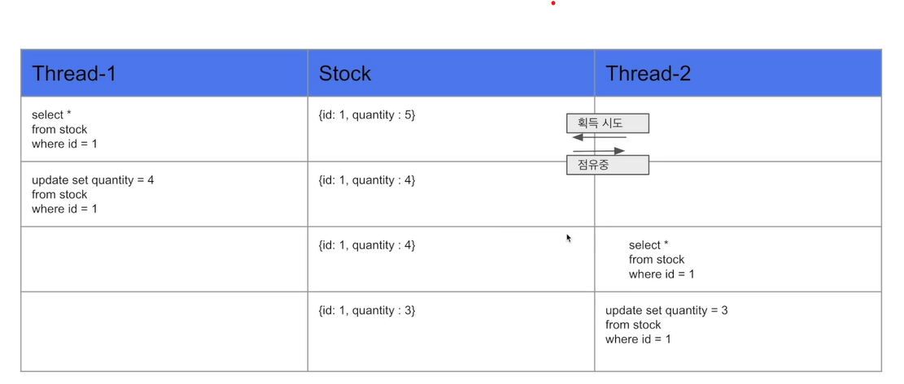
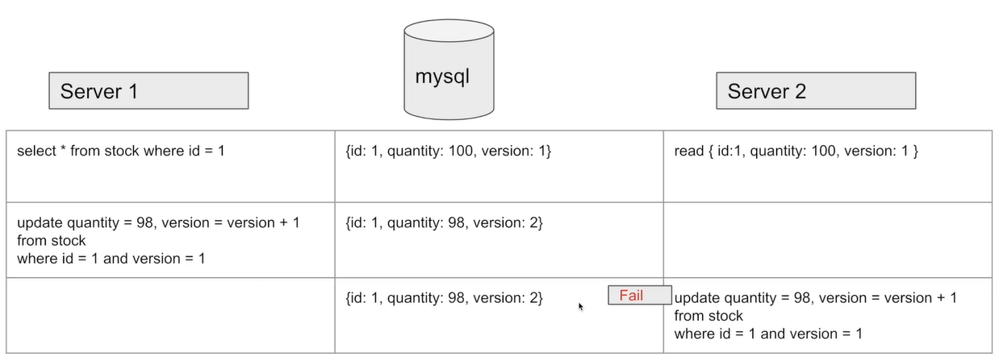
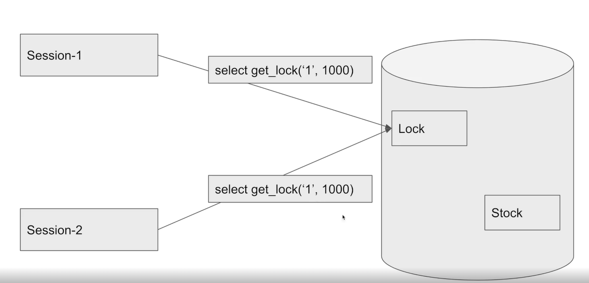

#DB동시성

---
---
## ✏️ `Java`

```java
@Entity
public class Stock {

    @Id @GeneratedValue(strategy = GenerationType.IDENTITY)
    private Long id;

    private Long productId;

    private Long quantity;

//    @Version
//    private Long version;

    public Stock(){
    }

    public Stock(Long productId, Long quantity) {
        this.productId = productId;
        this.quantity = quantity;
    }

    public Long getQuantity() {
        return quantity;
    }

    public void decrease(Long quantity){
        if(this.quantity - quantity < 0){
            throw new RuntimeException("재고는 0개 미만이 될 수 없습니다.");
        }
        this.quantity -= quantity;
    }

}
```
```java
@Service
public class StockService {

    private final StockRepository stockRepository;

    public StockService(StockRepository stockRepository) {
        this.stockRepository = stockRepository;
    }

//    @Transactional //우리가 만든 클래스를 래핑한 클래스를 새로 만듦(stockService를 필드로 가지는 클래스를 새로 만듦)
    public synchronized void decrease(Long id, Long quantity){

        Stock stock = stockRepository.findById(id).orElseThrow();
        stock.decrease(quantity);

        stockRepository.save(stock);
    }

    //@Transactional ⬇️
    //startTransaction()
    // stockService.decrease(id, quantity)
    //endTransaction()
}
```
-  1번 스레드가 decrease한 후 `endTransaction`에 있을때, 스레드2가 decrease호출하는 문제점 발생 가능성

```java
@SpringBootTest
class StockServiceTest {

    @Autowired
    private StockService stockService;
    @Autowired
    private StockRepository stockRepository;

    @BeforeEach
    public void before(){
        stockRepository.saveAndFlush(new Stock(1L, 100L));
    }

    @AfterEach
    public void after(){
        stockRepository.deleteAll();
    }

   @Test  //Synchronized 안하면 RaceConditon 발생함
   public void 동시에_100개의_요청() throws InterruptedException {
       int threadCount = 100;
       ExecutorService executorService = Executors.newFixedThreadPool(32);
       CountDownLatch latch = new CountDownLatch(threadCount); //100개 요청이 끝날때까지 기다려야함

       for(int i=0 ; i < threadCount ; i++){
           executorService.submit(() -> {
               try {
                   stockService.decrease(1L, 1L);
               }finally {
                   latch.countDown();
               }
           });
       }

       latch.await();

       Stock stock = stockRepository.findById(1L).orElseThrow();

       assertEquals(0, stock.getQuantity());
   }
}
```

`ExecutorService`
- 병렬 작업 시 여러 개의 작업을 효율적으로 처리하기 위해 제공되는 JAVA 라이브러리
- ExecutorService는 손쉽게 ThreadPool을 구성하고 Task를 실행하고 관리할 수 있는 역할 진행
- Executors 를 사용하여 ExecutorService 객체를 생성하며, 쓰레드 풀의 개수 및 종류를 지정할 수 있는 메소드를 제공

`CountDownLatch`
- 어떤 스레드가 다른 쓰레드에서 작업이 완료될 때 가지 기다릴 수 있도록 해주는 클래스
- CountDownLatch 를 이용하여, 멀티스레드가 100번 작업이 모두 완료한 후, 테스트를 하도록 기다리게 함

**사용**
- `new CountDownLatch(5);` 를 이용해 Latch할 갯수를 지정
- `countDown()`을 호출하면 Latch의 숫자가 1개씩 감소
- `await()` 는 Latch의 숫자가 0이 될 때 까지 기다림

### 1. `synchronized`
- 하나의 스레드만 접근이 가능하게 만들어줌
- 공유되는 데이터의 Thread-safe를 하기 위해, synchronized 로 스레드간 동기화를 시켜 thread-safe 하게 만들어줌
- 자바에서 지원하는 synchronized는, 현제 데이터를 사용하고 있는 해당 스레드를 제외하고 나머지 스레드들은 데이터 접근을 막아 순차적으로 데이터에 접근할 수 있도록 해줌

**단점**
- 자바의 Synchronized는 하나의 프로세스 안에서만 보장이 됨
- 서버가 1대일때는 문제가 없지만 서버가 2대 이상일 경우 데이터에 대한 접근을 막을 수가 없다
- 서비스들은 `Synchronized`를 거의 사용하지 않음

---
---
## ✏️ `MySQL`
### 1. `Pessimistic Lock`(비관적 락)
- 실제로 데이터에 Lock을 걸어서 정합성을 맞추는 방법
- exclusive lock을 걸게되면 다른 트랜잭션에서는 lock이 해제되기전에 데이터를 가져갈 수 없게됨
- 데드락이 걸릴 수 있기 때문에 주의하기
- 데이터에 Lock을 가진 쓰레드만 접근할 수 있음

**장점**
- 충돌이 빈번히 발생한다면 `optimistic lock`보다 성능이 좋음

```java
//StockRepository
@Lock(LockModeType.PESSIMISTIC_WRITE)
@Query("select s from Stock s where s.id = :id")
Stock findByIdWithPessimisticLock(@Param("id") Long id);
```

```java
@Service
public class PessimisticLockStockService {

    private final StockRepository stockRepository;

    public PessimisticLockStockService(StockRepository stockRepository) {
        this.stockRepository = stockRepository;
    }

    @Transactional
    public void decrease(Long id, Long quantity){
        Stock stock = stockRepository.findByIdWithPessimisticLock(id);

        stock.decrease(quantity);

        stockRepository.save(stock);
    }
}
```
- Java Synchronized와 같은 Test코드가 성공함




---
---
### 2. `Optimistic Lock`(낙관적 락)
- 실제로 Lock을 이용하지 않고 버전을 이용함으로써 정합성을 맞추는 방법
- 데이터를 읽은 후에 update를 수행할 때 현재 내가 읽은 버전이 맞는지 확인하며 업데이트
- 내가 읽은 버전에서 수정사항이 생겼을 경우에는 application에서 다시 읽은 후에 작업을 수행해야함

- 별도의 Lock을 잡지 않으므로 `Pessimistic Lock`보다 성능상의 이점이 있음
- 실패했을때 재시도 로직을 개발자가 직접 작성해야함(Facade)
- 충돌이 빈번하지 않을때 사용하기(빈번하다면 `Pessimistic Lock`)

```java
//StockRepository
@Lock(LockModeType.OPTIMISTIC)
@Query("select s from Stock s where s.id = :id")
Stock findByIdWithOptimisticLock(@Param("id") Long id);
```
- `stock엔티티`에서 `version`칼럼 추가해주기

```java
@Service
public class OptimisticLockStockService {
    private final StockRepository stockRepository;

    public OptimisticLockStockService(StockRepository stockRepository){
        this.stockRepository = stockRepository;
    }

    @Transactional
    public void decrease(Long id, Long quantity){
        Stock stock = stockRepository.findByIdWithOptimisticLock(id);

        stock.decrease(quantity);

        stockRepository.save(stock);
    }
}
```

```java
@Component
public class OptimisticLockStockFacade {
    //실패했을때 재시작해야하므로 Facade만듦

    private final OptimisticLockStockService optimisticLockStockService;

    public OptimisticLockStockFacade(OptimisticLockStockService optimisticLockStockService) {
        this.optimisticLockStockService = optimisticLockStockService;
    }

    public void decrease(Long id, Long quantity) throws InterruptedException {
        while(true){
            try {
                optimisticLockStockService.decrease(id, quantity);
                break;
            }catch (Exception e){
                Thread.sleep(50);
            }
        }
    }
}
```
```java
//Test
@Test
public void 동시에_100개의_요청2() throws InterruptedException {
    int threadCount = 100;
    ExecutorService executorService = Executors.newFixedThreadPool(32);
    CountDownLatch latch = new CountDownLatch(threadCount);

    for(int i=0 ; i < threadCount ; i++){
        executorService.submit(() -> {
            try {
                optimisticLockStockFacade.decrease(1L, 1L);
            }catch (InterruptedException e) {
                    throw new RuntimeException(e);
            }finally{
                latch.countDown();
            }
        });
    }
    latch.await();

    Stock stock = stockRepository.findById(1L).orElseThrow();

    assertEquals(0, stock.getQuantity());
}
```





---
---

### 3. `Named Lock`
- stock이 아닌 별도의 공간에 lock을 걺
- 이름을 가진 metadata locking 
- 이름을 가진 lock을 획득한 후 해제할때까지 다른 세션은 이 lock을 획득할 수 없도록 함
- 주의할점으로는 transcation이 종료될 때 lock이 자동으로 해제되지 않음
- 별도의 명령어로 해제를 수행해주거나 선점시간이 끝나야 해제됨
- 실무에서는 데이터 소스 분리해서 사용하기
- 분산 락을 구현할때 사용

```java
//LockRepository
@Query(value = "select get_lock(:key, 3000)", nativeQuery = true)
void getLock(@Param("key") String key);

@Query(value = "select release_lock(:key)", nativeQuery = true)
void releaseLock(@Param("key") String key);
```

```java
//stockservice
//부모의 트랜잭션과 별도로 실행되어야 하므로 propogation 변경함
@Transactional(propagation = Propagation.REQUIRES_NEW)
public void decrease1(Long id, Long quantity) {
    Stock stock = stockRepository.findById(id).orElseThrow();
    stock.decrease(quantity);

    stockRepository.saveAndFlush(stock);
}
```

```java
@Component
public class NamedLockStockFacade {

    private final LockRepository lockRepository;
    private final StockService stockService;

    public NamedLockStockFacade(LockRepository lockRepository, StockService stockService) {
        this.lockRepository = lockRepository;
        this.stockService = stockService;
    }

    public void decrease(Long id, Long quantity){
        try{
            lockRepository.getLock(id.toString());
            stockService.decrease1(id, quantity);
        }finally {
            lockRepository.releaseLock(id.toString());
        }
    }
}
```

```yml
hikari:  # Named할때 사용
    maximum-pool-size: 40 
```
- 같은 데이터소스 사용하므로 커넥션 풀 사이즈 변경하기

- 테스트 케이스는 같음

