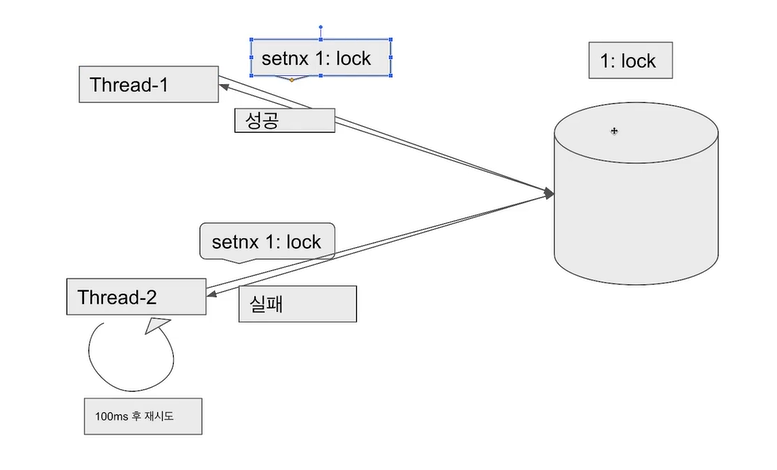
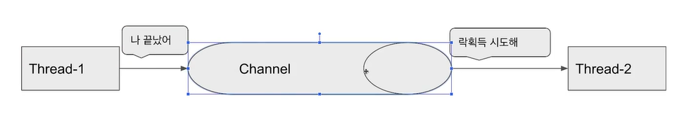

#Redis

---
---
## ✏️ `Lettuce`

- `setnx` 명령어를 활용하여 분산락 구현
- `spin lock`방식: 락을 획득하려는 스레드가 락을 획득할 수 있는지 반복적으로 확인하면서 락획득 시도
- Thread-1이 key가 1인 데이터가 없어서 성공
- Thread-2는 key가 1인 데이터가 있어서 실패

장점
- 구현이 간단함
- spring data redis를 이용하면 lettuce가 기본이기 때문에 별도의 라이브러리를 사용하지 않아도 됨

단점
- `spin lock`방식이기 때문에 동시에 많은 스레드가 lock획득 대기 상태라면 redis에 부하가 갈 수 있음

---
---
## ✏️ `Redisson`

- `pub-sub` 기반으로 Lock구현 제공
- 채널을 하나 만들고 락을 점유중인 쓰레드가 락을 획득하려고 대기중인 스레드에게 해제를 알려주면 안내를 받은 스레드가 락 획득을 시도
- `Lettuce`와 다르게 별도의 retry로직이 필요없음

장점
- 락 획득 재시도를 기본으로 제공함
- 

단점
- `spin lock`방식이기 때문에 동시에 많은 스레드가 lock획득 대기 상태라면 redis에 부하가 갈 수 있음
