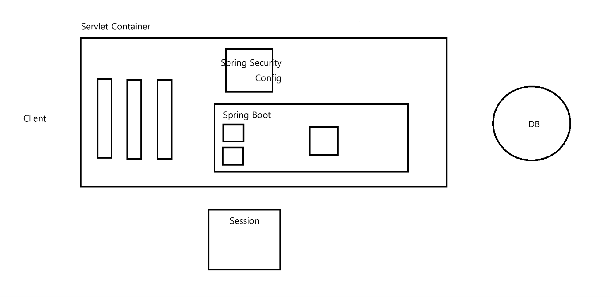

#SecurityConfig

---
---
### ✏️ SecurityConfig



- 인증: 로그인
- 인가: 경로별 접근 권한

```java
@Configuration
@EnableWebSecurity
public class SecurityConfig {

    @Bean
    public BCryptPasswordEncoder bCryptPasswordEncoder(){
        return new BCryptPasswordEncoder();
    }
```
```java
@Bean
public SecurityFilterChain filterChain(HttpSecurity http) throws Exception{
        
    http   //인가
            .authorizeHttpRequests((auth) -> auth
                    .requestMatchers("/", "/login", "/loginProc", "/join", "/joinProc").permitAll()
                    .requestMatchers("/admin").hasRole("ADMIN")
                    .requestMatchers("/my/**").hasAnyRole("ADMIN", "USER")
                    .anyRequest().authenticated()
            ); //특정 경로 허용, 거부, permitAll 모든 사용자 접근 가능
```
```java
        http  //login페이지의 경로를 설정해줌, admin페이지 같은 곳으로 들어가도 오류 발생x ->  자동으로 /login으로 redirect해줌
                .formLogin((auth) -> auth
                        .loginPage("/login")
                        .loginProcessingUrl("/loginProc")   //mustache에서 로그인하고 로그인값을 보내주는 경로
                        .permitAll()
                );
        
        http
                .csrf((auth) -> auth.disable());  //사이트 위변조 방지 시스템, 개발환경이라 disable
        
        return http.build();
    }

}
```

- `anyRequest()` : 처리하지 못한 나머지 경로
- `().authenticated()` : 로그인한 사용자만 접근 가능
- `().denyAll` : 모든 사용자 접근 불가능

- 상단부터 순서대로 동작하므로 순서에 유의하기


### ✏️ 커스텀 로그인 설정
- `SecurityConfig`를 만들면 커스텀 로그인을 따로 구현해줘야함
