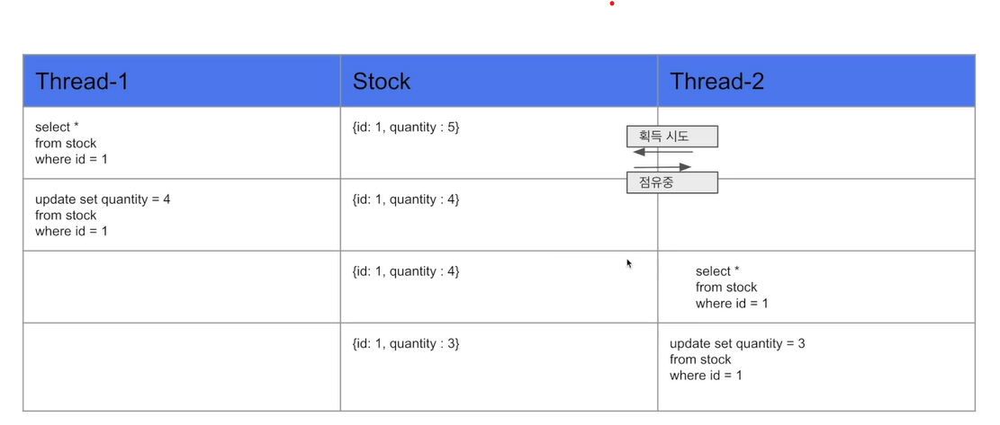
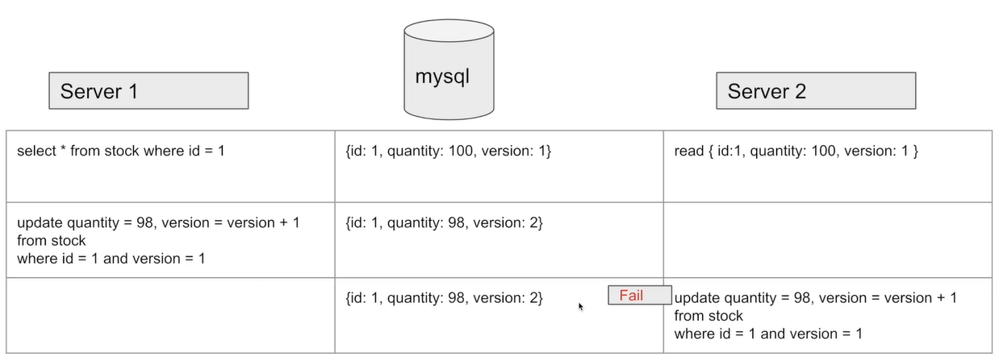

#DB동시성

---
---
## ✏️ `Java`

`ExecutorService`
- 병렬 작업 시 여러 개의 작업을 효율적으로 처리하기 위해 제공되는 JAVA 라이브러리
- ExecutorService는 손쉽게 ThreadPool을 구성하고 Task를 실행하고 관리할 수 있는 역할 진행
- Executors 를 사용하여 ExecutorService 객체를 생성하며, 쓰레드 풀의 개수 및 종류를 지정할 수 있는 메소드를 제공

`CountDownLatch`
- 어떤 스레드가 다른 쓰레드에서 작업이 완료될 때 가지 기다릴 수 있도록 해주는 클래스
- CountDownLatch 를 이용하여, 멀티스레드가 100번 작업이 모두 완료한 후, 테스트를 하도록 기다리게 함

**사용**
- `new CountDownLatch(5);` 를 이용해 Latch할 갯수를 지정
- `countDown()`을 호출하면 Latch의 숫자가 1개씩 감소
- `await()` 는 Latch의 숫자가 0이 될 때 까지 기다림

### 1. `synchronized`
- 하나의 스레드만 접근이 가능하게 만들어줌
- 공유되는 데이터의 Thread-safe를 하기 위해, synchronized 로 스레드간 동기화를 시켜 thread-safe 하게 만들어줌
- 자바에서 지원하는 synchronized는, 현제 데이터를 사용하고 있는 해당 스레드를 제외하고 나머지 스레드들은 데이터 접근을 막아 순차적으로 데이터에 접근할 수 있도록 해줌

**단점**
- 자바의 Synchronized는 하나의 프로세스 안에서만 보장이 됨
- 서버가 1대일때는 문제가 없지만 서버가 2대 이상일 경우 데이터에 대한 접근을 막을 수가 없다
- 서비스들은 `Synchronized`를 거의 사용하지 않음


---
## ✏️ `MySQL`
### 1. `Pessimistic Lock`(비관적 락)
- 실제로 데이터에 Lock을 걸어서 정합성을 맞추는 방법
- exclusive lock을 걸게되면 다른 트랜잭션에서는 lock이 해제되기전에 데이터를 가져갈 수 없게됨
- 데드락이 걸릴 수 있기 때문에 주의하기
- 데이터에 Lock을 가진 쓰레드만 접근할 수 있음

**장점**
- 충돌이 빈번히 발생한다면 `optimistic lock`보다 성능이 좋음

```java
@Lock(LockModeType.PESSIMISTIC_WRITE)
@Query("select s from Stock s where s.id = :id")
Stock findByIdWithPessimisticLock(@Param("id") Long id);
```



### 2. `Optimistic Lock`(낙관적 락)
- 실제로 Lock을 이용하지 않고 버전을 이용함으로써 정합성을 맞추는 방법
- 데이터를 읽은 후에 update를 수행할 때 현재 내가 읽은 버전이 맞는지 확인하며 업데이트
- 내가 읽은 버전에서 수정사항이 생겼을 경우에는 application에서 다시 읽은 후에 작업을 수행해야함

- 별도의 Lock을 잡지 않으므로 `Pessimistic Lock`보다 성능상의 이점이 있음
- 실패했을때 재시도 로직을 개발자가 직접 작성해야함(Facade)
- 충돌이 빈번하지 않을때 사용하기(빈번하다면 `Pessimistic Lock`)

```java
@Lock(LockModeType.OPTIMISTIC)
@Query("select s from Stock s where s.id = :id")
Stock findByIdWithOptimisticLock(@Param("id") Long id);
```




### 3. `Named Lock`
- 이름을 가진 metadata locking 
- 이름을 가진 lock을 획득한 후 해제할때까지 다른 세션은 이 lock을 획득할 수 없도록 함
- 주의할점으로는 transcation이 종료될 때 lock이 자동으로 해제되지 않음
- 별도의 명령어로 해제를 수행해주거나 선점시간이 끝나야 해제됨
- 실무에서는 데이터 소스 분리해서 사용하기
- 분산 락을 구현할때 사용
```java
@Query(value = "select get_lock(:key, 3000)", nativeQuery = true)
void getLock(@Param("key") String key);

@Query(value = "select release_lock(:key)", nativeQuery = true)
void releaseLock(@Param("key") String key);
```
