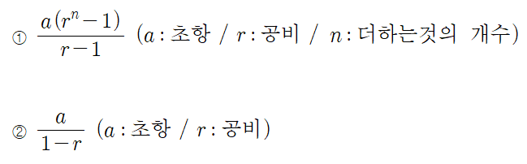

#1.구현

---
---
## ✏️ 시간복잡도

`O(n2)`​
- 빅오 표기법(Big - O notation) 이란 복잡도에 가장 영향을 많이 끼치는 항의 상수인자를 빼고 나머지 항을 없애서 복잡도를 나타내는 표기법

**`n! > 2^n > n^2 > nlogn > n > logn > 1`**

### ✔️ `상수시간 복잡도`
`O(1)`

- 입력크기와 상관없이 일정한 시간복잡도를 가지는 것
- 입력과 출력 
ex) cin, cout, scanf, printf 
- 곱하기, 나누기, 나머지, 빼기 등 
- 비교 if
- 배열 인덱스 참조 등등


### ✔️ `활용`

**문제1**
```cpp
#include<bits/stdc++.h>
using namespace std; 
int n;
int main(){
	cin >> n; 
	int a = 0;
	for(int i = 0; i < n; i++){
		for(int j = 0; j < i; j++){
			a += i + j; 
		}
	}
	cout << a << '\n';   
	return 0;
} 
```
`O(n^2)`
- i=0   0번(x, x, x, x)
- i=1   1번(0, x, x, x)
- i=2   2번(0, 1, x, x)
- i=3   3번(0, 1, 2, x)
- ...
- i=n-1   n-1번(0,1,2,3...n-2)
- 최종적으로 `1/2(n^2 - n)`
- n=4일때를 기준으로 보기


**문제2**
```cpp
#include<bits/stdc++.h>
using namespace std;

int n, a[1004], cnt;

int go(int l, int r){ 
	//cnt와 같은 디버깅으로 점화식 구할 수 있음
	if(l == r) return a[l];  
	int mid = (l + r) / 2; 
	int sum = go(l, mid) + go(mid + 1, r); 
	return sum;
}

int main(){
	cin >> n; 
	for(int i = 1; i <= n; i++){
		a[i - 1] = i; 
	}
	int sum = go(0, n - 1);
	cout << sum << '\n';  
} 
```
- `O(2n-1)` -> `O(N)`
- n=4 -> 1+2+4 -> 1(2^(log2n+1) - 1)/2 - 1 -> 2N - 1


**문제3**
```cpp
#include<bits/stdc++.h>
using namespace std;  
int N;
void solve(int N){
	int a = 0, i = N;
	while (i > 0) {
		a += i;
		i /= 2;
	} 
	cout << a << '\n';
}
int main(){
	cin >> N; 
	solve(N);    
	return 0;
} 
```
- `O(log2N + 1)` -> `O(log2N)`


**문제4**
```cpp
#include<bits/stdc++.h>
using namespace std;  
int N, cnt;
void solve(int N){
	cnt++;
	cout << cnt << '\n';
	if(N == 0) return;
	for(int i = 0; i < 3; i++){
		solve(N - 1);
	} 
	return;
}
int main(){
	cin >> N; 
	solve(N);    
	return 0;
} 
```
- `재귀함수 시간복잡도 = main logic * (함수 호출 횟수)`
- n=3 -> 1 + 3 + 9 + 27 -> 등비수열의 합 구하기
- main logic(`O(1)`) * 함수 호출 횟수(`1(3^n - 1)/(3 - 1)`) -> `O(3^n)`

> 팁: 함수 하나당 k번 호출되었을때 -> k^n (대략적으로 구하는 방법)
> - 재귀 함수 호출을 함수 1개가 K번 하는 경우
> - go(idx/20)로 호출되는 등의 경우는 다른 시간복잡도를 가짐





### ✔️ `자료구조`
배열(Array) 
 - 참조 : O(1)
 - 탐색 : O(n) 

배열(vector) 
 - 참조 : O(1)
 - 탐색 : O(n)
 - 맨 끝, 앞에 삽입/삭제 : O(1)
 - 중간에 삽입 / 삭제 : O(n)


스택(stack)
- n번째 참조 : O(n)
- 가장 앞부분 참조 : O(1)
- 탐색 : O(n)
- 삽입 / 삭제(n번째 제외) : O(1)

​
큐(queue)
- n번째 참조 : O(n)
- 가장 앞부분 참조 : O(1)
- 탐색 : O(n)
- 삽입 / 삭제(n번째 제외) : O(1)


연결리스트(doubly linked list)
 - 참조 : O(n)
 - 탐색 : O(n)
 - 삽입 / 삭제 : O(1)

맵(map)
 - 참조 : O(logn)
 - 탐색 : O(logn)
 - 삽입 / 삭제 : O(logn)


---
---
## ✏️ 공간복잡도
1. 문제의 최대 범위로 배열의 크기를 설정하는 방법
2. 메모리 제한을 활용해 크기 설정하는 방법
   - 512MB -> 512,000,000byte -> int a[128000000]; -> 2차원 배열(10000 * 10000)

**1000만까지는 어느정도 통과할 확률이 높다고 생각하고 문제풀기**

---
---
## ✏️ 누적합
- `prefix sum`위주로 공부
- 문제를 풀 때 "구간"에 대한 많은 "쿼리"가 나올 때 생각해야 될 것은 트리 또는 누적합
   - 트리는 세그먼트, 펜윅트리를 뜻함
   - 구간 안에 있는 요소들이 변하지 않는 정적 요소라면 누적합 사용하기

```cpp
#include<bits/stdc++.h>
using namespace std;   
typedef long long ll;  
int a[100004], b, c, psum[100004], n ,m;
int main(){
	ios_base::sync_with_stdio(false); 
	cin.tie(NULL); cout.tie(NULL);
	cin >> n >> m; 
	for(int i = 1; i <= n; i++){
		cin >> a[i];
		psum[i] = psum[i - 1] + a[i]; 
	}
	
	for(int i = 0 ; i < m; i++){
		cin >> b >> c; 
		cout << psum[c] - psum[b - 1] << "\n";
	} 
	return 0;
}
```


---
---
## ✏️ 구현문제

1. 문제를 보기
2. 문제를 해석
  - 1. 최대, 최소 범위를 파악 
  - 2. 단순 구현이라면 구현 
  - 3. 무식하게 풀 수 있다면 무식하게 풀기   
  - 4. 아니라면 다른 알고리즘을 생각하기
  - 5. 제출하기전, 반례를 항상 생각하기  
3. 코드를 작성
