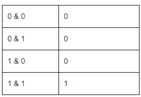
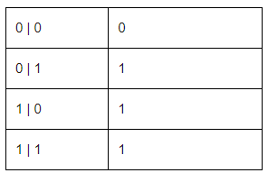
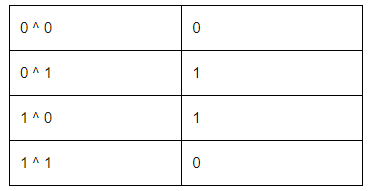
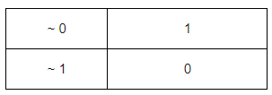
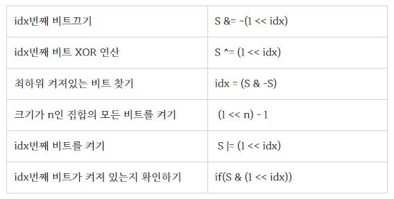

# 4.비트마스킹

---
---
## ✏️ **이진수를 이용해 불리언 배열 표현**

1. 0번째 비트가 켜져있음 = 0번째가 포함되어 있음 = 001 = 1
2. 0, 1번째 비트가 켜져있음 = 0번째가 포함되어 있음 = 011 = 3

---
## ✏️ 비트연산자

### ✔️ `+ / -`
- 십진법의 `+,-`와 동일함
- `10101 + 11(21 + 3)`= `11000(24)`
- `10101 - 11(21 - 3)`= `10010(18)` 

### ✔️ `& / |`



- `1001&1000`=`1000`



- `1001|1000`=`1001`


### ✔️ `<< / >>`
#### ✨ `<<`
- left logical shift
- `a << b` = `a * 2 ^ b`
- `111(7) << 2` = `11100(28)`


#### ✨ `>>`
- right logical shift
- `a >> b` = `(int) a * (1/2) ^ b`
- `1111(15) >> 2` = `0011(3)`

### ✔️ `^ / ~`
#### ✨ `^`



- `1001(9)^ 1000(8)`=`0001`


#### ✨ `~`



- `~011`은 `11111111 , 11111111 , 11111111 , 11111100`과 동일함
- 모든 비트의 반전에 1을 더하면 음수 표현 가능(2의 보수법)
- **-value = ~value + 1**
- **~value = -(value+1)**


---
---
## ✏️ 비트연산자 활용



### ✔️ `1. idx번째 비트끄기`

- 10010(18)에서 첫번째 비트 끄고 싶음
- 1 << 1 = 00010
- 보수적용: 11101
- 10010 & 11101 = 10000(16)

```cpp
int main() {   
    int S = 18;
    int idx = 1; 
    S &= ~(1 << idx);
    cout << S << '\n'; // 16
    return 0;
} 
```


### ✔️ `2. idx번째 비트 XOR 연산`

- 해당비트가 0이라면 1, 1이라면 0으로 만듦
- 10010(18)에서 첫번째 비트 0으로 바꿈
- 1 << 1 = 00010
- 10010 ^ 00010 = 10000(16)

```cpp
int main() {   
    int S = 18;
    int idx = 1; 
    S ^= (1 << idx);
    cout << S << '\n'; // 16
    return 0;
}
```


### ✔️ `3. 최하위 켜져있는 비트 찾기`

- `-S = ~S + 1`
- 10010 & 01101+1
- 10010 & 01110 = 00010

```cpp
int main() {   
    int S = 18;
    int idx = (S & -S); 
    cout << idx << '\n'; // 2
    return 0;
} 
```


### ✔️ `4. 크기가 n인 집합의 모든 비트를 켜기`

- 크기가 4인 배열의 모든 요소를 포함한다면
- [1, 1, 1, 1]
- (1 << 4) - 1 = 10000 - 1 = 1111(15)

```cpp
int main() {   
    int n = 4;  
    cout << (1 << n) - 1 << '\n'; // 15
    return 0;
}
```

### ✔️ `5. idx번째 비트를 켜기`

- 10010(18)에서 0번째 비트 1으로 바꿈
- 1 << 0 = 00001
- 10010 | 00001 = 10011(19)

```cpp
int main() {   
    int S = 18; 
    int idx = 0;
    S |= (1 << idx); 
    cout << S << '\n'; // 19
    return 0;
}
```


### ✔️ `6. idx번째 비트가 켜져 있는지 확인하기`

- 10010에서 3번째 비트 켜져있나 확인
- 10010 & 00100 = 0(false)

```cpp
int main() {   
    int S = 18; 
    int idx = 0;
    if(S & (1 << idx)){
        cout << "true\n";
    }else{
        cout << "false\n"; 
    }  
    return 0;
} 
```


---
---
## ✏️ 비트마스킹: 경우의 수, 매개변수

- 불리언 배열에서 무언가를 찾는 연산은 `vector<bool>, set<int>, bitset`로 표현하고 `find`메서드 등으로 찾음
- 비트연산이 이것보다 더 빠름
- **불리언 배열 역할을 하는 하나의 숫자를 비트마스킹으로 탐색, 수정**
- 비트마스킹은 int형 숫자, 31까지만 가능함(넘으면 시간복잡도 초과)

### ✔️ 경우의 수

- 4개의 배열은 16개의 경우의 수를 가짐
- 4C1, 4C2..와 같은 조합의 모든 경우의 수를 for문으로 한번에 표현이 가능함
- combi함수와 달리 조합의 선택 갯수를 여러개 선택해야할때 유용함

```cpp
#include <bits/stdc++.h>
using namespace std;  
const int n = 4;

int main() {   
	string a[n] = {"A", "B", "C", "D"};

	for(int i = 0; i < (1 << n); i++){  //10000(16)
		string ret = "";
		for(int j = 0; j < n; j++){
			if(i & (1 << j)){  //0001 0010 0100 1000
				ret += (a[j] + " ");
			}
		}
		cout << ret << '\n';
	} 
    return 0;
} 
/*

A
B
A B
C
A C
B C
A B C
D
A D
B D
A B D
C D
A C D
B C D
A B C D
*/
```


### ✔️ 매개변수 전달

- A라는 매개변수는 포함되어 있음
- A에 다른 매개변수를 더하는 것을 구현

```cpp
#include <bits/stdc++.h>
using namespace std;  
const int n = 4;
string a[4] = {"A", "B", "C", "D"};

void go(int num){
	string ret = "";	
	for(int i = 0; i < 4; i++){
		if(num & (1 << i)) ret += a[i] + " ";
	}
	cout << ret << '\n';
	return;
}

int main() {    
	for(int i = 1; i < n; i++){
		go(1 | (1 << i));  //0011, 0101, 1001
	} 
    return 0;
} 
/*
A B 
A C 
A D
*/
```