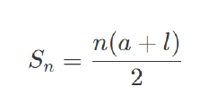
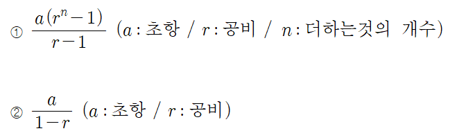

# C++ 문법(수학)

---
## ✏️ 재귀함수
**반드시 기저사례를 쓰기**<br>
ex. `if(n==1||n==0) return 1;`<br><br>
**사이클이 있다면 쓰면 안됨**<br>
ex. f(a)가 f(b)를 호출한 뒤 f(b)가 다시 f(a)를 호출하는 것<br><br>
**반복문으로 될 거같으면 반복문으로**

### ✔️ 팩토리얼
```cpp
int fact_rec(int n){
    if(n == 1 || n == 0) return 1;
    return n * fact_rec(n - 1);
}

int fact_for(int n){
    int ret = 1;
    for(int i = 1; i <= n; i++){
        ret *= i;
    }
    return ret;
}
```

### ✔️ 피보나치 수열
```cpp
int fibo(int n){
    if(n == 0 || n == 1) return n;
    return fibo(n - 1) + fibo(n - 2);
}
```
---
---
## ✏️ 순열
- 순서와 관계있이
- nPr = n!/(n-r)!
​
### ✔️ `next_permutation()`/`prev_permutation()`
- [first, last)
- `next_permutation()`: 오름차순 배열
- `prev_permutation()`: 내림차순 배열
- 둘 다 return bool, 해당 배열의 다음번 순열을 만들어냄
- do_while안쓰면 처음 값 안나옴
- **오름차순을 사용할때 정렬하고 사용하기**
```cpp
vector<int> v = {1, 2, 3};
do{
..print V
}while(next_permutation(v.begin(), v.end()));
// 1 2 3
// 1 3 2
// 2 1 3
// 2 3 1
// 3 1 2
// 3 2 1

vector<int> v = {3, 2, 1};;
do{
..print V
}while(prev_permutation(v.begin(), v.end()));
// 3 2 1
// 3 1 2
// 2 3 1
// 2 1 3
// 1 3 2
// 1 2 3
```

**배열 3가지 방법**
```cpp
int a[] = {1, 2, 3};
//1
do{
}while(next_permutation(&a[0], &a[3]));
//2
do{
}while(next_permutation(&a[0], &a[0] + 3));
//3
do{
}while(next_permutation(a, a + 3));
```


---

### ✔️ 재귀함수
```cpp
#include <bits/stdc++.h>
using namespace std;
int a[3] = {1, 2, 3};
int n = 3, r = 3;
void print(){
    for(int i = 0; i < r; i++){
        cout << a[i] << " ";
    }
    cout << "\n";
}
void makePermutation(int n, int r, int depth){
    if(r == depth){
        print();
        return;
    }
    for(int i = depth; i < n; i++){
        swap(a[i], a[depth]);
        makePermutation(n, r, depth + 1);
        swap(a[i], a[depth]);
    }
    return;
}
int main(){
    makePermutation(n, r, 0);
    return 0;
}
```

---
## ✏️ 조합
- nCr = n!/r!(n-r)!
- 순서가 없음
- 다양하게 뽑을 때 사용
### ✔️ 재귀함수
```cpp
#include <bits/stdc++.h>
using namespace std;
int n = 5, k = 3, a[5] = {1, 2, 3, 4, 5};
void print(vector<int> b){
    for(int i : b)cout << i << " ";
    cout << '\n';
}

void combi(int start, vector<int> b){
    if(b.size() == k){
        print(b);
        return;
    }
    for(int i = start + 1; i < n; i++){
        b.push_back(i);
        combi(i, b);
        b.pop_back();
    }
    return;
}
int main() {
    vector<int> b;
    combi(-1, b);
    return 0;
}
```
- `call by reference`형식으로 안쓴이유는 `combi`함수 내부에서 작업하고 `print()`도 함수 내부에서 실행했기 때문
- `main`으로 다시 나오면 값 안바뀜
- 아래 코드와 같은 원리(재귀함수에서 값이 변경되지만, 함수 종료후 main에는 아무값이 없음)
```cpp
void go(vector<int> v){
	if(v.size() == 10){
		for(int i : v) cout << i << '\n';
		return;
	}
	v.push_back(100);
	go(v);
	return;
}
int main(){
	vector<int> v;
	go(v);
	cout << "hello\n";
	for(int i : v) cout << i << '\n';
}
```


### ✔️ 중첩 for문
- r이 3이하일때 사용하기 좋음
```cpp
#include <bits/stdc++.h>
using namespace std;
int n = 5;
int k = 3;
int a[5] = {1, 2, 3, 4, 5};
int main() {
    for(int i = 0; i < n; i++){
        for(int j = i + 1; j < n; j++){
            for(int k = j + 1; k < n; k++){
                cout << i << " " << j << " " << k << '\n';
            }
        }
    }
    return 0;
}
/*
0 1 2
0 1 3
0 1 4
0 2 3
0 2 4
0 3 4
1 2 3
1 2 4
1 3 4
2 3 4
*/
```
**같은 조합의 의미**
```cpp
for(int i = 0; i < n; i++){
    for(int j = 0; j < i; j++){
        for(int k = 0; k < j; k++){
            cout << i << " " << j << " " << k << '\n';
        }
    }
}
```


**조합의 특징 : nCr = nC(n - r)**


---
---
## ✏️ 정수론
### ✔️ 최대공약수 최소공배수
**최대공약수**
```cpp
int gcd(int a, int b){
    if(a == 0) return b;
    return gcd(b % a, a);
}
```

**최소 공배수**
```cpp
int gcd(int a, int b){
    if(a == 0) return b;
    return gcd(b % a, a);
}

int lcm(int a, int b){
    return (a * b) / gcd(a, b);
}
```

---
### ✔️ 모듈러 연산

1. `a = b mod n` `b = c mod n`은 `a = c mod n`을 의미
2. `[(a mod n) + (b mod n)] mod n = (a+b) mod n`
3. `[(a mod n) - (b mod n)] mod n = (a-b) mod n`
4. `[(a mod n) * (b mod n)] mod n = (a*b) mod n`

---
### ✔️ 에라토스테네스의 체
- 소수가 아닌 값들에 대한 불 배열을 만들어 소수를 걸러낼 수 있는 방법

**1번 방법**
```cpp
const int max_n = 40; //40까지의 소수 구하기
bool che[max_n + 1];

vector<int> era(int mx_n){
    vector<int> v;
    for(int i = 2 ; i <= mx_n ; i++){
        if(che[i]) continue;
        for(int j = 2 * i ; j <= mx_n ; j += i){
            che[j] = 1;
        }
    }
    for(int i = 2 ; i <= mx_n ; i++){
        if(che[i] == 0) v.push_back(i);
    }
    return v;
}
```
- 배열의 크기가 일정 수준(1000만 이상)을 넘어가면 사용하기 어려움

**2번 방법**
```cpp
bool check(int n){
    if(n <= 1) return 0;
    if(n == 2) return 1; //소수
    if(n % 2 == 0) return 0;
    for(int i = 2 ; i * i <= n ; i++){
        if(n % i == 0) return 0;
    }
    return 1; //소수
}
```
---
### ✔️ 등차수열, 등비수열

#### ✨ 등차수열의 합

1. 1부터 시작해 1씩 증가하는 수열의 합


```cpp
int n = 5;
int ret = 0;
for(int i = 1 ; i <= n ; i++){
    ret += i; //15
}
// or
n * (n + 1) / 2; //15
```
- O(1)의 시간복잡도

2. 초항과 등차가 변하는 등차수열의 합



```cpp
int n = 5;
int a = 3, l = 23;
n * (a + l) / 2; //65
```
- a: 초항
- n: 등차
- l: 마지막 항
- 3, 8, 13, 18, 23

#### ✨ 등비수열의 합



```cpp
//{1,2,4,8}의 합 구하기

int a = 1, r = 2, n = 4;
vector<int> v;
a*((int)pow(2,n) - 1) / (r - 1);
```


---
### ✔️ 승수
```cpp
int n = 4;
int pow_2 = (int)pow(2, n); //16
```
- `pow(double base, double exponent)`는 double형 파라미터를 2개 받아 double을 반환함
- `int`형 사용이 필요하다면 형변환 해주기

---
### ✔️ 제곱근
- 9의 제곱근: 3
- 16의 제곱근: 4

```cpp
int n = 16;
int ret = (int)sqrt(n); // 4
```
- `sqrt(double num)`는 double을 매개변수로 받고 double형을 return함
- `int`형 사용이 필요하다면 형변환 해주기

