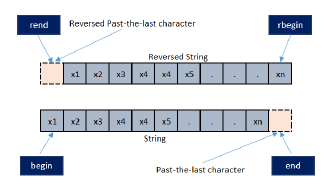

# C++ 문법(기타)

---
---
## ✏️ 회전

### ✔️ 1차원 배열 회전

**`rotate()`** 이용하기
- [first iterator, middle iterator, last iterator)
- middle이 first로 이동함


### ✨ 반시계방향

1. 배열 전체 이동
```cpp
vector<int> v = {1, 2, 3, 4, 5, 6};
rotate(v.begin(), v.begin() + 1, v.end())
// 2 3 4 5 6 1

vector<int> v = {1, 2, 3, 4, 5, 6};
rotate(v.begin(), v.begin() + 2, v.end())
// 3 4 5 6 1 2
```

2. 배열 부분 이동
```cpp
vector<int> v = {1, 2, 3, 4, 5, 6};
rotate(v.begin() + 1, v.begin() + 2, v.begin() + 5);
// 1 [3 4 5 2] 6
```
- v.begin() + 1 : 2
- v.begin() + 5 : 6, `[2, 6)`


### ✨ 시계방향
- 반시계 방향과 같지만, `rbegin(), rend()`를 사용하기

```cpp
vector<int> v = {1, 2, 3, 4, 5, 6};
rotate(v.rbegin(), v.rbegin() + 1, v.rend());
// 6 1 2 3 4 5
```
- rbegin()은 배열의 마지막을 나타냄(여기서는 6)
- rend()는 오른쪽부터 시작해 배열의 시작 전 위치를 나타냄



```cpp
//이것도 가능
vector<int> v = {1,2,3,4,5,6,7,8,9};
rotate(v.begin(), v.begin() + v.size() - 1, v.end());
// 9 1 2 3 4 5 6 7 8
```


### ✨ 직접 구현

```cpp
vector<int> v = {1,2,3,4,5,6};
int i = 1;
int temp = v[i]; // 2
v[i] = v[i+1];
v[i+1] = v[i+2];
v[i+2] = v[i+3];
v[i+3] = temp;
// 1 [3 4 5 2] 6
```


---
### ✔️ 2차원 배열
#### ✨ 2차원 배열 회전
**n과 m이 다른 경우**
```cpp
void rotate_left_90(vector<vector<int>> &key){
    int n = key.size();
    int m = key[0].size();
    vector<vector<int>> temp(m, vector<int>(n, 0));

    for(int i=0 ; i<m ; i++){
        for(int j=0 ; j<n ; j++){
            temp[i][j] = key[j][m - i - 1];
        }
    }
    key.resize(m);
    key[0].resize(n);

    key = temp;
    return;
}

void rotate_right_90(vector<vector<int>> &key){
    int n = key.size();
    int m = key[0].size();
    vector<vector<int>> temp(m, vector<int>(n, 0));

    for(int i = 0; i < m; i++){
        for(int j = 0; j < n; j++){
            temp[i][j] = key[n - j - 1][i];
        }
    }
    key.resize(m);
    key[0].resize(n);

    key = temp;
    return;
}

int main(){
    vector<vector<int>> a = {
        {1, 2, 3, 4},
        {5, 6, 7, 8},
        {9, 10, 11, 12},
    };

    rotate_right_90(a);
    for(int i = 0; i < m; i++){
        for(int j = 0; j < n; j++){
            cout << a[i][j] << " ";
        }
        cout << '\n';
    }

    return 0;
}
```
- `resize()`는 vector의 크기를 재할당하는 메서드
- `i, j = n - j - 1, i`

**n과 m의 크기가 같은 경우**
```cpp
const int n = 3;
void rotate_right_90(vector<vector<int>> &key){
    vector<vector<int>> temp(n, vector<int>(n, 0));

    for(int i = 0; i < n; i++){
        for(int j = 0; j < n; j++){
            temp[i][j] = key[n - j - 1][i];
        }
    }
    key = temp;
    return;
}
int main(){
    vector<vector<int>> a = {
        {1, 2, 3},
        {5, 6, 7},
        {9, 10, 11},
    };

    rotate_right_90(a);
    for(int i = 0; i < n; i++){
        for(int j = 0; j < n; j++){
            cout << a[i][j] << " ";
        }
    cout << '\n';
    }

    return 0;
}
```

#### ✨ 2차원 배열 대칭
```cpp
vector<vector<int>> v = {{1, 2, 3}, {4, 5, 6}, {7, 8, 9}};
int b[3][3];

int main(){
    for(int i = 0; i < 3; i++){
        for(int j = 0; j < 3; j++){
            b[j][i] = v[i][j];
        }
    }

    for(int i = 0; i < 3; i++){
        for(int j = 0; j < 3; j++){
            cout << b[i][j] << " ";
        }
        cout << '\n';
    }
    return 0;
}
/*
1 2 3
4 5 6
7 8 9
->
1 4 7
2 5 8
3 6 9
*/
```


---
---
## ✏️ n 진법 변환
- 숫자 n을 b진법으로 변환

```cpp
int n = 100;
int b = 2;
while(n > 1){
    v.push_back(n % b);
    n /= b;
}
if(n == 1) v.push_back(1);
reverse(v.begin(), v.end());

for(int a : v){
    //16진법 변환을 위해 필요함
    if(a >= 10) cout << char(a + 55);
    else cout << a;
}
```
- b를 바꾸면 진법이 변경됨


---
---
## ✏️ 팁

- 초기값은 답의 범위 밖에서 설정하기
   - 답의 범위가 -1000 ~ 1000이고 최솟값을 구하는 문제
   - `ret = min(ret, value)`일때 ret은 1004로 설정하면서 답의 범위 밖에서 설정하기


- 시간복잡도 계산을 위한 값
   - `10!` = 3628800
   - `2^10` = 1024
   - `3^10` = 59049

- 이미 전역변수로 사용중인 변수명은 다른 값으로 변경하기
  - `y1`
  - `time`
  - `prev`
  - `next`
  - `define y1 aaaa`
  - 기존에 선언되어 있는 이터레티어와 함수, 매개변수는 define을 걸어도 사용하지 못함(ex. begin)
```cpp
#define prev aaa
#define next aaaa
int prev[10]; // 이 코드를 사용하기위해 기존에 선언된 변수명을 define으로 바꿔둠
``` 
  


- 실수형 연산은 부정확 할 확률이 있음, 정수형으로 변경하는 것이 좋음


- 문자열 크기 선언
  - 100개 문자를 입력받을때, string이 아닌 char[]를 사용하면 char[101]로 선언하기
  - 마지막에 `\0`에 해당하는 값이 붙음
```cpp
//입력되는 문자열의 길이는 최대 100일때
char str[101]
```


- 참조 에러
  - queue, stack등에서 pop 등 연산을 할때 항상 size를 체크하기
  - `if(q.size() && q.top() == value)`
  - 아무것도 없는데 참조하려고 하면 참조에러가 발생함

- 붙어있는 입력
```cpp
4 4
1000
0100
0010
0001
```
1. string으로 변환
```cpp
int arr[10][10];
cin >> n >> m;
for(int i = 0 ; i < n ; i++){
    cin >> s;
    for(int j = 0 ; j < m ; j++){
        a[i][j] = s[j] - '0';
    }
}
```

2. scanf로 받기
```cpp
int arr[10][10];
cin >> n >> m;
for(int i = 0 ; i < n ; i++){
    for(int j = 0 ; j < m ; j++){
        scanf("%1d", &a[i][j]);
    }
}
```
- `scanf(" %c", &a[i][j])`는 문자타입을 입력받을때
```cpp
2 4
AABB
BBAA
char a[10][10];
```

3. char타입 & cin
- char타입으로 2차원 배열이 설정되어 있다면 cin으로 입력 가능
```cpp
char a[54][54];
for(int i=0 ; i < 2 ; i++){
    for(int j=0 ; j < 4 ; j++){
        cin >> a[i][j];
    }
}
//AABB
//BBAA
```
- cin으로 int타입을 입력받으면 여러개 문자들 입력을 기다렸다가 개행문자직전까지 입력을 받음
- char는 한 문자만 입력받을 수 있어, 개행문자가 없어도 개행문자가 있는것과 같은 역할을 함


- 입력의 끝이 정해지지 않은 경우
```cpp
while(scanf("%d", &n != EOF))
while(cin >> n)
```

- 2차원 배열로 입력을 받을때
```cpp
vector<vector<int>> v = {{0,0,1}, {1,0,1}, {0,1,0}};
int n = v.size();
int m = v[0].size();
for(int i=0 ; i < n ; i++){
    for(int j=0 ; j < m ; j++){
        ...
    }
}
```